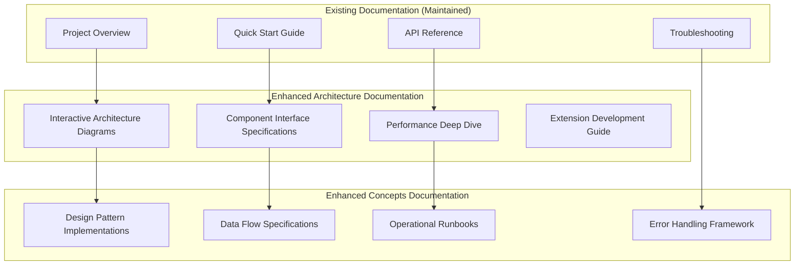

# Design Document

## Overview

This design enhances the existing Jarvis Assistant documentation by adding targeted improvements to architecture and concepts documentation. Rather than replacing the excellent existing documentation, we'll add specific enhancements that address gaps in technical depth, developer onboarding, and AI-system compatibility.

## Architecture

### Documentation Enhancement Strategy

The enhancement follows a **layered documentation approach** that builds upon the existing structure:



### Target Audience Segmentation

| Audience | Primary Needs | Documentation Focus |
|----------|---------------|-------------------|
| **New Developers** | Quick understanding, clear examples | Interactive diagrams, step-by-step guides |
| **Performance Engineers** | Bottleneck identification, optimization | Detailed metrics, profiling guides |
| **AI Systems** | Structured data, formal specifications | Machine-readable schemas, API contracts |
| **Extension Developers** | Plugin patterns, integration points | Interface specifications, example implementations |
| **Operations Teams** | Deployment, monitoring, maintenance | Runbooks, configuration guides, troubleshooting |

## Components and Interfaces

### 1. Interactive Architecture Diagrams

**Purpose**: Replace static diagrams with interactive, explorable architecture visualizations

#### Component Structure
```
docs/02-architecture/interactive/
├── architecture-explorer.html          # Main interactive diagram
├── component-details/                   # Detailed component specs
│   ├── mcp-server.md                   # MCP server internals
│   ├── service-registry.md             # Service management details
│   ├── vector-service.md               # Vector search implementation
│   └── graph-service.md                # Graph search implementation
├── sequence-diagrams/                   # Interactive sequence flows
│   ├── search-semantic-flow.html       # Semantic search sequence
│   ├── search-graph-flow.html          # Graph search sequence
│   └── indexing-flow.html              # Vault indexing sequence
└── assets/                             # Supporting files
    ├── mermaid-config.js               # Diagram configuration
    └── interaction-handlers.js         # Click handlers
```

#### Key Features
- **Clickable Components**: Click on any component to see detailed specifications
- **Flow Visualization**: Animated request flows showing data transformation
- **Performance Overlays**: Show typical response times and bottlenecks
- **Code Links**: Direct links to relevant source code files

### 2. Component Interface Specifications

**Purpose**: Provide formal specifications for all service interfaces and contracts

#### Interface Documentation Structure
```python
# Example interface specification format
class VectorServiceInterface:
    """
    Vector Service Interface Specification
    
    Responsibilities:
    - Semantic search using vector embeddings
    - Embedding generation and caching
    - Vector similarity calculations
    
    Performance Characteristics:
    - Embedding generation: ~200ms for 1000 tokens
    - Similarity search: <50ms for 10k vectors
    - Memory usage: ~2GB for 100k embeddings
    
    Dependencies:
    - sentence-transformers model
    - DuckDB vector database
    - Service registry for configuration
    """
    
    async def search_semantic(
        self,
        query: str,
        similarity_threshold: float = 0.7,
        limit: int = 10,
        vault_filter: Optional[str] = None
    ) -> List[SearchResult]:
        """
        Perform semantic search using vector similarity.
        
        Args:
            query: Natural language search query
            similarity_threshold: Minimum similarity score (0.0-1.0)
            limit: Maximum number of results
            vault_filter: Optional vault name filter
            
        Returns:
            List of search results ranked by similarity
            
        Raises:
            VectorServiceError: If embedding generation fails
            DatabaseError: If vector database is unavailable
            
        Performance:
            - Typical response time: 150-300ms
            - Memory usage: ~50MB per request
            - Cache hit rate: ~80% for repeated queries
        """
```

### 3. Performance Deep Dive Documentation

**Purpose**: Provide comprehensive performance analysis and optimization guidance

#### Performance Documentation Structure
```
docs/02-architecture/performance/
├── benchmarks.md                       # Performance benchmarks and baselines
├── profiling-guide.md                  # How to profile and identify bottlenecks
├── optimization-strategies.md          # Proven optimization techniques
├── scaling-analysis.md                 # Scaling characteristics and limits
├── memory-management.md                # Memory usage patterns and optimization
└── database-performance.md             # Database-specific performance tuning
```

#### Key Performance Metrics
```yaml
# Performance baseline specifications
performance_baselines:
  search_operations:
    semantic_search:
      p50_response_time: "200ms"
      p95_response_time: "500ms"
      p99_response_time: "1000ms"
      memory_usage: "50MB"
      cache_hit_rate: "80%"
    
    graph_search:
      p50_response_time: "150ms"
      p95_response_time: "400ms"
      p99_response_time: "800ms"
      memory_usage: "30MB"
      cache_hit_rate: "70%"
  
  indexing_operations:
    vault_indexing:
      throughput: "100 files/second"
      memory_peak: "500MB"
      disk_io: "50MB/s"
      cpu_usage: "60%"
  
  system_limits:
    max_vault_size: "100k files"
    max_concurrent_requests: "50"
    max_memory_usage: "2GB"
    max_embedding_cache: "1GB"
```

### 4. Extension Development Framework

**Purpose**: Provide comprehensive guidance for extending the system

#### Extension Documentation Structure
```
docs/05-development/extensions/
├── extension-architecture.md           # Overall extension system design
├── creating-mcp-tools.md              # Step-by-step MCP tool creation
├── service-integration.md             # Integrating with existing services
├── event-system-guide.md              # Using the event bus
├── database-adapters.md               # Creating new database adapters
├── testing-extensions.md              # Testing strategies for extensions
└── examples/                          # Complete working examples
    ├── custom-search-tool/            # Example MCP tool
    ├── new-database-adapter/          # Example database adapter
    └── event-driven-service/          # Example service with events
```

## Data Models

### Documentation Metadata Schema

```python
@dataclass
class DocumentationMetadata:
    """Metadata for enhanced documentation sections."""
    
    # Content identification
    document_id: str
    title: str
    section_type: str  # "architecture", "interface", "performance", "extension"
    target_audience: List[str]  # ["developer", "ai-system", "operations"]
    
    # Content characteristics
    complexity_level: str  # "beginner", "intermediate", "advanced"
    estimated_read_time: int  # minutes
    prerequisites: List[str]
    related_documents: List[str]
    
    # Technical metadata
    code_examples: List[CodeExample]
    diagrams: List[DiagramReference]
    performance_data: Optional[PerformanceMetrics]
    
    # Maintenance information
    last_updated: datetime
    review_frequency: str  # "monthly", "quarterly", "on-change"
    maintainer: str
    accuracy_verified: bool
```

### Interactive Diagram Schema

```python
@dataclass
class InteractiveDiagram:
    """Schema for interactive architecture diagrams."""
    
    # Diagram metadata
    diagram_id: str
    title: str
    description: str
    diagram_type: str  # "architecture", "sequence", "flow"
    
    # Interactive elements
    clickable_components: List[ClickableComponent]
    animation_sequences: List[AnimationSequence]
    overlay_data: List[OverlayData]
    
    # Technical specifications
    mermaid_source: str
    custom_styling: Dict[str, Any]
    interaction_handlers: List[str]  # JavaScript function names
    
    # Performance data
    load_time_target: int  # milliseconds
    interaction_response_time: int  # milliseconds
```

### Performance Specification Schema

```python
@dataclass
class PerformanceSpecification:
    """Formal performance specifications for system components."""
    
    # Component identification
    component_name: str
    component_type: str  # "service", "database", "tool"
    version: str
    
    # Performance metrics
    response_time_percentiles: Dict[str, int]  # {"p50": 200, "p95": 500}
    throughput_metrics: Dict[str, float]  # {"requests_per_second": 100}
    resource_usage: ResourceUsage
    
    # Scaling characteristics
    scaling_limits: ScalingLimits
    bottleneck_analysis: List[BottleneckDescription]
    optimization_recommendations: List[OptimizationRecommendation]
    
    # Testing and validation
    benchmark_methodology: str
    test_environment: TestEnvironment
    validation_date: datetime
    confidence_level: float  # 0.0-1.0
```

## Error Handling

### Documentation Error Handling Strategy

1. **Broken Link Detection**
   - Automated link checking in CI/CD pipeline
   - Quarterly manual review of external links
   - Fallback content for unavailable resources

2. **Code Example Validation**
   - Automated testing of all code examples
   - Version compatibility checking
   - Syntax validation for multiple languages

3. **Diagram Maintenance**
   - Automated diagram generation from code
   - Version control for diagram sources
   - Consistency checking across related diagrams

4. **Performance Data Accuracy**
   - Automated benchmark updates
   - Performance regression detection
   - Confidence intervals for all metrics

## Testing Strategy

### Documentation Testing Approach

#### 1. Content Validation Testing
```python
def test_code_examples_execute():
    """Ensure all code examples in documentation execute successfully."""
    for doc_file in find_documentation_files():
        code_blocks = extract_code_blocks(doc_file)
        for block in code_blocks:
            if block.language in EXECUTABLE_LANGUAGES:
                assert execute_code_block(block) == SUCCESS

def test_links_are_valid():
    """Verify all internal and external links are accessible."""
    for doc_file in find_documentation_files():
        links = extract_links(doc_file)
        for link in links:
            assert is_link_accessible(link), f"Broken link: {link}"

def test_diagrams_render():
    """Ensure all Mermaid diagrams render without errors."""
    for diagram in find_mermaid_diagrams():
        assert validate_mermaid_syntax(diagram), f"Invalid diagram: {diagram.id}"
```

#### 2. Performance Documentation Testing
```python
def test_performance_baselines_current():
    """Verify documented performance baselines match current system."""
    documented_baselines = load_performance_baselines()
    current_performance = measure_current_performance()
    
    for metric, baseline in documented_baselines.items():
        current_value = current_performance[metric]
        tolerance = baseline * 0.2  # 20% tolerance
        
        assert abs(current_value - baseline) <= tolerance, (
            f"Performance regression: {metric} = {current_value}, "
            f"baseline = {baseline}"
        )
```

#### 3. Interactive Documentation Testing
```python
def test_interactive_diagrams_functional():
    """Test interactive diagram functionality."""
    for diagram in find_interactive_diagrams():
        # Test diagram loads
        assert diagram.loads_successfully()
        
        # Test click handlers
        for component in diagram.clickable_components:
            assert component.click_handler_works()
        
        # Test animations
        for animation in diagram.animations:
            assert animation.plays_correctly()
```

### Documentation Quality Metrics

| Metric | Target | Measurement Method |
|--------|--------|--------------------|
| **Link Validity** | 100% | Automated link checking |
| **Code Example Success** | 100% | Automated execution testing |
| **Diagram Rendering** | 100% | Syntax validation |
| **Performance Accuracy** | ±20% | Benchmark comparison |
| **Read Time Accuracy** | ±2 minutes | User testing |
| **Completeness Score** | >90% | Content audit |

## Implementation Phases

### Phase 1: Interactive Architecture Diagrams (Week 1-2)
- Create interactive architecture explorer
- Add clickable component details
- Implement sequence diagram animations
- Add performance overlay data

### Phase 2: Component Interface Specifications (Week 3-4)
- Document all service interfaces
- Create formal API contracts
- Add performance characteristics
- Include error handling specifications

### Phase 3: Performance Deep Dive (Week 5-6)
- Create comprehensive benchmarks
- Add profiling and optimization guides
- Document scaling characteristics
- Create performance monitoring runbooks

### Phase 4: Extension Development Framework (Week 7-8)
- Create extension architecture guide
- Add step-by-step development tutorials
- Create working example extensions
- Add testing strategies for extensions

### Phase 5: Integration and Testing (Week 9-10)
- Integrate all enhancements with existing docs
- Implement automated testing pipeline
- Conduct user testing with target audiences
- Refine based on feedback

## Success Metrics

### Quantitative Metrics
- **Developer Onboarding Time**: Reduce from 2 days to 4 hours
- **Documentation Coverage**: Increase from 85% to 95%
- **Code Example Success Rate**: Maintain 100%
- **Link Validity**: Maintain 100%
- **Performance Accuracy**: Within ±20% of actual measurements

### Qualitative Metrics
- **Developer Satisfaction**: Survey score >4.5/5
- **AI System Compatibility**: Successful integration with 3+ AI tools
- **Extension Adoption**: 5+ community extensions created
- **Maintenance Burden**: <2 hours/week for updates

## Future Considerations

### Potential Enhancements
1. **Video Tutorials**: Screen recordings for complex procedures
2. **Interactive Tutorials**: Hands-on coding exercises
3. **Multi-Language Support**: Documentation in multiple languages
4. **Community Contributions**: Framework for community-contributed docs
5. **AI-Generated Updates**: Automated documentation updates from code changes
