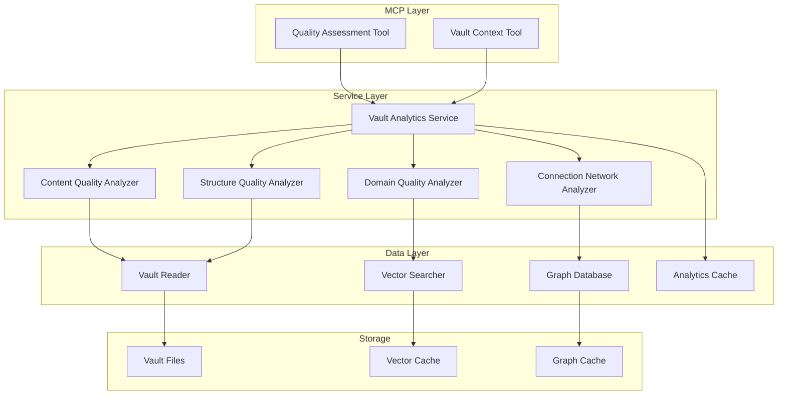

# Design Document

## Overview

The Quality Assessment Agents feature introduces AI-powered content analysis capabilities that automatically evaluate Obsidian vault content to provide intelligent quality scoring, improvement recommendations, and content optimization suggestions. This system integrates seamlessly with the existing Jarvis Assistant architecture to deliver actionable insights about knowledge base quality and organization.

The design follows the "Structured Data as Lingua Franca" principle, ensuring all analytical outputs are machine-readable JSON that enables complex AI reasoning while also providing human-readable summaries. The system is built on the existing analytics service architecture with enhanced quality assessment capabilities.

## Architecture

### High-Level Architecture



### Service Integration

The quality assessment system extends the existing `VaultAnalyticsService` with specialized quality analyzers:

- **Content Quality Analyzer**: Evaluates individual note quality across multiple dimensions
- **Structure Quality Analyzer**: Assesses organizational patterns and structural coherence
- **Connection Network Analyzer**: Analyzes link patterns and knowledge graph connectivity
- **Domain Quality Analyzer**: Evaluates quality distribution across knowledge domains

**Design Rationale**: This modular approach allows for independent development and testing of each quality dimension while maintaining a unified interface through the analytics service.

## Components and Interfaces

### Core Quality Assessment Interface

```python
class IQualityAssessmentService(Protocol):
    """Interface for quality assessment operations."""
    
    async def assess_note_quality(
        self, 
        note_path: str, 
        vault_name: str = "default"
    ) -> QualityScore:
        """Assess quality of individual note."""
        ...
    
    async def analyze_vault_quality(
        self, 
        vault_name: str = "default"
    ) -> QualityAnalysis:
        """Analyze vault-wide quality distribution."""
        ...
    
    async def get_quality_recommendations(
        self, 
        vault_name: str = "default",
        limit: int = 10
    ) -> List[ActionableRecommendation]:
        """Get prioritized improvement recommendations."""
        ...
    
    async def track_quality_changes(
        self, 
        note_path: str, 
        vault_name: str = "default"
    ) -> QualityTrend:
        """Track quality changes over time."""
        ...
```

### Quality Assessment Components

#### 1. Content Quality Analyzer

**Purpose**: Evaluates individual note quality across four key dimensions.

**Key Methods**:
- `assess_completeness()`: Analyzes content depth, word count, structural elements
- `assess_structure()`: Evaluates heading hierarchy, formatting, organization
- `assess_connections()`: Analyzes link density, backlink count, network position
- `assess_freshness()`: Evaluates recency, relevance, update frequency

**Design Decision**: Multi-dimensional scoring allows for targeted improvement suggestions rather than generic quality feedback.

#### 2. Structure Quality Analyzer

**Purpose**: Assesses organizational patterns and structural coherence at the vault level.

**Key Methods**:
- `detect_organization_patterns()`: Identifies PARA, Zettelkasten, or custom patterns
- `analyze_folder_hierarchy()`: Evaluates depth, distribution, naming conventions
- `assess_content_clustering()`: Identifies natural content groupings

#### 3. Connection Network Analyzer

**Purpose**: Analyzes link patterns and knowledge graph connectivity.

**Key Methods**:
- `calculate_connection_metrics()`: Hub scores, authority scores, density metrics
- `identify_isolated_notes()`: Finds notes with poor connectivity
- `suggest_bridge_opportunities()`: Recommends connections between domains

#### 4. Domain Quality Analyzer

**Purpose**: Evaluates quality distribution across knowledge domains.

**Key Methods**:
- `map_quality_by_domain()`: Quality distribution per knowledge area
- `identify_quality_gaps()`: Areas needing improvement
- `suggest_domain_improvements()`: Domain-specific recommendations

## Data Models

### Enhanced Quality Score Model

```python
@dataclass
class QualityScore:
    """Comprehensive quality assessment for a note."""
    overall_score: float  # 0.0-1.0
    level: QualityLevel   # 🌱🌿🌳🗺️ emoji indicators
    
    # Component scores (0.0-1.0 each)
    completeness: float    # Content depth and thoroughness
    structure: float      # Organization and formatting quality
    connections: float    # Links to other notes
    freshness: float     # Recency and relevance
    
    # Detailed metrics
    word_count: int
    link_count: int
    backlink_count: int
    last_modified: float
    headers_count: int
    list_items_count: int
    
    # Connection analysis
    connection_metrics: ConnectionMetrics
    
    # AI-powered insights
    suggestions: List[str]
    confidence: float
    estimated_improvement_time: str  # "5min", "30min", "2h"
    
    # Context
    domain: Optional[str] = None
    tags: List[str] = field(default_factory=list)
```

### Quality Assessment Configuration

```python
@dataclass
class QualityAssessmentConfig:
    """Configuration for quality assessment behavior."""
    
    # Scoring weights (must sum to 1.0)
    completeness_weight: float = 0.3
    structure_weight: float = 0.2
    connections_weight: float = 0.3
    freshness_weight: float = 0.2
    
    # Quality thresholds
    seedling_max: float = 0.25
    growing_max: float = 0.50
    mature_max: float = 0.75
    comprehensive_min: float = 0.75
    
    # Performance settings
    max_processing_time_seconds: int = 5  # Per note
    enable_real_time_assessment: bool = True
    cache_assessment_results: bool = True
    
    # Content analysis settings
    min_word_count_for_mature: int = 200
    min_links_for_good_connections: int = 3
    freshness_decay_days: int = 90
    
    # Domain-specific overrides
    domain_specific_rules: Dict[str, Dict[str, float]] = field(default_factory=dict)
```

## Error Handling

### Quality Assessment Errors

```python
class QualityAssessmentError(AnalyticsError):
    """Base class for quality assessment errors."""
    pass

class NoteNotFoundError(QualityAssessmentError):
    """Note could not be found or accessed."""
    pass

class InsufficientContentError(QualityAssessmentError):
    """Note has insufficient content for quality assessment."""
    pass

class AssessmentTimeoutError(QualityAssessmentError):
    """Quality assessment exceeded time limit."""
    pass
```

### Graceful Degradation Strategy

1. **Partial Assessment Mode**: If one quality dimension fails, others continue
2. **Cached Fallback**: Return stale but valid cached results with freshness indicators
3. **Progressive Enhancement**: Start with basic metrics, add advanced analysis as available
4. **Error Context**: Include error details in response for debugging

**Design Rationale**: Quality assessment should never completely fail - partial results are better than no results for user experience.

## Testing Strategy

### Unit Testing Approach

#### Quality Analyzer Testing
```python
class TestContentQualityAnalyzer:
    """Test suite for content quality analysis."""
    
    def test_completeness_scoring(self):
        """Test completeness dimension scoring."""
        # Test with various content lengths and structures
        
    def test_structure_scoring(self):
        """Test structure dimension scoring."""
        # Test with different heading hierarchies and formatting
        
    def test_connection_scoring(self):
        """Test connection dimension scoring."""
        # Test with various link patterns and densities
        
    def test_freshness_scoring(self):
        """Test freshness dimension scoring."""
        # Test with different modification times
```

#### Integration Testing
```python
class TestQualityAssessmentIntegration:
    """Integration tests for quality assessment system."""
    
    async def test_real_time_assessment(self):
        """Test real-time quality assessment on note changes."""
        # Simulate note modifications and verify assessment updates
        
    async def test_vault_wide_analysis(self):
        """Test comprehensive vault quality analysis."""
        # Test with realistic vault structures and content
        
    async def test_performance_under_load(self):
        """Test system performance with large vaults."""
        # Verify response times meet requirements
```

### Test Data Strategy

#### Realistic Test Vaults
- **Small Vault**: 50 notes, mixed quality levels
- **Medium Vault**: 500 notes, realistic organization patterns
- **Large Vault**: 2000+ notes, complex domain structure
- **Edge Case Vault**: Empty notes, broken links, unusual structures

#### Quality Assessment Test Cases
- Notes with different quality levels (🌱🌿🌳🗺️)
- Various content types (meeting notes, research, documentation)
- Different organizational patterns (PARA, Zettelkasten, custom)
- Connection patterns (isolated, hub, authority notes)

## Performance Considerations

### Real-Time Assessment Requirements

**Requirement 4** specifies real-time quality feedback with 5-second response times for individual notes.

#### Performance Optimization Strategy

1. **Incremental Analysis**: Only re-analyze changed content sections
2. **Caching Strategy**: Multi-level caching for computed metrics
3. **Async Processing**: Non-blocking assessment operations
4. **Resource Limits**: Memory and CPU usage constraints

```python
class RealTimeQualityAssessor:
    """Optimized quality assessor for real-time feedback."""
    
    def __init__(self):
        self.cache = LRUCache(maxsize=1000)  # Recent assessments
        self.processing_queue = asyncio.Queue(maxsize=100)
        
    async def assess_note_incremental(
        self, 
        note_path: str, 
        content_changes: List[ContentChange]
    ) -> QualityScore:
        """Perform incremental quality assessment."""
        # Only re-analyze changed sections
        # Use cached results for unchanged content
        # Return updated quality score
```

### Vault-Wide Analysis Performance

For large vaults (>5000 notes), implement sampling and progressive analysis:

1. **Statistical Sampling**: Analyze representative subset for quick insights
2. **Progressive Enhancement**: Start with basic metrics, add detail over time
3. **Background Processing**: Continue analysis after initial response
4. **Result Streaming**: Provide partial results as analysis progresses

## Configuration and Customization

### Configurable Quality Criteria

**Requirement 5** specifies configurable assessment criteria for different organizational standards.

#### Configuration Schema

```yaml
quality_assessment:
  enabled: true
  
  # Global scoring weights
  scoring_weights:
    completeness: 0.3
    structure: 0.2
    connections: 0.3
    freshness: 0.2
  
  # Quality thresholds
  thresholds:
    seedling_max: 0.25
    growing_max: 0.50
    mature_max: 0.75
    comprehensive_min: 0.75
  
  # Domain-specific rules
  domain_rules:
    "meeting-notes":
      completeness: 0.2  # Less emphasis on completeness
      freshness: 0.4     # More emphasis on freshness
    "research":
      completeness: 0.4  # More emphasis on completeness
      connections: 0.4   # More emphasis on connections
  
  # Performance settings
  performance:
    max_processing_time_seconds: 5
    enable_real_time_assessment: true
    cache_results: true
    sample_large_vaults: true
    sample_threshold: 5000
```

#### Custom Assessment Rules

```python
class CustomQualityRule:
    """Custom quality assessment rule."""
    
    def __init__(
        self,
        name: str,
        condition: Callable[[Dict[str, Any]], bool],
        score_modifier: Callable[[float], float],
        suggestion: str
    ):
        self.name = name
        self.condition = condition
        self.score_modifier = score_modifier
        self.suggestion = suggestion
    
    def applies_to(self, note_metadata: Dict[str, Any]) -> bool:
        """Check if rule applies to note."""
        return self.condition(note_metadata)
    
    def modify_score(self, base_score: float) -> float:
        """Modify quality score based on rule."""
        return self.score_modifier(base_score)
```

## Integration Points

### MCP Tool Integration

The quality assessment system integrates with the MCP layer through two primary tools:

#### 1. Assess Quality Tool (`assess_quality`)

**Purpose**: Provides both individual note and vault-wide quality assessment.

**Key Features**:
- Dual scope operation (note/vault)
- Multiple output formats (markdown/JSON)
- Configurable detail levels
- Performance-optimized responses

#### 2. Vault Context Tool Enhancement

**Purpose**: Includes quality metrics in comprehensive vault context.

**Integration**: Quality distribution and recommendations are embedded in vault context responses for AI reasoning.

### Event-Driven Updates

```python
class QualityAssessmentEventHandler:
    """Handle file system events for quality assessment updates."""
    
    async def on_file_modified(self, file_path: str):
        """Handle file modification events."""
        # Trigger incremental quality assessment
        # Update cached results
        # Notify subscribers of quality changes
        
    async def on_file_created(self, file_path: str):
        """Handle new file creation."""
        # Perform initial quality assessment
        # Update vault-wide statistics
        
    async def on_file_deleted(self, file_path: str):
        """Handle file deletion."""
        # Remove from quality cache
        # Update vault-wide statistics
```

## Migration and Versioning

### Data Model Evolution

Quality assessment data models will evolve over time. The system includes migration utilities:

```python
class QualityDataMigrator:
    """Migrate quality assessment data between versions."""
    
    def migrate_v1_to_v2(self, old_data: Dict[str, Any]) -> QualityScore:
        """Migrate quality score from v1 to v2 format."""
        # Handle schema changes
        # Preserve existing assessments
        # Update to new format
```

### Backward Compatibility

- Maintain API compatibility for at least 2 major versions
- Provide feature detection for clients
- Support multiple response formats during transitions
- Document breaking changes and migration paths

## Security and Privacy

### Data Privacy

All quality assessment processing occurs locally:
- No content sent to external services
- All analysis performed on user's machine
- Results stored locally in encrypted cache
- User controls all data retention policies

### Access Control

Quality assessment respects vault access permissions:
- Only analyze accessible files
- Respect file system permissions
- Honor vault-specific access controls
- Provide audit logging for assessment operations

## Monitoring and Observability

### Quality Assessment Metrics

```python
# Performance metrics
quality_assessment_duration = Histogram(
    'jarvis_quality_assessment_duration_seconds',
    'Time spent on quality assessment',
    ['scope', 'vault_name']
)

# Quality distribution metrics
quality_level_distribution = Gauge(
    'jarvis_quality_level_count',
    'Count of notes by quality level',
    ['level', 'vault_name']
)

# Cache performance
quality_cache_hit_ratio = Gauge(
    'jarvis_quality_cache_hit_ratio',
    'Quality assessment cache hit ratio'
)
```

### Health Checks

```python
async def quality_assessment_health_check() -> Dict[str, Any]:
    """Check quality assessment system health."""
    return {
        "service_available": True,
        "cache_operational": cache.is_healthy(),
        "average_response_time_ms": get_average_response_time(),
        "error_rate_percent": get_error_rate(),
        "last_successful_assessment": get_last_success_timestamp()
    }
```

This design provides a comprehensive, scalable, and user-focused quality assessment system that integrates seamlessly with the existing Jarvis Assistant architecture while meeting all specified requirements for intelligent content analysis and improvement recommendations.