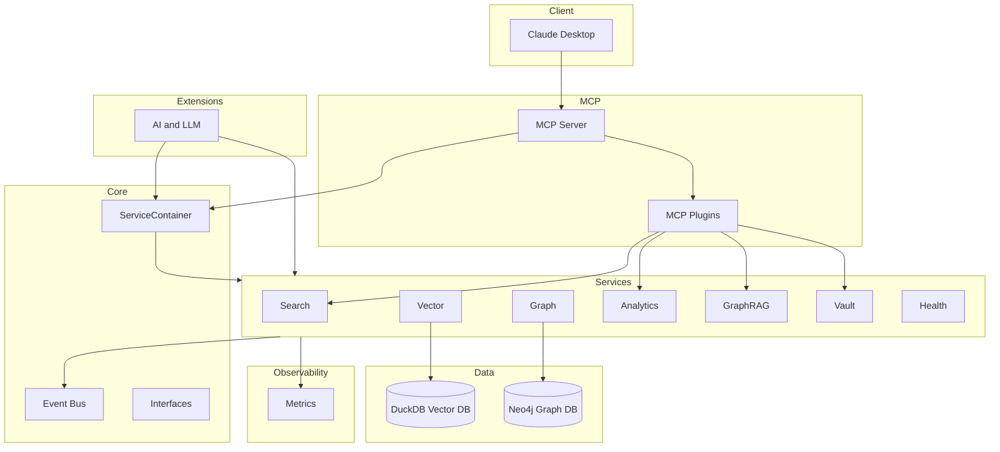

# Jarvis Assistant — Architecture and Restructuring Plan

Version: 2025-09-13 • Owner: Core Team • Status: Active

This document defines the target architecture, clarifies module boundaries, and provides a concrete migration plan. It supersedes prior guidance where conflicting.

## Key Decisions (authoritative)

- Single canonical service layer under `jarvis/services`.
  - Move Analytics and GraphRAG implementations from `features/*` into `services/*`.
  - Keep temporary shims in `features/*` that re-export from `services/*` with deprecation warnings.
- Database scope: only DuckDB (vector) and Neo4j (graph) for now.
  - Remove generic database adapters (e.g., Chroma, Pinecone) and adapter registration.
  - Keep system design adaptable for future backends, but do not ship or maintain concrete adapters at this time.
- Observability: consolidate metrics (and future logging/tracing) under `jarvis/observability`.
  - Rename `monitoring/` → `observability/` and keep `metrics.py` there.
  - Add centralized logging configuration and a tracing stub when needed.
- Plugins: clarify and separate responsibilities.
  - `extensions/` remains for optional runtime extensions (e.g., LLM providers), integrating with core/services via DI.
  - `mcp/plugins/` continues to house MCP tool plugins for Claude Desktop.
  - Do not duplicate “tools” folders elsewhere; remove empty `jarvis/tools` and `extensions/ai/tools`.
- Documentation: add README.md to major subfolders to explain purpose, boundaries, and dependency direction.

## Target Structure (authoritative)

```
src/jarvis/
  core/                # DI container, events, service registry, interfaces
  database/            # Simple factory/config for current backends (duckdb, neo4j)
  extensions/          # Optional runtime extensions (e.g., ai/llm); depends on services
  mcp/                 # MCP server, plugins, discovery/registry, schemas, structured outputs
    plugins/tools/     # All MCP tool implementations
  models/              # Shared domain models
  observability/       # metrics.py (+ future logging_config.py, tracing.py)
  services/            # Canonical service implementations
    analytics/         # moved from features/analytics
    graphrag/          # moved from features/graphrag
    vector/            # vector database, encoder, indexer, searcher, worker
    graph/             # graph database integrations
    search/            # cross-cutting search and ranking logic
    vault/             # vault reader/parser
    health.py
    database_initializer.py
  utils/               # config, errors, helpers

# Temporary compatibility (to be removed after deprecation period)
  features/            # shims re-exporting services/* with warnings
```

### Folder Role Table

| Path | Purpose | Notes |
|------|---------|-------|
| `core/` | DI, events, interfaces, registry | No service implementations here |
| `services/` | All service implementations | Depends on `core`, `database`, `models`, `utils`, `observability` |
| `database/` | Configuration + known backends (duckdb, neo4j) | Remove generic adapters/registrations |
| `observability/` | Metrics (and future logging/tracing) | Move `monitoring/metrics.py` here |
| `extensions/` | Optional runtime extensions | Should depend on `services`; no circular deps |
| `mcp/` | MCP server + plugin system | MCP tools in `mcp/plugins/tools` only |
| `models/` | Data models | Shared across layers |
| `utils/` | Config, errors, helpers | Cross-cutting utilities |
| `features/` | Deprecated import shims | Re-export from `services/*` + `warnings.warn` |

## Architecture (Mermaid)



## Migration Plan (overwrite of previous)

Phases are cumulative; each includes verification and docs updates. Backwards compatibility maintained via shims until removal in Phase 3.

### Phase 1 — Structure and Documentation (no behavior change)
- Add README.md files to: `services/`, `extensions/`, `mcp/plugins/`, `observability/` (or `monitoring/` if rename not yet applied) describing purpose and dependency rules.
- Remove confusing/empty folders: `src/jarvis/tools/`, `src/jarvis/extensions/ai/tools/` (or replace with README that points to `mcp/plugins/tools`).
- Rename `monitoring/` → `observability/` and move `metrics.py` accordingly; update imports in code to `jarvis.observability.metrics`.
- Update PLAN.md (this document) and `README.md` to reflect new structure and decisions.

Checklist:
- [ ] Folder READMEs added
- [ ] Empty tools folders removed or documented
- [ ] monitoring → observability rename done, imports updated
- [ ] Top-level docs updated

### Phase 2 — Canonical Services
- Move implementations from `features/analytics` and `features/graphrag` into `services/analytics` and `services/graphrag` respectively (if any code still lives in `features/*`).
- Keep `features/*` as import shims that re-export from `services/*` and `warnings.warn("Deprecated: import from jarvis.services.*")`.
- Sweep the repo and update all internal imports to `jarvis.services.*`.

Checklist:
- [ ] Implementations live under `services/*`
- [ ] Shims in `features/*` with deprecation warnings
- [ ] `rg` shows no internal imports from `features.*`

### Phase 3 — Database Simplification
- Remove generic database adapters and registrations for backends we don’t ship (Chroma, Pinecone).
- Simplify `database/factory.py` to only recognize `duckdb` for vectors and `neo4j` for graph; remove dynamic backend registration pattern and adapter discovery.
- Keep configuration classes minimal and focused on current backends; document how future adapters would be added.

Checklist:
- [ ] Delete `jarvis/database/adapters/*`
- [ ] Slim `DatabaseFactory` to duckdb+neo4j only
- [ ] Container factories updated; tests/smoke paths verified

### Phase 4 — Observability Expansion (optional)
- Add `logging_config.py` with a single `configure_root_logging(settings)` used by entry points.
- Add a `tracing.py` stub to stage future tracing.

Checklist:
- [ ] Centralized logging
- [ ] Tracing stub

## Step-by-Step Instructions

1) Create subfolder READMEs
- `services/README.md`: role, dependency direction, module index
- `extensions/README.md`: how extensions integrate, DI guidance
- `mcp/plugins/README.md`: plugin lifecycle, tool schema, DI usage
- `observability/README.md`: metrics now, logging/tracing later

2) Rename monitoring → observability
- Move `src/jarvis/monitoring/metrics.py` → `src/jarvis/observability/metrics.py`.
- Update imports: `from jarvis.monitoring.metrics import ...` → `from jarvis.observability.metrics import ...`.

3) Clean up tools folders
- Remove `src/jarvis/tools/` (unused) and `src/jarvis/extensions/ai/tools/` (empty) or replace with README pointing to `mcp/plugins/tools`.

4) Consolidate features into services
- Ensure canonical code under `services/*`.
- Keep `features/*` shims with `warnings.warn` and re-exports to preserve backward compatibility.

5) Database simplification
- Delete `database/adapters/` and remove adapter registration from `database/factory.py`.
- Keep only duckdb (vector) and neo4j (graph) creation paths.

6) Docs & diagrams
- Update `README.md` architecture section to match this plan.
- Keep the Mermaid diagram above as the reference architecture.

## Compatibility & Risk

- Imports from `features.*` continue to work during deprecation window via shims with warnings.
- MCP tools unaffected; they consume services via DI.
- Removing adapters is safe given we don’t ship those backends; document this in release notes.
- The `monitoring` → `observability` rename requires import updates; perform in one PR to avoid breakage.

## Current Status Snapshot

- DI container default path: done
- MCP plugin registry integration: done
- Structured outputs in MCP: in place and growing
- Analytics event-driven invalidation: wired; continue to refine
- GraphRAG MVP: implemented; iterate ranking/cluster quality
- Pydantic v2: largely done; sweep remaining warnings

## References

- DI container: `src/jarvis/core/container.py`
- MCP server and plugins: `src/jarvis/mcp/`
- Services (canonical): `src/jarvis/services/`
- Observability (metrics): `src/jarvis/observability/metrics.py` (after rename)
- Database factory: `src/jarvis/database/factory.py`

End of document.
