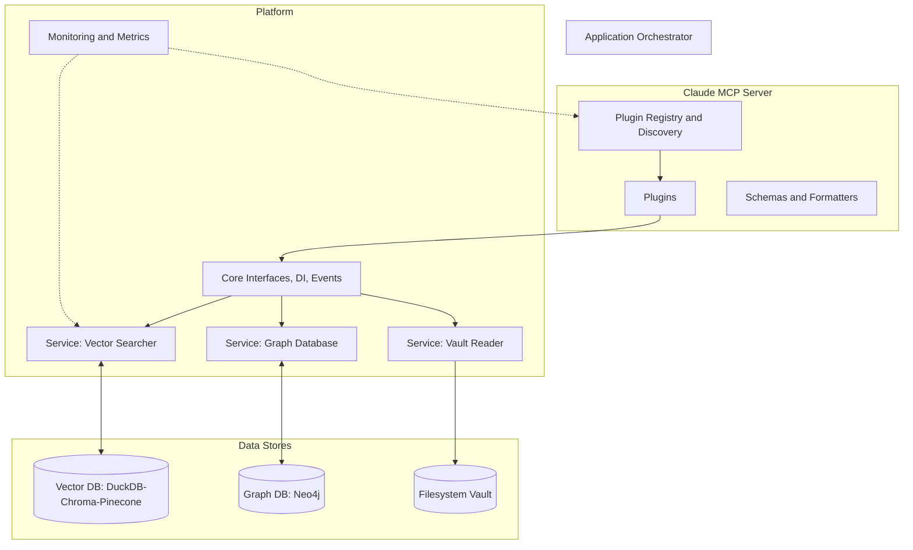
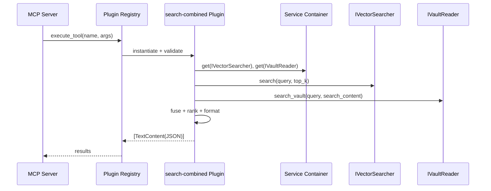

# Jarvis Assistant — Repository Architecture & Cleanup Analysis

This analysis reviews the current layout and proposes ways to make the codebase cleaner, more modular, and easier to maintain. It focuses on folder structure, boundaries between subsystems (MCP, services, analytics/dataset-generation), configuration, and tests.

## High‑Level Folder Structure (condensed)

```
.
├── ai-docs/                     # AI-facing docs (command maps, etc.)
├── config/                      # Configuration files/templates
├── docs/                        # User/product docs
├── resources/                   # Test assets and tests (now slimmed)
├── src/
│  └── jarvis/
│     ├── core/                 # Interfaces, containers, events, service registry
│     ├── database/             # DB factories/adapters (vector/graph backends)
│     ├── extensions/           # Optional/experimental extensions (AI, etc.)
│     ├── mcp/                  # MCP server + plugins + schemas + formatters
│     ├── models/               # Pydantic models (SearchResult etc.)
│     ├── monitoring/           # Metrics/telemetry
│     ├── services/             # Vault, vector, graph, analytics services
│     │  ├── vector/
│     │  ├── graph/
│     │  ├── vault/
│     │  ├── search/
│     │  ├── analytics/
│     │  └── graphrag/
│     ├── tools/                # (removed) dataset generation tooling
│     ├── utils/                # Config, errors, helpers
├── Dockerfile / docker-compose.yaml
├── pyproject.toml
└── README.md / PLAN.md / Refactoring.md
```

## Current Architecture (Mermaid)



## Plugin Execution Path (Mermaid)



## Observations & Opportunities

### 1) MCP-first, but legacy server handlers still exist
- Observation: Modern plugin design (mcp/plugins/tools, schemas, formatters) is clean. Some legacy files still exist (e.g., `server_original_with_handlers.py`).
- Recommendation: Move all legacy server handlers to an `archive/` folder or remove after confirming parity with the plugin system.

### 2) Dataset generation is large and tangential
- Observation: `tools/dataset_generation` is a large subsystem (generators, analyzers, filters) that dominates complexity but isn’t essential for day‑to‑day MCP usage.
- Recommendation: Extract into a separate optional package (e.g., `jarvis-datasets`) or move under `extensions/` and guard with extras (`pip install jarvis-assistant[datasets]`). This reduces core footprint and speeds installs/tests.

### 3) Clearer separation of “core platform” vs “features”
- Observation: `services/analytics`, `services/graphrag`, and `extensions/ai` overlap “feature” territory while `core/`, `mcp/`, `services/vector|vault|graph` are platform.
- Recommendation: Group by layers:
  - platform/: core interfaces, DI, registry, MCP infra, base services
  - features/: analytics, graphrag, quality assessment, domain analysis
  - adapters/: database adapters (vector/graph backends)
  - ui/: future web API (no CLI required)

### 4) Configuration (Pydantic v2 migration)
- Observation: Deprecation warnings (json_encoders, class-based config) show in test runs.
- Recommendation:
  - Migrate `JarvisSettings` to Pydantic v2 idioms (`ConfigDict`, `field_json_schema_extra`), and reduce runtime log noise on settings creation.
  - Optional extras can remain for heavy non-core features (e.g., datasets, AI); Graph stays core.

### 5) Plugin registry + schema integration
- Observation: Schema tooling looks solid, but a couple plugins fail schema validation due to `UtilitySchemaConfig` arguments.
- Recommendation: Fix schema template mismatch; add a smoke test for registry discover+execute (with mocks) to ensure schemas and inputs stay aligned.

### 6) Monitoring & logging consistency
- Observation: Structured JSON logger deprecation warnings and chatty startup logs (in Settings init) increase noise.
- Recommendation: Standardize logging levels and upgrade the logger import path (`pythonjsonlogger.json`). Use a single logging config per environment (dev/test/prod).

### 7) Main CLI organization
- Observation: `main.py` is large and mixes CLI concerns with orchestration.
- Recommendation: Extract to `jarvis/cli/` with commands grouped by domain (search, graph, admin). Keep CLI thin; call service/application layer functions.

### 8) Tests: slim, value-focused suite
- Observation: Tests are now narrowly focused on plugin behavior, formatters, and cache – good direction.
- Recommendation: Maintain this philosophy. Add one or two smoke tests:
  - registry loads builtin plugins and schema validation passes
  - plugin execute returns JSON shaped payloads (already covered for key tools)

## Module Inventory & Suggestions

| Area | Key Paths | Role | Risks/Notes | Suggested Actions |
|------|-----------|------|-------------|-------------------|
| MCP Core | `src/jarvis/mcp/` | Server, plugin registry, discovery, schemas, formatters | Some legacy server code remains; two utility plugins show schema errors | Remove/Archive legacy handlers; fix `UtilitySchemaConfig` mismatch; add small registry smoke test |
| Services – Vector/Vault/Graph | `src/jarvis/services/{vector,vault,graph}` | Core service impls behind interfaces | Heavy DB deps; graph is essential | Keep Graph as core; provide graceful degradation (DISABLED/UNAVAILABLE) and clear errors |
| Analytics/GraphRAG | `src/jarvis/services/{analytics,graphrag}` | High-level analysis features | Adds complexity and deps | Keep under services (canonical); expose via optional config flags if needed |
| Dataset Generation | — | Offline dataset tools | Not core to MCP | If needed, host in `extensions/` as an optional package |
| Core/DI/Interfaces | `src/jarvis/core` | Interfaces, container, events | Good separation | Add short dev guide: how to bind services and extend |
| Observability | `src/jarvis/observability` | Metrics infra | Logging/deprecation noise | Normalize logging config; add env-based level switches |
| Config/Utils | `src/jarvis/utils` | Settings, error types, helpers | Pydantic v2 deprecations; noisy Settings init logs | Migrate to v2 idioms; reduce init logging; add config reference doc |
| (No CLI) | — | — | MCP is primary interface | Remove CLI; keep only internal scripts if needed |

## Suggested Target Layout (proposal)

```
src/jarvis/
├── platform/
│  ├── core/            # interfaces, DI, events
│  ├── mcp/             # server, plugins infra, schemas/formatters
│  ├── services/        # vector, vault, graph (base)
│  └── monitoring/
├── features/
│  ├── analytics/
│  └── graphrag/
├── adapters/
│  ├── vector_backends/
│  └── graph_backends/
├── (no-cli)
├── utils/
└── models/
```

## Shortlist of High‑Impact, Low‑Risk Improvements

1. Fix schema mismatch for utility plugins and add one registry smoke test.
2. Migrate `JarvisSettings` to Pydantic v2 idioms and reduce init logging.
3. Keep Graph DB as a core service; implement graceful degradation and robust errors.
4. Move dataset generation under `extensions/` (or separate package) and guard with extras.
5. Consolidate (or archive) legacy MCP server code to avoid confusion with the plugin architecture.
6. Normalize logging (switch to non‑deprecated imports; set per‑env levels) and structure metrics in one place.

## Documentation Ideas

- Architecture overview (include the Mermaid diagrams above) and data flow for each key plugin.
- “How to build a new plugin” guide with a minimal template and testing strategy.
- Configuration cheat‑sheet (env vars, defaults, and examples) and extras matrix.
- Operational runbooks for vector DB migration, graph connectivity, and vault indexing.

---

This document is intentionally implementation‑agnostic and focuses on structure and clarity. The items above can be sequenced to deliver incremental wins without risky rewrites.
