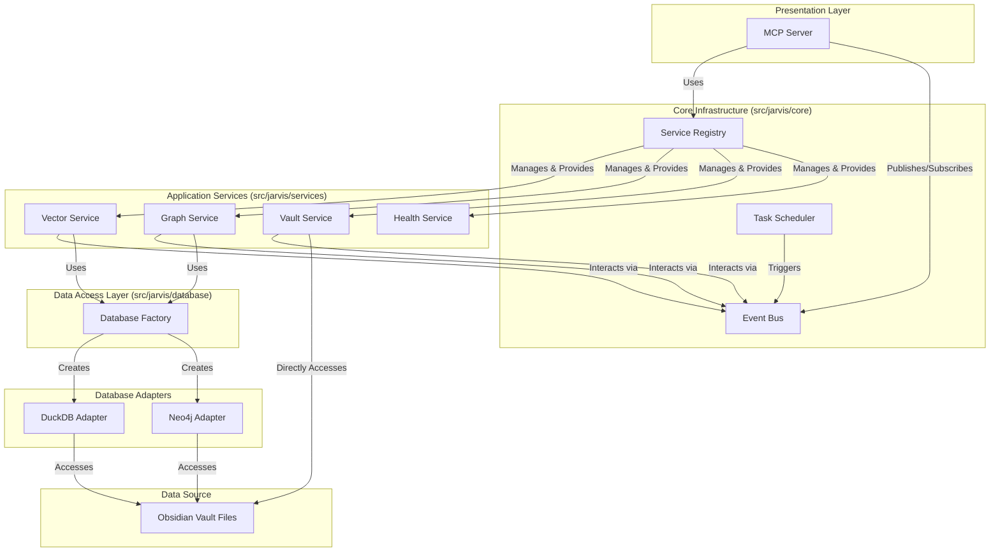

# System Architecture

*Version: 2.0 | Date: 2025-07-10*

## Architecture Overview

Jarvis Assistant has evolved to a highly modular, event-driven architecture. This design enhances scalability, maintainability, and flexibility by decoupling core components through a service-oriented approach and established design patterns.

## Key Architectural Patterns

The architecture relies on several key design patterns to achieve its goals of modularity and decoupling:

*   **Dependency Injection & Service Registry**: Instead of creating dependencies directly, services are "injected" at runtime. The **Service Registry** acts as a centralized container that manages the lifecycle and provides instances of all application services, promoting loose coupling.
*   **Event-Driven Architecture**: The **Event Bus** allows services to communicate asynchronously by publishing and subscribing to events. This means services don't need direct knowledge of each other, making the system highly extensible. For example, the indexing service can publish an `IndexingComplete` event, which other services can listen for to clear caches or update their state.
*   **Factory Pattern**: The **Database Factory** abstracts the creation of database connections. Services request a database connection from the factory without needing to know the specific implementation details (e.g., DuckDB or Neo4j).
*   **Adapter Pattern**: The **Database Adapters** provide a consistent interface for different database backends. This allows the application to switch between or support multiple databases with minimal changes to the service layer.

## Component Responsibilities

### MCP Server Layer
*   **Purpose**: Provides a standardized interface for AI tools via the Model Context Protocol. It uses the **Service Registry** to access the necessary application services to fulfill requests.

### Core Infrastructure
*   **Service Registry**: Manages the lifecycle of all application services.
*   **Event Bus**: A central messaging system for asynchronous communication between services.
*   **Task Scheduler**: Manages background tasks like indexing.

### Application Services
*   **Vector Service**: Manages semantic search.
*   **Graph Service**: Handles relationship discovery.
*   **Vault Service**: Provides file system operations.
*   **Health Service**: Provides health checks for all core services.

### Database Layer
*   **Database Factory**: Creates database connections.
*   **DuckDB Adapter**: Provides access to the DuckDB vector store.
*   **Neo4j Adapter**: Provides access to the Neo4j graph database. The system gracefully degrades if Neo4j is unavailable.

### Data Layer
*   **Obsidian Vault**: The source of truth for all knowledge content.

---