# DEPRECATION NOTICE

This page is superseded by the consolidated architecture docs:
- docs/architecture/arc42.md (primary)
- docs/architecture/architecture-map.md (visual map)

# System Architecture

*Version: 3.0 | Date: 2024-12-15*

## Architecture Overview

Jarvis Assistant implements a **production-ready, modular architecture** with comprehensive dependency injection, robust database initialization, and graceful service degradation. The system is designed for reliability, testability, and maintainability while supporting both minimal and full-featured deployments.

```mermaid
graph TD
    subgraph "Client Layer"
        CD[Claude Desktop<br/>🤖 AI Interface]
    end

    subgraph "Protocol Layer"
        MCP[MCP Server<br/>📡 JSON-RPC Handler]
    end

    subgraph "Core Infrastructure (src/jarvis/core)"
        SC[Service Container<br/>🏗️ Dependency Injection]
        DI[Database Initializer<br/>🔧 Database Management]
        INT[Service Interfaces<br/>📋 Contract Definitions]
    end

    subgraph "Application Services (src/jarvis/services)"
        VS[Vector Service<br/>🧠 Semantic Search]
        GS[Graph Service<br/>🕸️ Relationships]
        VaultS[Vault Service<br/>📁 File Operations]
        HS[Health Service<br/>💊 Monitoring]
    end

    subgraph "Database Layer"
        VDB[(Vector Database<br/>📊 DuckDB)]
        GDB[(Graph Database<br/>🌐 Neo4j)]
        FS[(File System<br/>📝 Obsidian Vault)]
    end

    CD -->|MCP Protocol| MCP
    MCP -->|Service Requests| SC
    
    SC -->|Manages Lifecycle| VS
    SC -->|Manages Lifecycle| GS
    SC -->|Manages Lifecycle| VaultS
    SC -->|Manages Lifecycle| HS
    
    SC -.->|Implements| INT
    VS -.->|Implements| INT
    GS -.->|Implements| INT
    VaultS -.->|Implements| INT
    HS -.->|Implements| INT
    
    DI -->|Ensures Ready| VDB
    DI -->|Ensures Ready| GDB
    
    VS -->|Queries| VDB
    GS -->|Queries| GDB
    VaultS -->|Reads| FS
    
    classDef client fill:#e3f2fd,stroke:#1976d2,stroke-width:2px
    classDef protocol fill:#fff3e0,stroke:#f57c00,stroke-width:2px
    classDef infrastructure fill:#e8eaf6,stroke:#3f51b5,stroke-width:2px
    classDef service fill:#f3e5f5,stroke:#7b1fa2,stroke-width:2px
    classDef database fill:#e8f5e8,stroke:#388e3c,stroke-width:2px
    
    class CD client
    class MCP protocol
    class SC,DI,INT infrastructure
    class VS,GS,VaultS,HS service
    class VDB,GDB,FS database
```

## Key Architectural Patterns

The architecture relies on several key design patterns to achieve its goals of modularity and decoupling:

*   **Dependency Injection & Service Registry**: Instead of creating dependencies directly, services are "injected" at runtime. The **Service Registry** acts as a centralized container that manages the lifecycle and provides instances of all application services, promoting loose coupling.
*   **Event-Driven Architecture**: The **Event Bus** allows services to communicate asynchronously by publishing and subscribing to events. This means services don't need direct knowledge of each other, making the system highly extensible. For example, the indexing service can publish an `IndexingComplete` event, which other services can listen for to clear caches or update their state.
*   **Factory Pattern**: The **Database Factory** abstracts the creation of database connections. Services request a database connection from the factory without needing to know the specific implementation details (e.g., DuckDB or Neo4j).
*   **Adapter Pattern**: The **Database Adapters** provide a consistent interface for different database backends. This allows the application to switch between or support multiple databases with minimal changes to the service layer.

## Component Responsibilities

### Protocol Layer
*   **MCP Server** (`src/jarvis/mcp/server.py`): Implements Model Context Protocol for AI tool integration
    - Routes tool requests to appropriate services via Service Container
    - Handles parameter validation and response formatting
    - Manages caching and performance metrics
    - Supports both traditional and container-aware contexts

### Core Infrastructure Layer
*   **Service Container** (`src/jarvis/core/container.py`): Centralized dependency injection system
    - Manages service lifecycles and dependencies
    - Provides automatic dependency resolution with circular dependency detection
    - Supports singleton pattern for expensive services (databases, encoders)
    - Enables easy testing through mock service injection

*   **Database Initializer** (`src/jarvis/services/database_initializer.py`): Robust database management
    - Ensures databases exist and are properly initialized before system startup
    - Handles missing files, corruption, and permission issues with specific recovery strategies
    - Maintains schema versioning and metadata for future migrations
    - Provides comprehensive error reporting with actionable guidance

*   **Service Interfaces** (`src/jarvis/core/interfaces.py`): Contract definitions for all services
    - Defines abstract interfaces for loose coupling (IVectorDatabase, IGraphDatabase, etc.)
    - Enables runtime service swapping and plugin architecture
    - Facilitates comprehensive unit testing with mock implementations

### Application Services Layer
*   **Vector Service** (`src/jarvis/services/vector/`): Semantic search capabilities
    - **Database**: DuckDB vector storage with similarity search
    - **Encoder**: Text-to-vector conversion using sentence-transformers
    - **Searcher**: High-level search interface with caching and ranking
    - **Indexer**: Batch processing for vault content indexing

*   **Graph Service** (`src/jarvis/services/graph/`): Knowledge relationship discovery
    - **Database**: Neo4j graph storage with Cypher query support
    - **Indexer**: Relationship extraction from markdown links and references
    - **Parser**: Content analysis for automatic relationship detection
    - **Graceful Degradation**: Falls back to semantic search when Neo4j unavailable

*   **Vault Service** (`src/jarvis/services/vault/`): File system operations
    - **Reader**: Markdown file parsing with frontmatter support
    - **Parser**: Content extraction and metadata generation
    - **Search**: Traditional text-based search with regex support

*   **Health Service** (`src/jarvis/services/health.py`): System monitoring
    - Checks database connectivity and service availability
    - Provides detailed health reports for troubleshooting
    - Integrates with metrics collection for performance monitoring

### Database Layer
*   **Vector Database** (DuckDB): Embedded vector storage
    - Stores document embeddings with metadata
    - Provides fast similarity search with configurable thresholds
    - Supports multiple vaults with isolation
    - Automatic schema management and versioning

*   **Graph Database** (Neo4j): Optional relationship storage
    - Models notes, headings, and blocks as nodes
    - Captures links, references, and semantic relationships
    - Enables multi-hop traversal for knowledge discovery
    - Graceful degradation when unavailable

### Data Layer
*   **Obsidian Vault**: Source of truth for knowledge content
    - Markdown files with frontmatter metadata
    - Wiki-style links and references
    - Tag-based organization
    - File system watching for real-time updates

---
