# DEPRECATION NOTICE

This page is superseded by the consolidated architecture docs:
- docs/architecture/arc42.md (primary)
- docs/architecture/architecture-map.md (visual map)

# System Architecture

*Version: 4.0 | Date: 2025-01-08*

## Architecture Overview

Jarvis Assistant implements a **production-ready, service-oriented architecture** with comprehensive dependency injection, robust database initialization, and graceful service degradation. The system is designed for reliability, testability, and maintainability while supporting both minimal and full-featured deployments.

```mermaid
graph TB
    subgraph "Client Layer"
        CD[Claude Desktop<br/>🤖 AI Interface]
    end

    subgraph "Protocol Layer"
        MCP[MCP Server<br/>📡 JSON-RPC Handler]
        MCPTools[MCP Tools<br/>🔧 8 Production Tools]
    end

    subgraph "Core Infrastructure"
        SC[Service Container<br/>🏗️ Dependency Injection]
        DI[Database Initializer<br/>🔧 Database Management]
        INT[Service Interfaces<br/>📋 Contract Definitions]
        EB[Event Bus<br/>📡 Service Communication]
    end

    subgraph "Application Services"
        VS[Vector Service<br/>🧠 Semantic Search]
        GS[Graph Service<br/>🕸️ Relationships]
        VaultS[Vault Service<br/>📁 File Operations]
        HS[Health Service<br/>💊 Monitoring]
        RS[Ranking Service<br/>📊 Result Scoring]
    end

    subgraph "Database Layer"
        VDB[(Vector Database<br/>📊 DuckDB)]
        GDB[(Graph Database<br/>🌐 Neo4j)]
        FS[(File System<br/>📝 Obsidian Vault)]
    end

    CD -->|MCP Protocol| MCP
    MCP -->|Tool Requests| MCPTools
    MCPTools -->|Service Calls| SC
    
    SC -->|Manages Lifecycle| VS
    SC -->|Manages Lifecycle| GS
    SC -->|Manages Lifecycle| VaultS
    SC -->|Manages Lifecycle| HS
    SC -->|Manages Lifecycle| RS
    
    SC -.->|Implements| INT
    VS -.->|Implements| INT
    GS -.->|Implements| INT
    VaultS -.->|Implements| INT
    HS -.->|Implements| INT
    
    DI -->|Ensures Ready| VDB
    DI -->|Ensures Ready| GDB
    DI -->|Initializes Schema| VDB
    
    VS -->|Queries| VDB
    GS -->|Queries| GDB
    VaultS -->|Reads| FS
    
    EB -->|Events| VS
    EB -->|Events| GS
    EB -->|Events| VaultS
    
    classDef client fill:#e3f2fd,stroke:#1976d2,stroke-width:2px
    classDef protocol fill:#fff3e0,stroke:#f57c00,stroke-width:2px
    classDef infrastructure fill:#e8eaf6,stroke:#3f51b5,stroke-width:2px
    classDef service fill:#f3e5f5,stroke:#7b1fa2,stroke-width:2px
    classDef database fill:#e8f5e8,stroke:#388e3c,stroke-width:2px
    
    class CD client
    class MCP,MCPTools protocol
    class SC,DI,INT,EB infrastructure
    class VS,GS,VaultS,HS,RS service
    class VDB,GDB,FS database
```



## Key Architectural Patterns

### 1. Service-Oriented Architecture (SOA)
The system is built around discrete, loosely-coupled services that communicate through well-defined interfaces:

- **Service Container**: Manages service lifecycles and dependencies
- **Interface-Based Design**: All services implement contracts (IVectorDatabase, IGraphDatabase, etc.)
- **Dependency Injection**: Services receive dependencies automatically
- **Event-Driven Communication**: Services communicate via event bus for loose coupling

### 2. Database Initialization Pattern
The **DatabaseInitializer** provides robust database management:

```python
# Actual usage in MCP server startup
initializer = DatabaseInitializer(database_path, settings)
if not initializer.ensure_database_exists():
    logger.error("Database initialization failed")
    raise ServiceUnavailableError("Cannot start MCP server")
```

**Key Features**:
- **Automatic Creation**: Creates missing database files with proper schema
- **Health Validation**: Verifies database integrity and schema version
- **Corruption Recovery**: Backs up corrupted databases and recreates them
- **Permission Handling**: Provides actionable guidance for access issues

### 3. Graceful Degradation
Services are designed to work independently with fallback mechanisms:

- **Graph Search**: Falls back to semantic search if Neo4j unavailable
- **Metrics Collection**: System works without metrics if disabled
- **Cache Layers**: Multiple cache levels with fallback to source data

## Component Responsibilities

### Protocol Layer
- **MCP Server** (`src/jarvis/mcp/server.py`): Implements Model Context Protocol
  - Routes tool requests to appropriate services via Service Container
  - Handles parameter validation and response formatting
  - Manages caching and performance metrics
  - Supports both traditional and container-aware contexts

- **MCP Tools** (`src/jarvis/mcp/plugins/tools/`): 8 production-ready tools
  - `search-semantic`: Conceptual content discovery
  - `search-graph`: Relationship traversal
  - `search-vault`: Traditional text matching
  - `search-combined`: Multi-strategy hybrid
  - `read-note`: File content retrieval
  - `list-vaults`: Vault discovery & stats
  - `health-status`: System health monitoring
  - `performance-metrics`: Performance analytics

### Core Infrastructure Layer
- **Service Container** (`src/jarvis/core/container.py`): Centralized dependency injection
  - Manages service lifecycles and dependencies
  - Provides automatic dependency resolution with circular dependency detection
  - Supports singleton pattern for expensive services
  - Enables easy testing through mock service injection

- **Database Initializer** (`src/jarvis/services/database_initializer.py`): Database management
  - Ensures databases exist and are properly initialized before system startup
  - Handles missing files, corruption, and permission issues
  - Maintains schema versioning and metadata
  - Provides comprehensive error reporting with actionable guidance

- **Service Interfaces** (`src/jarvis/core/interfaces.py`): Contract definitions
  - Defines abstract interfaces for loose coupling
  - Enables runtime service swapping and plugin architecture
  - Facilitates comprehensive unit testing with mock implementations

### Application Services Layer
- **Vector Service** (`src/jarvis/services/vector/`): Semantic search capabilities
  - **Database**: DuckDB vector storage with similarity search
  - **Encoder**: Text-to-vector conversion using sentence-transformers
  - **Searcher**: High-level search interface with caching and ranking
  - **Indexer**: Batch processing for vault content indexing

- **Graph Service** (`src/jarvis/services/graph/`): Knowledge relationship discovery
  - **Database**: Neo4j graph storage with Cypher query support
  - **Indexer**: Relationship extraction from markdown links
  - **Parser**: Content analysis for automatic relationship detection
  - **Graceful Degradation**: Falls back to semantic search when Neo4j unavailable

- **Vault Service** (`src/jarvis/services/vault/`): File system operations
  - **Reader**: Markdown file parsing with frontmatter support
  - **Parser**: Content extraction and metadata generation

- **Health Service** (`src/jarvis/services/health.py`): System monitoring
  - Checks database connectivity and service availability
  - Provides detailed health reports for troubleshooting
  - Integrates with metrics collection for performance monitoring

- **Ranking Service** (`src/jarvis/services/ranking.py`): Result optimization
  - Combines multiple search strategies with weighted scoring
  - Provides relevance ranking for search results
  - Supports configurable ranking algorithms

### Database Layer
- **Vector Database** (DuckDB): Embedded vector storage
  - Stores document embeddings with metadata
  - Provides fast similarity search with configurable thresholds
  - Supports multiple vaults with isolation
  - Automatic schema management and versioning

- **Graph Database** (Neo4j): Optional relationship storage
  - Models notes, headings, and blocks as nodes
  - Captures links, references, and semantic relationships
  - Enables multi-hop traversal for knowledge discovery
  - Graceful degradation when unavailable

## Startup Sequence

The system follows a specific initialization order to ensure reliability:


## Performance Characteristics

### Current Performance Metrics

| Operation | Target | Current Average | Status | Notes |
|-----------|--------|-----------------|--------|-------|
| **Semantic Search** | <5s | 2.1s | ✅ Exceeds | With dependency injection |
| **Graph Search** | <8s | 3.4s | ✅ Exceeds | Includes fallback handling |
| **Vault Search** | <3s | 0.8s | ✅ Exceeds | Traditional file search |
| **Database Initialization** | <30s | 12s | ✅ Exceeds | With comprehensive error handling |
| **Service Container Startup** | <10s | 3.2s | ✅ Exceeds | Full dependency resolution |
| **Error Recovery** | <5s | 2.8s | ✅ Exceeds | Database corruption recovery |
| **MCP Tool Response** | <1s | 0.4s | ✅ Exceeds | Cached responses |

### Resource Usage

| Resource | Limit | Current Usage | Notes |
|----------|-------|---------------|-------|
| **Memory** | <2GB | 1.2GB avg | Including all services |
| **CPU** | <80% | 45% avg | During active indexing |
| **Disk I/O** | Minimal | <100MB/s | Optimized with caching |
| **Startup Time** | <60s | 25s avg | Full system initialization |

## Error Handling & Recovery

### Database Recovery Strategies

The DatabaseInitializer implements comprehensive recovery patterns:

| Error Type | Recovery Strategy | User Impact |
|------------|------------------|-------------|
| **Missing File** | Create new database with schema | Transparent - automatic |
| **Permission Denied** | Provide specific guidance | User action required |
| **Corruption** | Backup and recreate | Minimal - data preserved |
| **Schema Mismatch** | Log warning, continue | None - backward compatible |

### Service Degradation

Services implement graceful degradation patterns:

```python
# Example: Graph search fallback
try:
    return await self.graph_service.search(query)
except ServiceUnavailableError:
    logger.warning("Graph service unavailable, falling back to semantic search")
    return await self.vector_service.search(query)
```

## Security & Privacy

### Privacy-First Design
- **No External APIs**: All processing happens locally
- **No Data Collection**: No telemetry or usage tracking
- **Encrypted Storage**: Database files use standard encryption
- **Access Control**: File system permissions control access

### Security Considerations

| Threat | Mitigation | Implementation |
|--------|------------|----------------|
| **Code Injection** | Input validation + sanitization | Parameter checking |
| **Path Traversal** | Vault root restrictions | Path validation |
| **Resource Exhaustion** | Query limits + timeouts | Circuit breakers |
| **Unauthorized Access** | File system permissions | OS-level security |

## Future Architecture Evolution

### Planned Enhancements

1. **Event-Driven Updates** (Q1 2025)
   - Real-time vault change detection
   - Incremental indexing
   - Service coordination via events

2. **Plugin Architecture** (Q2 2025)
   - Discoverable MCP tools
   - Third-party extensions
   - Dynamic service loading

3. **Multi-Tenant Support** (H2 2025)
   - Isolated vault processing
   - Resource quotas
   - Enhanced security

## Cross-References

### Core Infrastructure Documentation

| Component | Primary Document | Implementation Details | Testing Guide | Status |
|-----------|------------------|----------------------|---------------|--------|
| **System Architecture** | [Architecture](architecture.md) | Complete system design | System integration tests | ✅ Production |
| **Service Container** | [Dependency Injection Implementation](dependency-injection-implementation.md) | `src/jarvis/core/container.py` | `resources/tests/unit/test_service_container.py` | ✅ Production |
| **Database Initializer** | [Database Initialization Architecture](database-initialization-architecture.md) | `src/jarvis/services/database_initializer.py` | `resources/tests/unit/test_database_initializer.py` | ✅ Production |
| **Enhanced Error Handling** | [Database Initialization Architecture](database-initialization-architecture.md) | `src/jarvis/utils/database_errors.py` | `resources/tests/unit/test_database_error_handling.py` | ✅ Production |
| **MCP Server** | [MCP Implementation Details](mcp-implementation-details.md) | `src/jarvis/mcp/server.py` | `resources/tests/mcp/test_mcp_integration.py` | ✅ Production |

### Implementation Guides
- [Developer Guide](../05-development/developer-guide.md) - Development setup and patterns
- [Testing Strategy](../05-development/testing-strategy.md) - Testing approaches and standards
- [Performance Tuning](../07-maintenance/performance-tuning.md) - Optimization techniques

### Reference Documentation
- [API Reference](../06-reference/api-reference.md) - Complete API documentation
- [Configuration Reference](../06-reference/configuration-reference.md) - Settings and options
- [Error Codes](../06-reference/error-codes.md) - Error handling reference

---

*This architecture document reflects the current production implementation as of January 2025. For implementation status details, see [Implementation Status](implementation-status.md).*
