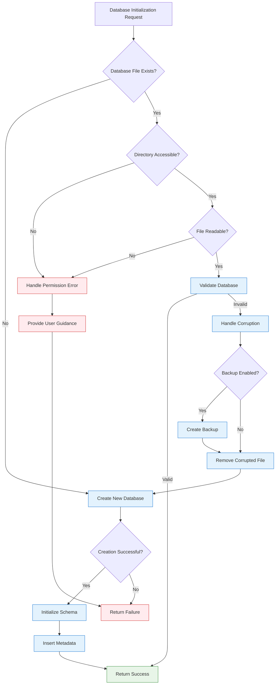

# Database Initialization Architecture

## Robust Database Creation and Recovery Patterns

## Overview

The Database Initialization system provides a comprehensive solution for creating, validating, and recovering database files when they're missing or corrupted. This architecture ensures reliable system startup while maintaining backward compatibility with existing installations.

## Core Components

### DatabaseInitializer Class

The main orchestrator that coordinates database creation and validation:

```python
class DatabaseInitializer:
    def __init__(self, database_path: Path, settings: JarvisSettings)
    def ensure_database_exists(self) -> bool
    def create_database(self) -> None
    def validate_database(self) -> bool
    def get_database_info(self) -> Dict[str, Any]
```

**Key Responsibilities**:
- Coordinate database initialization workflow
- Provide unified interface for database operations
- Handle error propagation and logging

### DatabaseRecoveryStrategy Class

Implements the **Strategy Pattern** for handling different database failure scenarios:

```python
class DatabaseRecoveryStrategy:
    def handle_missing_file(self) -> InitializationResult
    def handle_permission_error(self, error: Exception) -> InitializationResult
    def handle_corruption(self) -> InitializationResult
```

**Recovery Strategies**:
- **Missing File**: Create new database with proper schema
- **Permission Error**: Provide actionable guidance for resolution
- **Corruption**: Backup corrupted database and recreate

### Data Models

**DatabaseState**: Comprehensive database status information
```python
@dataclass
class DatabaseState:
    exists: bool
    path: Path
    size_bytes: int
    created_at: Optional[datetime]
    last_modified: Optional[datetime]
    schema_version: Optional[str]
    is_healthy: bool
    error_message: Optional[str]
    table_count: int
    note_count: int
    embedding_count: int
```

**InitializationResult**: Detailed operation outcome
```python
@dataclass
class InitializationResult:
    success: bool
    action_taken: str  # "created", "validated", "migrated", "failed"
    database_state: DatabaseState
    error_message: Optional[str]
    warnings: List[str]
    duration_ms: float
```

## Initialization Flow



## Schema Management

### Version Tracking

The system maintains schema version information in a dedicated metadata table:

```sql
CREATE TABLE IF NOT EXISTS database_metadata (
    key STRING PRIMARY KEY,
    value STRING,
    created_at TIMESTAMP DEFAULT CURRENT_TIMESTAMP,
    updated_at TIMESTAMP DEFAULT CURRENT_TIMESTAMP
);

-- Schema version tracking
INSERT OR REPLACE INTO database_metadata (key, value, updated_at)
VALUES ('schema_version', '1.0.0', CURRENT_TIMESTAMP);
```

### Schema Evolution Strategy

- **Backward Compatibility**: New versions support older schemas
- **Migration Path**: Automatic migration for compatible versions
- **Version Validation**: Warning for version mismatches
- **Metadata Preservation**: Creation timestamps and version history

## Error Handling Patterns

### Comprehensive Error Classification

| Error Type | Recovery Strategy | User Guidance |
|------------|------------------|---------------|
| **Missing File** | Create new database | Automatic - no user action needed |
| **Permission Denied** | Provide specific guidance | Check file permissions, directory access |
| **Corruption** | Backup and recreate | Backup preserved, database recreated |
| **Schema Mismatch** | Log warning, continue | Version compatibility information |
| **Disk Space** | Fail with clear message | Free disk space, check available storage |

### Error Response Structure

```python
# Consistent error information across all recovery strategies
database_state = DatabaseState(
    exists=self.database_path.exists(),
    path=self.database_path,
    size_bytes=0,
    created_at=None,
    last_modified=None,
    schema_version=None,
    is_healthy=False,
    error_message=error_msg,
    table_count=0,
    note_count=0,
    embedding_count=0
)
```

## Integration Points

### MCP Server Startup

The database initialization integrates with MCP server startup with comprehensive error handling:

```python
# Actual implementation from src/jarvis/mcp/server.py
def run_mcp_server():
    """Run MCP server with database initialization."""
    try:
        logger.info("💾 Initializing database for MCP server")
        initializer = DatabaseInitializer(database_path, settings or get_settings())
        
        if not initializer.ensure_database_exists():
            logger.error("❌ Database initialization failed")
            logger.error("❌ Common solutions:")
            logger.error("❌   1. Check file permissions for the database directory")
            logger.error("❌   2. Ensure sufficient disk space is available")
            logger.error("❌   3. Try running: jarvis index --force to rebuild the database")
            raise ServiceUnavailableError("Database initialization failed - cannot start MCP server")
        
        # Get database information for logging
        db_info = initializer.get_database_info()
        logger.info(f"✅ Database ready: {db_info['note_count']} notes, {db_info['size_mb']} MB")
        
        if db_info.get('has_embeddings'):
            logger.info(f"🧠 Embeddings available: {db_info['embedding_count']} notes with vectors")
        else:
            logger.warning("⚠️ No embeddings found - semantic search may not work until indexing is complete")
            logger.info("💡 Run 'jarvis index' to generate embeddings for semantic search")
        
    except ServiceUnavailableError:
        raise  # Re-raise with full error context
```

### Configuration Integration

Database initialization respects configuration settings:

```python
# Configuration options for database initialization
database_auto_create: bool = True
database_backup_on_corruption: bool = True
database_schema_version: str = "1.0.0"
```

## Performance Characteristics

### Initialization Performance

| Operation | Typical Duration | Notes |
|-----------|------------------|-------|
| **File Existence Check** | <1ms | File system operation |
| **Database Creation** | 50-200ms | Schema creation + metadata |
| **Database Validation** | 10-50ms | Connection test + table check |
| **Corruption Recovery** | 100-500ms | Backup + recreation |

### Resource Usage

- **Memory**: <10MB during initialization
- **Disk I/O**: Minimal - only during creation/backup
- **CPU**: Low - mostly I/O bound operations

## Testing Strategy

### Unit Testing Approach

```python
# Test database creation scenarios
def test_database_creation_with_missing_directory()
def test_database_creation_with_existing_file()
def test_database_validation_with_healthy_database()
def test_database_validation_with_corrupted_database()

# Test error handling scenarios
def test_permission_error_handling()
def test_corruption_recovery_with_backup()
def test_corruption_recovery_without_backup()
```

### Integration Testing

```python
# Test MCP server integration
def test_mcp_server_startup_with_missing_database()
def test_mcp_server_startup_with_corrupted_database()
def test_mcp_server_startup_with_permission_issues()
```

## Future Enhancements

### Planned Improvements

1. **Migration System**: Automatic schema migrations between versions
2. **Health Monitoring**: Continuous database health checking
3. **Backup Management**: Automated backup rotation and cleanup
4. **Performance Metrics**: Database initialization performance tracking
5. **CLI Integration**: Manual database management commands

### Extension Points

- **Custom Recovery Strategies**: Plugin system for specialized recovery
- **Alternative Backends**: Support for different database engines
- **Cloud Integration**: Remote database initialization and backup
- **Monitoring Integration**: Health check integration with monitoring systems

---

*This architecture ensures reliable database initialization while providing comprehensive error handling and recovery capabilities.*