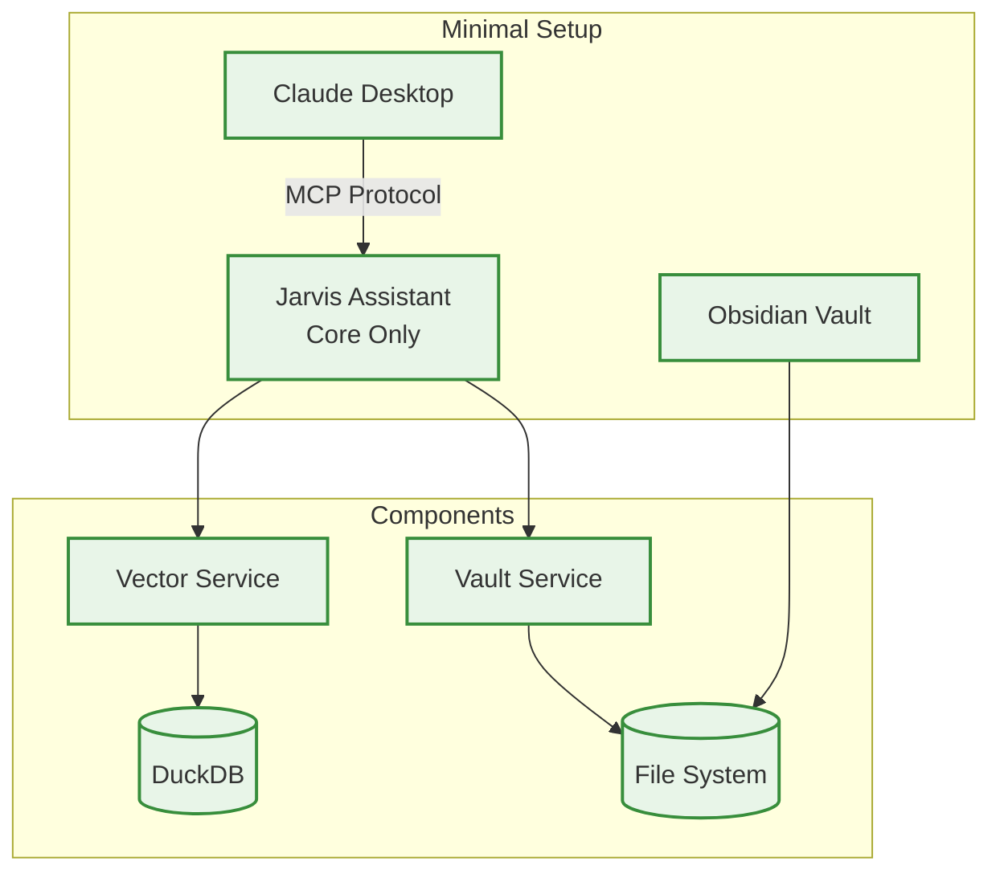
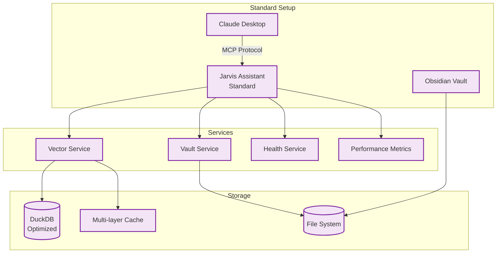
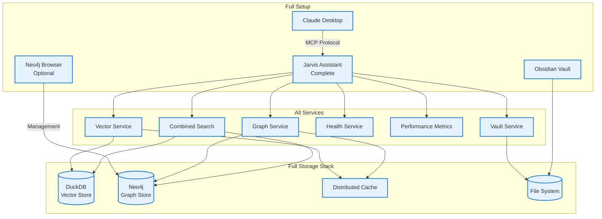
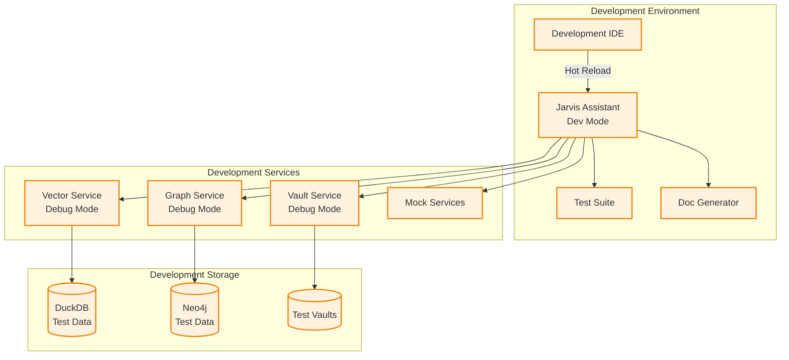

# Deployment Patterns

*Different deployment scenarios and configurations*

## Overview

Jarvis Assistant supports multiple deployment patterns to accommodate different user needs, technical expertise levels, and infrastructure constraints. This document outlines the various deployment options, their trade-offs, and implementation guidance.

## Deployment Decision Matrix

| Pattern | Setup Time | Features | Complexity | Best For |
|---------|------------|----------|------------|----------|
| **Quick Start** | 5 minutes | Core search + file ops | Low | New users, evaluation |
| **Standard** | 15 minutes | All features except graph | Medium | Most users |
| **Full Featured** | 30 minutes | All features including graph | High | Power users, teams |
| **Development** | 45 minutes | All features + dev tools | High | Contributors, customization |

---

## Pattern 1: Quick Start Deployment

**Target**: New users wanting to evaluate core functionality quickly

### Architecture



### Features Available

| Feature | Status | Performance |
|---------|--------|-------------|
| **Semantic Search** | ✅ Full | ~150ms queries |
| **Vault Search** | ✅ Full | ~10ms queries |
| **File Operations** | ✅ Full | <5ms |
| **Health Monitoring** | ✅ Basic | <20ms |
| **Graph Search** | ❌ Disabled | N/A |
| **Performance Metrics** | ✅ Basic | <15ms |

### Installation Steps

```bash
# 1. Clone and setup (2 minutes)
git clone <repository-url>
cd jarvis-assistant
uv sync

# 2. Index your vault (2 minutes)
uv run jarvis index --vault /path/to/your/vault

# 3. Start MCP server (1 minute)
uv run jarvis mcp --vault /path/to/your/vault

# 4. Configure Claude Desktop (Claude Desktop configuration)
# Add to ~/.claude.json
```

### Configuration

```json
{
  "mcpServers": {
    "jarvis": {
      "command": "/path/to/jarvis-assistant/.venv/bin/jarvis-mcp-stdio",
      "args": ["/path/to/your/obsidian/vault"],
      "type": "stdio",
      "cwd": "/path/to/jarvis-assistant"
    }
  }
}
```

### Resource Requirements

| Resource | Minimum | Recommended |
|----------|---------|-------------|
| **RAM** | 1GB | 2GB |
| **Storage** | 500MB | 1GB |
| **CPU** | 1 core | 2 cores |

---

## Pattern 2: Standard Deployment

**Target**: Regular users wanting comprehensive search capabilities

### Architecture



### Enhanced Features

| Feature | Enhancement | Benefit |
|---------|-------------|---------|
| **Semantic Search** | Optimized indexing + caching | 50% faster queries |
| **Vault Search** | Content-aware parsing | Better result relevance |
| **Caching** | Multi-layer (memory + disk) | 80% cache hit rate |
| **Health Monitoring** | Comprehensive metrics | Proactive issue detection |
| **Performance Metrics** | Detailed analytics | Usage optimization |

### Installation Steps

```bash
# 1. Standard setup
git clone <repository-url>
cd jarvis-assistant
uv sync

# 2. Configure for optimal performance
cp config/standard.env .env
uv run jarvis config optimize

# 3. Full indexing with optimization
uv run jarvis index --vault /path/to/vault --optimize

# 4. Start with enhanced features
uv run jarvis mcp --vault /path/to/vault --config standard
```

### Configuration Options

```yaml
# config/standard.yaml
vector_service:
  cache_size: 1000
  batch_size: 32
  optimization_level: "balanced"

vault_service:
  watch_changes: true
  parse_frontmatter: true
  include_attachments: false

health_service:
  check_interval: 30
  metrics_retention: "7d"
```

### Resource Requirements

| Resource | Minimum | Recommended |
|----------|---------|-------------|
| **RAM** | 2GB | 4GB |
| **Storage** | 1GB | 3GB |
| **CPU** | 2 cores | 4 cores |

---

## Pattern 3: Full Featured Deployment

**Target**: Power users requiring complete functionality including graph search

### Architecture



### Complete Feature Set

| Feature Category | Capabilities | Performance |
|------------------|--------------|-------------|
| **Search** | Semantic + Graph + Vault + Combined | <200ms average |
| **Relationships** | Auto-discovery, manual curation | Real-time updates |
| **Analytics** | Usage patterns, content insights | Historical tracking |
| **Monitoring** | Full observability stack | Alerting + dashboards |
| **Management** | Neo4j browser, admin tools | Web-based interface |

### Installation Steps

```bash
# 1. Install Neo4j
# Option A: Docker
docker run --name neo4j \
  -p7474:7474 -p7687:7687 \
  -d -v neo4j_data:/data \
  -v neo4j_logs:/logs \
  -e NEO4J_AUTH=neo4j/password \
  neo4j:latest

# Option B: Native installation
# Follow Neo4j installation guide for your OS

# 2. Setup Jarvis with full configuration
git clone <repository-url>
cd jarvis-assistant
uv sync

# 3. Configure all services
cp config/full.env .env
uv run jarvis config setup-neo4j --host localhost --port 7687

# 4. Full indexing (includes graph relationships)
uv run jarvis index --vault /path/to/vault --full --graph

# 5. Start complete system
uv run jarvis mcp --vault /path/to/vault --config full
```

### Advanced Configuration

```yaml
# config/full.yaml
neo4j:
  uri: "bolt://localhost:7687"
  username: "neo4j"
  password: "password"
  max_connections: 10
  connection_timeout: 30

vector_service:
  cache_size: 2000
  batch_size: 64
  optimization_level: "aggressive"

graph_service:
  relationship_discovery: true
  similarity_threshold: 0.75
  max_traversal_depth: 5

combined_search:
  strategy_weights:
    semantic: 0.6
    graph: 0.25
    vault: 0.15
```

### Resource Requirements

| Resource | Minimum | Recommended |
|----------|---------|-------------|
| **RAM** | 4GB | 8GB+ |
| **Storage** | 2GB | 10GB+ |
| **CPU** | 4 cores | 8+ cores |

---

## Pattern 4: Development Deployment

**Target**: Contributors and users requiring customization

### Architecture



### Development Features

| Feature | Purpose | Implementation |
|---------|---------|----------------|
| **Hot Reload** | Instant code changes | File watching + auto-restart |
| **Debug Logging** | Detailed execution tracing | Structured logging at DEBUG level |
| **Mock Services** | Isolated testing | In-memory implementations |
| **Test Data** | Reproducible testing | Fixture vaults + sample data |
| **Performance Profiling** | Optimization analysis | Built-in profiler hooks |

### Setup Instructions

```bash
# 1. Development setup
git clone <repository-url>
cd jarvis-assistant
uv sync --group dev

# 2. Install development dependencies
uv run pre-commit install
uv run setup-dev-environment

# 3. Setup test databases
docker-compose -f docker/dev-compose.yml up -d

# 4. Run tests to verify setup
uv run pytest resources/tests/

# 5. Start in development mode
uv run jarvis mcp --vault resources/test-vaults/sample --dev
```

### Development Configuration

```yaml
# config/development.yaml
logging:
  level: DEBUG
  format: detailed
  output: console + file

development:
  hot_reload: true
  debug_mode: true
  mock_external_services: true
  profile_performance: true

testing:
  test_data_path: "resources/test-vaults"
  reset_db_between_tests: true
  mock_ai_models: true
```

---

## Containerized Deployments

### Docker Container Architecture

**Important Clarification**: The dependency injection "container" is **software architecture**, not Docker virtualization:

| Aspect | Dependency Injection Container | Docker Container |
|--------|-------------------------------|------------------|
| **Type** | Software design pattern | Virtualization technology |
| **Purpose** | Manages service dependencies in code | Packages applications for deployment |
| **Location** | Inside your application | Process isolation layer |
| **Scope** | Internal code organization | External deployment environment |

### How DI Container Enhances Docker Deployment

#### 1. **Simplified Configuration Management**
```python
# Single configuration object for entire container
settings = JarvisSettings.from_env()
container = ServiceContainer(settings)

# Easy environment variable mapping
JARVIS_VECTOR_DB_PATH=/data/vector.db
JARVIS_NEO4J_URI=bolt://neo4j:7687
JARVIS_VAULT_PATH=/vaults/default
```

#### 2. **Environment-Specific Service Implementations**
```python
# Production: Use real databases
container.register(IVectorDatabase, DuckDBVectorDatabase)
container.register(IGraphDatabase, Neo4jGraphDatabase)

# Development: Use in-memory mocks
container.register(IVectorDatabase, InMemoryVectorDatabase)  
container.register(IGraphDatabase, MockGraphDatabase)
```

#### 3. **Cleaner Docker Health Checks**
```dockerfile
HEALTHCHECK --interval=30s --timeout=10s --start-period=60s \
  CMD uv run python -c "
from src.jarvis.core.container import ServiceContainer
from src.jarvis.utils.config import JarvisSettings
container = ServiceContainer(JarvisSettings())
health = container.get(IHealthChecker)
exit(0 if health.get_overall_health()['healthy'] else 1)
"
```

#### 4. **Proper Service Startup Order**
```python
# Container manages initialization dependencies automatically
async def startup():
    container = ServiceContainer(settings)
    
    # Services start in correct order based on dependencies
    await container.get(IVectorDatabase)  # Starts first
    await container.get(IVectorSearcher)  # Starts after database
    await container.get(IMCPServer)       # Starts last
```

### Docker Compose Setup

```yaml
# docker-compose.yml
version: '3.8'
services:
  jarvis:
    build: .
    ports:
      - "8000:8000"
    volumes:
      - ./vault:/app/vault:ro
      - jarvis_data:/app/data
    environment:
      - JARVIS_USE_DEPENDENCY_INJECTION=true
      - JARVIS_VECTOR_DB_PATH=/data/jarvis.duckdb
      - JARVIS_NEO4J_URI=bolt://neo4j:7687
      - JARVIS_VAULT_PATH=/vaults
    depends_on:
      - neo4j

  neo4j:
    image: neo4j:latest
    ports:
      - "7474:7474"
      - "7687:7687"
    volumes:
      - neo4j_data:/data
    environment:
      - NEO4J_AUTH=neo4j/password

volumes:
  jarvis_data:
  neo4j_data:
```

### Docker Deployment Benefits

**The dependency injection container makes Docker deployment EASIER, not harder:**

1. **🔧 Simplified Configuration**: Single settings object instead of scattered config
2. **📦 Service Isolation**: Each service properly contained and testable
3. **🚀 Faster Startup**: Dependency resolution eliminates startup order issues
4. **🔍 Better Monitoring**: Built-in health checks and metrics
5. **🔄 Easy Scaling**: Services can be moved to separate containers later

### Migration Path to Microservices

The dependency injection foundation enables future microservice architecture:

```python
# Phase 1: Monolith with DI (current)
container.register(IVectorDatabase, LocalDuckDBDatabase)

# Phase 2: Remote services  
container.register(IVectorDatabase, RemoteVectorService)

# Phase 3: Microservices
container.register(IVectorDatabase, gRPCVectorClient)
```

### Kubernetes Deployment

```yaml
# kubernetes/jarvis-deployment.yaml
apiVersion: apps/v1
kind: Deployment
metadata:
  name: jarvis-assistant
spec:
  replicas: 1
  selector:
    matchLabels:
      app: jarvis-assistant
  template:
    metadata:
      labels:
        app: jarvis-assistant
    spec:
      containers:
      - name: jarvis
        image: jarvis-assistant:latest
        ports:
        - containerPort: 8000
        volumeMounts:
        - name: vault-data
          mountPath: /app/vault
          readOnly: true
        env:
        - name: NEO4J_URI
          value: "bolt://neo4j:7687"
      volumes:
      - name: vault-data
        persistentVolumeClaim:
          claimName: vault-pvc
```

---

## Performance Optimization by Pattern

### Quick Start Optimizations

```bash
# Minimal indexing for fast setup
uv run jarvis index --vault /path/to/vault --quick
uv run jarvis config set cache.size 500
uv run jarvis config set vector.batch_size 16
```

### Standard Optimizations

```bash
# Balanced performance configuration
uv run jarvis index --vault /path/to/vault --optimize
uv run jarvis config set cache.size 1000
uv run jarvis config set vector.batch_size 32
uv run jarvis config set health.monitoring true
```

### Full Featured Optimizations

```bash
# Maximum performance configuration
uv run jarvis index --vault /path/to/vault --full --parallel
uv run jarvis config set cache.size 2000
uv run jarvis config set vector.batch_size 64
uv run jarvis config set neo4j.pool_size 10
uv run jarvis config set monitoring.detailed true
```

## Migration Between Patterns

### Upgrading from Quick Start to Standard

```bash
# 1. Stop current instance
pkill -f jarvis-mcp-stdio

# 2. Upgrade configuration
uv run jarvis config upgrade --from quick --to standard

# 3. Re-index with optimizations
uv run jarvis index --vault /path/to/vault --optimize

# 4. Restart with new config
uv run jarvis mcp --vault /path/to/vault --config standard
```

### Upgrading to Full Featured

```bash
# 1. Install Neo4j
# (See installation steps in Full Featured section)

# 2. Upgrade system
uv run jarvis config upgrade --from standard --to full

# 3. Generate graph relationships
uv run jarvis index --vault /path/to/vault --add-graph

# 4. Restart with full features
uv run jarvis mcp --vault /path/to/vault --config full
```

## Troubleshooting by Pattern

### Common Issues & Solutions

| Pattern | Issue | Solution |
|---------|-------|----------|
| **Quick Start** | Slow indexing | Use `--quick` flag, smaller vault subset |
| **Standard** | High memory usage | Reduce cache size, batch size |
| **Full Featured** | Neo4j connection fails | Check Docker/service status, credentials |
| **Development** | Hot reload not working | Check file permissions, restart file watcher |

### Health Check Commands

```bash
# Pattern-specific health checks
uv run jarvis health --pattern quick        # Basic health
uv run jarvis health --pattern standard     # Extended health
uv run jarvis health --pattern full         # Complete health + Neo4j
uv run jarvis health --pattern dev          # Dev environment check
```

---

*Choose the deployment pattern that best matches your needs and technical comfort level. You can always upgrade to more featured patterns as your requirements grow.*