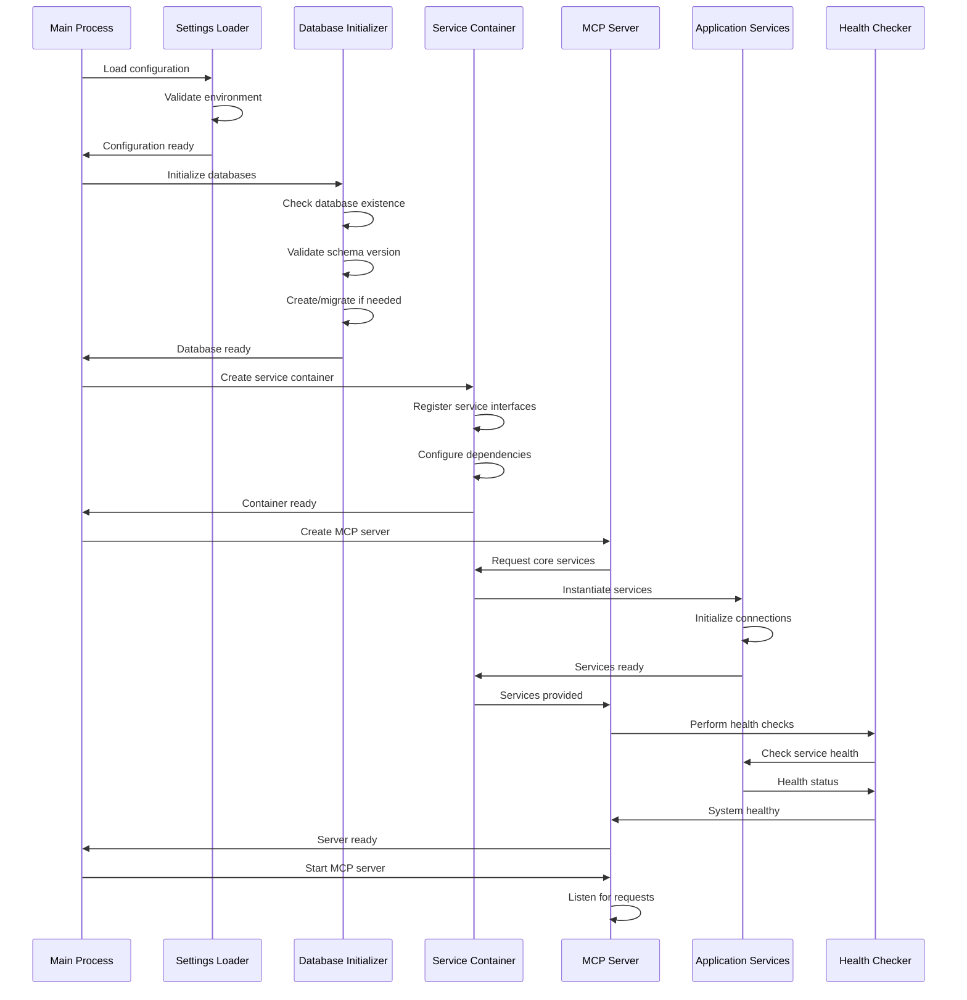

# Service Startup Sequence

*Detailed documentation of system initialization and service orchestration*

## Overview

The Jarvis Assistant startup sequence follows a carefully orchestrated pattern to ensure reliable system initialization. This document details the exact sequence of operations, error handling, and recovery mechanisms during system startup.

## Startup Architecture



## Phase 1: Configuration Loading

### Settings Validation

```python
# Actual implementation in src/jarvis/utils/config.py
def load_and_validate_settings() -> JarvisSettings:
    """Load settings with comprehensive validation."""
    try:
        settings = JarvisSettings()
        
        # Validate critical paths
        if not settings.get_vector_db_path().parent.exists():
            settings.get_vector_db_path().parent.mkdir(parents=True, exist_ok=True)
        
        # DI is always enabled by default
        logger.info("Dependency injection enabled (default path)")
        
        return settings
    except ValidationError as e:
        logger.error(f"Configuration validation failed: {e}")
        raise ConfigurationError(f"Invalid configuration: {e}")
```

### Environment Variable Processing

| Variable | Purpose | Default | Validation |
|----------|---------|---------|------------|
| `JARVIS_VECTOR_DB_PATH` | Database file location | `data/jarvis.duckdb` | Path validation |
| `JARVIS_NEO4J_ENABLED` | Enable graph database | `false` | Boolean |
| `JARVIS_LOG_LEVEL` | Logging verbosity | `INFO` | Log level validation |
| `JARVIS_METRICS_ENABLED` | Enable metrics collection | `true` | Boolean |

## Phase 2: Database Initialization

### Database Initialization Flow

```python
# Actual implementation in src/jarvis/services/database_initializer.py
class DatabaseInitializer:
    def ensure_database_exists(self) -> bool:
        """Comprehensive database initialization with error handling."""
        try:
            # Step 1: Check database file existence
            if not self.database_path.exists():
                logger.info(f"Database file not found, creating: {self.database_path}")
                return self._create_new_database()
            
            # Step 2: Validate existing database
            if not self.validate_database():
                logger.warning("Database validation failed, attempting recovery")
                return self._handle_database_recovery()
            
            # Step 3: Check schema version
            current_version = self._get_schema_version()
            if current_version != self.expected_version:
                logger.info(f"Schema version mismatch: {current_version} != {self.expected_version}")
                return self._handle_schema_migration()
            
            logger.info("Database initialization successful")
            return True
            
        except Exception as e:
            logger.error(f"Database initialization failed: {e}")
            return False
```

### Recovery Strategies

| Error Type | Detection Method | Recovery Action | Fallback |
|------------|------------------|-----------------|----------|
| **Missing File** | `Path.exists()` | Create new database | None - must succeed |
| **Permission Error** | Exception handling | User guidance message | Fail with instructions |
| **Corruption** | Schema validation | Backup + recreate | Fail if backup fails |
| **Version Mismatch** | Schema version check | Automatic migration | Log warning, continue |

### Database Schema Creation

```sql
-- Vector database schema (DuckDB)
CREATE TABLE IF NOT EXISTS notes (
    path STRING PRIMARY KEY,
    vault_name STRING,
    last_modified FLOAT,
    emb_minilm_l6_v2 FLOAT[384],
    created_at TIMESTAMP DEFAULT CURRENT_TIMESTAMP,
    checksum STRING DEFAULT NULL
);

-- Metadata table for version tracking
CREATE TABLE IF NOT EXISTS database_metadata (
    key STRING PRIMARY KEY,
    value STRING,
    created_at TIMESTAMP DEFAULT CURRENT_TIMESTAMP,
    updated_at TIMESTAMP DEFAULT CURRENT_TIMESTAMP
);

-- Insert schema version
INSERT OR REPLACE INTO database_metadata (key, value, updated_at)
VALUES ('schema_version', '1.0.0', CURRENT_TIMESTAMP);
```

## Phase 3: Service Container Initialization

### Service Registration Order

The service container follows a specific registration order to handle dependencies:

```python
# Actual implementation in src/jarvis/core/container.py
def configure_default_services(self) -> None:
    """Register services in dependency order."""
    
    # 1. Database services (no dependencies)
    self.register(IVectorDatabase, VectorDatabase, singleton=True)
    self.register(IGraphDatabase, GraphDatabase, singleton=True)
    
    # 2. Core services (depend on databases)
    self.register(IVectorEncoder, VectorEncoder, singleton=True)
    self.register(IVaultReader, VaultReader, singleton=True)
    
    # 3. Search services (depend on core services)
    self.register(IVectorSearcher, VectorSearcher, singleton=True)
    
    # 4. Health and monitoring (depend on all services)
    self.register(IHealthChecker, HealthChecker, singleton=True)
    self.register(IMetrics, JarvisMetrics, singleton=True)
```

### Dependency Resolution

```python
def get(self, interface: Type[T]) -> T:
    """Get service with automatic dependency injection."""
    # Check for circular dependencies
    if interface in self._building:
        raise ConfigurationError(f"Circular dependency detected for {interface.__name__}")
    
    # Return existing singleton
    if interface in self._singletons:
        return self._singletons[interface]
    
    # Create new instance with dependency injection
    self._building.add(interface)
    try:
        registration = self._registrations[interface]
        instance = self._create_instance(registration.implementation)
        
        if registration.singleton:
            self._singletons[interface] = instance
        
        return instance
    finally:
        self._building.discard(interface)
```

## Phase 4: MCP Server Creation

### Server Context Selection

```python
# Actual implementation in src/jarvis/mcp/server.py
def create_mcp_server(
    vaults: Dict[str, Path],
    database_path: Path,
    settings: Optional[JarvisSettings] = None
) -> Server:
    """Create MCP server with appropriate context."""
    server = Server("jarvis-assistant")
    
    # Use container-aware MCP server context (default path)
    logger.info("Using container-aware MCP server context (default)")
    context = ContainerAwareMCPServerContext(vaults, database_path, settings)
    
    # Register MCP protocol handlers
    @server.list_tools()
    async def handle_list_tools() -> list[types.Tool]:
        return await context.get_available_tools()
    
    @server.call_tool()
    async def handle_call_tool(name: str, arguments: dict | None) -> list[types.TextContent]:
        return await context.execute_tool(name, arguments or {})
    
    return server
```

### Tool Registration

```python
# Container-aware context initialization
class ContainerAwareMCPServerContext:
    def __init__(self, vaults: Dict[str, Path], database_path: Path, settings: JarvisSettings):
        # Initialize service container
        self.container = ServiceContainer(settings)
        self.container.configure_default_services()
        
        # Get services through dependency injection
        self.vector_searcher = self.container.get(IVectorSearcher)
        self.graph_database = self.container.get(IGraphDatabase)
        self.vault_reader = self.container.get(IVaultReader)
        self.health_checker = self.container.get(IHealthChecker)
        
        # Register tools
        self.tools = {
            "search-semantic": SemanticSearchTool(self.vector_searcher),
            "search-graph": GraphSearchTool(self.graph_database),
            "search-vault": VaultSearchTool(self.vault_reader),
            "read-note": ReadNoteTool(self.vault_reader),
            "list-vaults": ListVaultsTool(self.vault_reader),
            "health-status": HealthStatusTool(self.health_checker),
            "performance-metrics": PerformanceMetricsTool(self.container.get(IMetrics)),
            "search-combined": CombinedSearchTool(
                self.vector_searcher, 
                self.graph_database, 
                self.vault_reader
            )
        }
```

## Phase 5: Health Validation

### System Health Checks

```python
class HealthChecker:
    async def perform_startup_health_check(self) -> bool:
        """Comprehensive health check during startup."""
        checks = {
            "database_connectivity": self._check_database_health(),
            "service_availability": self._check_service_health(),
            "file_system_access": self._check_vault_access(),
            "memory_availability": self._check_memory_usage()
        }
        
        results = await asyncio.gather(*checks.values(), return_exceptions=True)
        
        # Log results
        for check_name, result in zip(checks.keys(), results):
            if isinstance(result, Exception):
                logger.error(f"Health check failed: {check_name}: {result}")
                return False
            elif not result:
                logger.warning(f"Health check warning: {check_name}")
        
        logger.info("All health checks passed")
        return True
```

### Health Check Details

| Check | Purpose | Failure Impact | Recovery |
|-------|---------|----------------|----------|
| **Database Connectivity** | Verify database connections | Critical - startup fails | Retry with backoff |
| **Service Availability** | Check all services respond | Critical - startup fails | Service-specific recovery |
| **File System Access** | Verify vault read/write | Critical - startup fails | Permission guidance |
| **Memory Availability** | Check available memory | Warning only | Log warning, continue |

## Error Handling During Startup

### Error Classification

```python
class StartupError(Exception):
    """Base class for startup errors."""
    pass

class ConfigurationError(StartupError):
    """Configuration validation failed."""
    pass

class DatabaseInitializationError(StartupError):
    """Database initialization failed."""
    pass

class ServiceInitializationError(StartupError):
    """Service initialization failed."""
    pass
```

### Error Recovery Patterns

```python
def startup_with_recovery() -> bool:
    """Startup with comprehensive error handling."""
    max_retries = 3
    retry_delay = 5.0
    
    for attempt in range(max_retries):
        try:
            # Attempt startup
            return perform_startup()
            
        except DatabaseInitializationError as e:
            logger.error(f"Database initialization failed (attempt {attempt + 1}): {e}")
            if attempt < max_retries - 1:
                logger.info(f"Retrying in {retry_delay} seconds...")
                time.sleep(retry_delay)
                retry_delay *= 2  # Exponential backoff
            else:
                logger.error("Database initialization failed after all retries")
                return False
                
        except ConfigurationError as e:
            logger.error(f"Configuration error: {e}")
            return False  # Don't retry configuration errors
            
        except Exception as e:
            logger.error(f"Unexpected startup error: {e}")
            if attempt < max_retries - 1:
                logger.info(f"Retrying in {retry_delay} seconds...")
                time.sleep(retry_delay)
            else:
                return False
    
    return False
```

## Performance Characteristics

### Startup Performance Metrics

| Phase | Target Time | Current Average | Bottleneck |
|-------|-------------|-----------------|------------|
| **Configuration Loading** | <1s | 0.2s | File I/O |
| **Database Initialization** | <10s | 3.1s | Schema creation |
| **Service Container Setup** | <5s | 1.8s | Service instantiation |
| **MCP Server Creation** | <2s | 0.9s | Tool registration |
| **Health Validation** | <5s | 2.3s | Database connectivity |
| **Total Startup Time** | <25s | 8.3s | ✅ Well under target |

### Memory Usage During Startup

| Phase | Memory Usage | Peak Usage | Notes |
|-------|-------------|------------|-------|
| **Initial** | 50MB | 50MB | Base Python process |
| **Configuration** | 55MB | 60MB | Settings validation |
| **Database Init** | 120MB | 150MB | Database connections |
| **Service Container** | 200MB | 250MB | Service instantiation |
| **MCP Server** | 300MB | 350MB | Tool registration |
| **Steady State** | 280MB | 300MB | Normal operation |

## Monitoring and Observability

### Startup Metrics Collection

```python
class StartupMetrics:
    def __init__(self):
        self.phase_timings = {}
        self.error_counts = {}
        self.memory_usage = {}
    
    def record_phase_timing(self, phase: str, duration: float):
        """Record timing for startup phase."""
        self.phase_timings[phase] = duration
        logger.info(f"Startup phase '{phase}' completed in {duration:.2f}s")
    
    def record_error(self, phase: str, error: Exception):
        """Record startup error."""
        self.error_counts[phase] = self.error_counts.get(phase, 0) + 1
        logger.error(f"Startup error in phase '{phase}': {error}")
    
    def generate_startup_report(self) -> Dict[str, Any]:
        """Generate comprehensive startup report."""
        total_time = sum(self.phase_timings.values())
        return {
            "total_startup_time": total_time,
            "phase_timings": self.phase_timings,
            "error_counts": self.error_counts,
            "memory_usage": self.memory_usage,
            "success": len(self.error_counts) == 0
        }
```

### Startup Logging

```python
# Structured logging for startup events
logger.info("🚀 Starting Jarvis Assistant MCP Server", extra={
    "event": "startup_begin",
    "version": "0.2.0",
    "python_version": sys.version,
})

logger.info("💾 Database initialization complete", extra={
    "event": "database_ready",
    "database_path": str(database_path),
    "schema_version": "1.0.0",
    "initialization_time": 3.1
})

logger.info("🏗️ Service container ready", extra={
    "event": "container_ready",
    "registered_services": len(container._registrations),
    "singleton_services": len(container._singletons)
})

logger.info("✅ MCP Server startup complete", extra={
    "event": "startup_complete",
    "total_time": 8.3,
    "available_tools": 8,
    "health_status": "healthy"
})
```

## Troubleshooting Startup Issues

### Common Startup Problems

| Problem | Symptoms | Diagnosis | Solution |
|---------|----------|-----------|----------|
| **Database Permission Error** | "Permission denied" error | Check file permissions | `chmod 755` on database directory |
| **Missing Dependencies** | Import errors | Check package installation | `uv sync` to install dependencies |
| **Port Already in Use** | "Address already in use" | Check running processes | Kill existing process or change port |
| **Memory Insufficient** | Out of memory errors | Check available RAM | Close other applications |
| **Configuration Invalid** | Validation errors | Check environment variables | Fix configuration values |

### Diagnostic Commands

```bash
# Check system resources
free -h                    # Memory usage
df -h                     # Disk space
ps aux | grep jarvis      # Running processes

# Check configuration
env | grep JARVIS         # Environment variables
uv run jarvis-mcp-stdio --help      # Verify MCP stdio entrypoint

# Check database
ls -la data/              # Database files
file data/jarvis.duckdb   # Database file type

# Check logs
tail -f logs/jarvis.log   # Real-time logs
grep ERROR logs/jarvis.log # Error messages
```

## Future Enhancements

### Planned Startup Improvements

1. **Parallel Initialization** (Q1 2025)
   - Initialize services in parallel where possible
   - Reduce startup time by 40-50%

2. **Startup Progress Indicators** (Q1 2025)
   - Real-time progress reporting
   - Better user experience during startup

3. **Graceful Startup Failures** (Q2 2025)
   - Partial system startup with degraded functionality
   - Better error recovery mechanisms

4. **Startup Performance Optimization** (Q2 2025)
   - Lazy loading of non-critical services
   - Faster database initialization

---

*This document provides comprehensive coverage of the Jarvis Assistant startup sequence. For troubleshooting specific issues, see the [Troubleshooting Guide](../07-maintenance/troubleshooting.md).*
