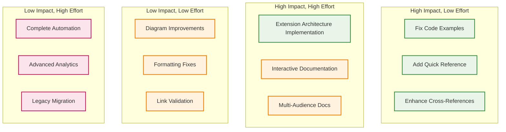

# Architecture Documentation Improvement Recommendations

## Executive Summary

This document provides specific, actionable recommendations for continuing to improve the architecture documentation based on the comprehensive review completed on 2024-12-15. The improvements focus on enhancing developer onboarding, maintaining implementation alignment, and supporting the system's evolution.

## Immediate Actions (Next 2 Weeks)

### 1. Complete Extension Architecture Implementation

**Priority**: High  
**Effort**: 1-2 weeks  
**Owner**: Core development team

**Actions**:
- Implement `ExtensionManager` class in `src/jarvis/extensions/manager.py`
- Create `ExtensionLoader` and `ExtensionRegistry` classes
- Add extension configuration to `JarvisSettings`
- Write unit tests for extension system foundation

**Success Criteria**:
- Extension system can be enabled/disabled via configuration
- Basic extension loading mechanism works
- Documentation examples match implementation

### 2. Enhance Developer Onboarding Flow

**Priority**: High  
**Effort**: 3-5 days  
**Owner**: Documentation team

**Actions**:
- Create architecture walkthrough for new developers
- Add "Architecture in 10 Minutes" quick start guide
- Enhance code examples with real implementation snippets
- Add troubleshooting section for common architecture questions

**Files to Create**:
```
docs/02-system-design/
├── architecture-walkthrough.md          # New developer guide
├── architecture-quick-reference.md      # Cheat sheet
└── architecture-troubleshooting.md      # Common issues
```

### 3. Improve Diagram Accessibility

**Priority**: Medium  
**Effort**: 2-3 days  
**Owner**: Documentation team

**Actions**:
- Add text descriptions for all Mermaid diagrams
- Create simplified architecture diagrams for different audiences
- Add diagram legends and explanations
- Ensure diagrams work in different documentation viewers

## Short-Term Improvements (Next Month)

### 4. Implementation Synchronization

**Priority**: High  
**Effort**: 1 week  
**Owner**: Development team

**Actions**:
- Audit all code examples in documentation against current implementation
- Update service interface examples to match `src/jarvis/core/interfaces.py`
- Verify all file paths and class names are current
- Add automated checks for documentation-code alignment

**Implementation**:
```python
# Add to CI/CD pipeline
def verify_documentation_code_alignment():
    """Verify code examples in docs match actual implementation."""
    # Check class names, method signatures, file paths
    # Report mismatches in CI
```

### 5. Performance Documentation Integration

**Priority**: Medium  
**Effort**: 3-4 days  
**Owner**: Performance team

**Actions**:
- Link performance characteristics to architectural decisions
- Add performance impact analysis for each architectural component
- Create performance troubleshooting guides
- Document performance testing methodology

### 6. Error Handling Documentation

**Priority**: Medium  
**Effort**: 2-3 days  
**Owner**: Development team

**Actions**:
- Document error propagation patterns across layers
- Create error handling best practices guide
- Add error recovery examples for each service
- Document graceful degradation scenarios

## Medium-Term Enhancements (Next Quarter)

### 7. Interactive Architecture Documentation

**Priority**: Medium  
**Effort**: 1-2 weeks  
**Owner**: Documentation team

**Actions**:
- Create interactive architecture explorer
- Add clickable diagrams with detailed component information
- Implement documentation search and filtering
- Add architecture decision timeline

### 8. Multi-Audience Documentation

**Priority**: Medium  
**Effort**: 1 week  
**Owner**: Documentation team

**Actions**:
- Create architecture overview for different audiences:
  - **End Users**: High-level capabilities and setup
  - **Developers**: Implementation details and patterns
  - **Contributors**: Extension development and contribution
  - **Operators**: Deployment and monitoring

### 9. Architecture Evolution Tracking

**Priority**: Low  
**Effort**: Ongoing  
**Owner**: Architecture team

**Actions**:
- Implement architecture decision record (ADR) automation
- Create architecture change impact analysis
- Add migration guides for architectural changes
- Document architectural debt and improvement plans

## Specific File Improvements

### System Overview Enhancements

**File**: `docs/02-system-design/system-overview.md`

**Improvements Needed**:
1. Add "Quick Architecture Tour" section for 5-minute overview
2. Enhance deployment architecture with real-world examples
3. Add troubleshooting quick reference
4. Include architecture decision rationale summaries

### Component Interaction Improvements

**File**: `docs/02-system-design/component-interaction.md`

**Improvements Needed**:
1. Add sequence diagrams for each major operation
2. Enhance error handling flow documentation
3. Add performance characteristics for each interaction
4. Include monitoring and observability patterns

### Implementation Status Updates

**File**: `docs/02-system-design/implementation-status.md`

**Improvements Needed**:
1. Automate status updates from CI/CD pipeline
2. Add implementation quality metrics
3. Include technical debt tracking
4. Add contributor onboarding status

## Quality Assurance Recommendations

### 1. Documentation Testing

**Implementation**:
```bash
# Add to CI pipeline
docs-test:
  - verify-links: Check all internal and external links
  - verify-code: Validate code examples compile/run
  - verify-diagrams: Ensure Mermaid diagrams render
  - verify-structure: Check markdown formatting
```

### 2. Regular Architecture Reviews

**Process**:
- Monthly architecture documentation review
- Quarterly architecture decision review
- Semi-annual architecture evolution planning
- Annual architecture documentation audit

### 3. Feedback Integration

**Mechanisms**:
- Developer feedback collection on documentation clarity
- User feedback on architecture understanding
- Contributor feedback on onboarding experience
- Automated documentation usage analytics

## Success Metrics

### Documentation Quality Metrics

| Metric | Current | Target | Timeline |
|--------|---------|--------|----------|
| **Developer Onboarding Time** | ~2 hours | <30 minutes | 1 month |
| **Architecture Question Frequency** | High | <5/week | 2 months |
| **Documentation Coverage** | 85% | 95% | 3 months |
| **Code-Doc Alignment** | Manual | Automated | 1 month |

### User Experience Metrics

| Metric | Current | Target | Timeline |
|--------|---------|--------|----------|
| **Setup Success Rate** | 90% | 98% | 1 month |
| **Architecture Understanding** | Survey needed | >4.5/5 | 2 months |
| **Contributor Onboarding** | ~1 week | <2 days | 3 months |

## Implementation Priority Matrix



## Resource Requirements

### Team Allocation

| Role | Time Commitment | Duration | Responsibilities |
|------|----------------|----------|------------------|
| **Lead Developer** | 25% | 1 month | Extension architecture implementation |
| **Documentation Lead** | 50% | 2 weeks | Developer onboarding improvements |
| **Technical Writer** | 100% | 1 week | Multi-audience documentation |
| **QA Engineer** | 25% | Ongoing | Documentation testing automation |

### Tool Requirements

| Tool | Purpose | Cost | Timeline |
|------|---------|------|----------|
| **Documentation Platform** | Interactive docs | Free (GitBook/Docusaurus) | 2 weeks |
| **Diagram Tools** | Enhanced visuals | Free (Mermaid/Draw.io) | 1 week |
| **Testing Framework** | Doc validation | Free (custom scripts) | 1 week |
| **Analytics** | Usage tracking | Free (Google Analytics) | 3 days |

## Risk Mitigation

### Documentation Debt

**Risk**: Documentation becomes outdated as system evolves  
**Mitigation**: Automated synchronization checks in CI/CD  
**Owner**: DevOps team

### Developer Confusion

**Risk**: Complex architecture overwhelms new contributors  
**Mitigation**: Progressive disclosure in documentation  
**Owner**: Documentation team

### Implementation Drift

**Risk**: Documentation doesn't match actual implementation  
**Mitigation**: Code-documentation integration testing  
**Owner**: Development team

## Next Steps

### Week 1
1. ✅ Complete current documentation improvements
2. 📋 Begin extension architecture implementation
3. 📋 Start developer onboarding guide creation

### Week 2
1. 📋 Implement basic extension system
2. 📋 Complete quick reference documentation
3. 📋 Add automated documentation testing

### Month 1
1. 📋 Full extension architecture implementation
2. 📋 Enhanced developer onboarding experience
3. 📋 Automated documentation-code synchronization

---

*This improvement plan provides a structured approach to evolving the architecture documentation while maintaining alignment with the rapidly developing codebase.*