# Data Flow Architecture

*Understanding the request-to-response journey through Jarvis Assistant*

## Overview

Jarvis Assistant follows a **layered architecture pattern** where each layer has specific responsibilities and communicates through well-defined interfaces. This design enables **separation of concerns**, **testability**, and **maintainability** while supporting the complex requirements of AI-powered knowledge discovery.

The system implements several key architectural patterns:
- **Command Pattern**: MCP requests are treated as commands with validation and execution phases
- **Strategy Pattern**: Different search strategies (semantic, graph, vault) can be selected based on query type
- **Observer Pattern**: Event-driven updates when vault content changes
- **Repository Pattern**: Data access abstraction for different storage backends

## High-Level Data Flow

```mermaid
flowchart LR
    subgraph "Client Layer"
        CD[Claude Desktop<br/>🤖 AI Interface]
    end
    
    subgraph "Protocol Layer"
        MCP[MCP Server<br/>📡 JSON-RPC Handler]
    end
    
    subgraph "Business Logic"
        SL[Service Layer<br/>⚙️ Processing Engine]
    end
    
    subgraph "Data Persistence"
        DB[Database Layer<br/>💾 Storage Systems]
    end
    
    CD -->|1. MCP Request<br/>JSON-RPC over stdio| MCP
    MCP -->|2. Tool Invocation<br/>Parameter validation| SL
    SL -->|3. Database Query<br/>Optimized operations| DB
    DB -->|4. Raw Results<br/>Structured data| SL
    SL -->|5. Processed Data<br/>Ranked & formatted| MCP
    MCP -->|6. MCP Response<br/>Standardized format| CD
    
    classDef client fill:#e3f2fd,stroke:#1976d2,stroke-width:2px
    classDef protocol fill:#fff3e0,stroke:#f57c00,stroke-width:2px
    classDef business fill:#f3e5f5,stroke:#7b1fa2,stroke-width:2px
    classDef data fill:#e8f5e8,stroke:#388e3c,stroke-width:2px
    
    class CD client
    class MCP protocol
    class SL business
    class DB data
```



### Data Flow by Service Type


## Architectural Layer Responsibilities

| Layer | Core Purpose | Key Files | Design Patterns |
|-------|--------------|-----------|-----------------|
| **Client Layer** | User interaction & AI integration | Claude Desktop (external) | Adapter Pattern |
| **Protocol Layer** | MCP communication & request routing | `src/jarvis/mcp/server.py` | Command Pattern, Factory |
| **Business Logic** | Search algorithms & data processing | `src/jarvis/services/` | Strategy, Repository |
| **Data Persistence** | Storage & retrieval optimization | Database adapters | Repository, Connection Pool |

## Detailed Request Processing

### Phase 1: Request Reception & Command Pattern

The **Command Pattern** implementation in `/src/jarvis/mcp/server.py` treats each MCP request as a discrete command object with:

1. **MCP Message Parsing**
   - Claude Desktop sends JSON-RPC message over stdio
   - MCP server parses message type and method using the Command Pattern
   - Request validation against MCP protocol specification
   - Each tool request becomes a command object with execute() and validate() methods

2. **Tool Routing & Factory Pattern**
   - Tool Factory (`src/jarvis/mcp/plugins/registry.py`) extracts tool name and parameters
   - Routes to appropriate tool handler using the Factory Pattern
   - Parameter validation and sanitization through command validation
   - **Why this pattern**: Enables adding new tools without modifying existing routing logic

### Phase 2: Service Processing & Strategy Pattern

The **Strategy Pattern** implementation allows dynamic selection of search algorithms based on query characteristics. Each service in `/src/jarvis/services/` implements a common interface but uses different strategies:

#### Semantic Search Strategy (`search-semantic`)

**Strategy**: Vector similarity using machine learning embeddings
**Implementation**: `/src/jarvis/services/vector/searcher.py`

```
Input Parameters → Vector Service → DuckDB Query → Result Ranking → Response
     ↓                    ↓              ↓             ↓            ↓
 query string      embedding       similarity     relevance    formatted
 similarity       generation       search        scoring      JSON result
 threshold        (sentence        (vector        (top-k      (with metadata
 vault filter     transformers)    distance)      results)     and content)
```

**Why this strategy**: Best for finding conceptually related content even when exact terms don't match

#### Graph Search Strategy (`search-graph`)

**Strategy**: Relationship traversal using graph theory
**Implementation**: `/src/jarvis/services/graph/indexer.py`

```
Input Parameters → Graph Service → Neo4j Query → Relationship Traversal → Response
     ↓                   ↓             ↓                 ↓                ↓
 starting node    relationship    Cypher query    depth-limited      formatted
 depth limit      type filter     execution       traversal          graph result
 direction        (links, refs)   (pattern        (breadth-first     (nodes + edges)
```

**Why this strategy**: Excellent for discovering connected ideas and knowledge paths

#### Vault Search Strategy (`search-vault`)

**Strategy**: Traditional text matching with file system optimization
**Implementation**: `/src/jarvis/services/vault/reader.py`

```
Input Parameters → Vault Service → File System Search → Content Matching → Response
     ↓                   ↓               ↓                    ↓               ↓
 search query      content type      directory         text pattern      file results
 file filter       detection         traversal         matching          (with previews)
 limit count       (markdown)        (recursive)       (regex/literal)   (ranked by relevance)
```

**Why this strategy**: Fastest for exact term matches and file-based queries

### Phase 3: Database Operations

#### DuckDB Vector Operations
```sql
-- Example semantic search query
SELECT 
    file_path,
    content,
    embedding <=> ? AS similarity_score,
    metadata
FROM embeddings 
WHERE similarity_score > ?
ORDER BY similarity_score ASC
LIMIT ?;
```

#### Neo4j Graph Operations
```cypher
-- Example graph traversal query
MATCH (start:Note {path: $start_path})
CALL apoc.path.expand(start, $relationship_types, $node_types, 1, $max_depth)
YIELD path
RETURN path, nodes(path), relationships(path)
ORDER BY length(path);
```

#### File System Operations
```python
# Example vault search operation
async def search_vault(query: str, vault_path: str) -> List[SearchResult]:
    results = []
    for file_path in glob.glob(f"{vault_path}/**/*.md", recursive=True):
        content = await read_file(file_path)
        if query.lower() in content.lower():
            results.append(SearchResult(file_path, content, calculate_relevance(query, content)))
    return sorted(results, key=lambda x: x.relevance, reverse=True)
```

### Phase 4: Response Generation

1. **Result Aggregation**
   - Combine results from multiple sources
   - Apply result limits and pagination
   - Calculate unified relevance scores

2. **Data Formatting**
   - Convert internal data structures to MCP format
   - Add metadata (timestamps, source info, confidence scores)
   - Ensure JSON-RPC compliance

3. **Response Delivery**
   - Serialize to JSON
   - Send over stdio to Claude Desktop
   - Handle errors and edge cases

## Data Types and Structures

### Internal Data Models

#### Search Result
```python
@dataclass
class SearchResult:
    file_path: str
    content: str
    relevance_score: float
    metadata: Dict[str, Any]
    created_at: datetime
    modified_at: datetime
    file_size: int
    excerpt: str
```

#### Graph Node
```python
@dataclass
class GraphNode:
    id: str
    path: str
    title: str
    content: str
    node_type: str  # "note", "heading", "block"
    properties: Dict[str, Any]
    created_at: datetime
    modified_at: datetime
```

#### Graph Relationship
```python
@dataclass
class GraphRelationship:
    source_id: str
    target_id: str
    relationship_type: str  # "links_to", "references", "similar_to"
    properties: Dict[str, Any]
    strength: float
    created_at: datetime
```

### MCP Protocol Structures

#### Tool Request
```json
{
  "method": "tools/call",
  "params": {
    "name": "search-semantic",
    "arguments": {
      "query": "machine learning algorithms",
      "similarity_threshold": 0.7,
      "limit": 10,
      "vault": "primary"
    }
  }
}
```

#### Tool Response
```json
{
  "content": [
    {
      "type": "text",
      "text": "Found 5 relevant results for 'machine learning algorithms'"
    },
    {
      "type": "text",
      "text": "1. /notes/ml-fundamentals.md (Score: 0.95)\n   Introduction to machine learning concepts..."
    }
  ]
}
```

## Performance Considerations

### Caching Strategy

1. **Embedding Cache**
   - Cache generated embeddings to avoid recomputation
   - Use file modification time for cache invalidation
   - LRU eviction for memory management

2. **Query Result Cache**
   - Cache recent search results
   - Time-based expiration (5 minutes)
   - Clear cache on index updates

3. **Graph Relationship Cache**
   - Cache computed relationships
   - Invalidate on file changes
   - Hierarchical cache for different query types

### Optimization Patterns

1. **Lazy Loading**
   - Load embeddings only when needed
   - Initialize services on first use
   - Defer expensive operations

2. **Batch Processing**
   - Process multiple files in batches
   - Use connection pooling for databases
   - Parallel processing where possible

3. **Memory Management**
   - Stream large result sets
   - Limit in-memory result size
   - Use generators for file processing

## Error Handling Flow

### Error Types and Propagation

1. **Input Validation Errors**
   - Invalid parameters → 400 Bad Request
   - Missing required fields → 400 Bad Request
   - Type conversion errors → 400 Bad Request

2. **Service Errors**
   - Database connection failed → 503 Service Unavailable
   - Index not found → 404 Not Found
   - Timeout errors → 504 Gateway Timeout

3. **System Errors**
   - Out of memory → 500 Internal Server Error
   - Permission denied → 403 Forbidden
   - Disk space issues → 507 Insufficient Storage

### Error Response Format

```json
{
  "error": {
    "code": -32603,
    "message": "Internal error",
    "data": {
      "type": "ServiceError",
      "details": "Neo4j connection failed",
      "retry_after": 30
    }
  }
}
```

## Monitoring and Observability

### Key Metrics

- **Request Latency**: Time from request to response
- **Database Performance**: Query execution time
- **Cache Hit Rates**: Effectiveness of caching layers
- **Error Rates**: Frequency of different error types
- **Memory Usage**: Service and database memory consumption

### Logging Strategy

```python
# Example structured logging
logger.info(
    "search_semantic_request",
    query=query,
    vault=vault_name,
    similarity_threshold=threshold,
    limit=limit,
    request_id=request_id
)
```

## For More Detail

- **Component Interaction**: [Component Interaction](component-interaction.md)
- **Database Schemas**: [Neo4j Schema](neo4j-schema.md)
- **Search Implementation**: [Semantic Search Design](semantic-search-design.md)
- **Protocol Details**: [MCP Implementation Details](mcp-implementation-details.md)