# Extension Architecture

## Plugin-Based Extension System Design

**Status**: 📋 Planned (Foundation Ready)  
**Priority**: High  
**Implementation**: Phase 2 Development

## Overview

The Extension Architecture provides a **plugin-based system** that enables optional advanced capabilities while preserving core system reliability. This design follows the **Progressive Enhancement** principle, where the core system remains fully functional while extensions add specialized features.

### Architectural Principles

- **True Optionality**: Extensions are completely separate from core functionality
- **Zero Performance Impact**: Core system performance unchanged when extensions disabled
- **Graceful Degradation**: Extension failures don't affect core system stability
- **Progressive Enhancement**: Users can enable specific features based on needs
- **Resource Efficiency**: AI models only loaded when extensions are enabled

## Extension System Architecture

```mermaid
graph TB
    subgraph "Core System (Always Available)"
        MCP[MCP Server]
        SC[Service Container]
        CS[Core Services<br/>Vector, Graph, Vault]
        CT[Core Tools<br/>8 Production Tools]
    end
    
    subgraph "Extension Infrastructure"
        EM[Extension Manager<br/>🔌 Plugin Orchestrator]
        EL[Extension Loader<br/>📦 Dynamic Loading]
        ER[Extension Registry<br/>📋 Service Discovery]
        EV[Extension Validator<br/>✅ Safety Checks]
    end
    
    subgraph "Extension Types"
        subgraph "AI Extensions"
            LLM[LLM Service<br/>🤖 Local Language Models]
            GR[GraphRAG<br/>🕸️ Graph-Enhanced RAG]
            WF[AI Workflows<br/>⚡ Automated Processes]
        end
        
        subgraph "Analytics Extensions"
            VA[Vault Analytics<br/>📊 Advanced Metrics]
            QA[Quality Assessment<br/>🎯 Content Analysis]
            TR[Trend Analysis<br/>📈 Temporal Insights]
        end
        
        subgraph "Integration Extensions"
            API[External APIs<br/>🌐 Third-party Services]
            EXP[Export Tools<br/>📤 Data Export]
            SYNC[Sync Services<br/>🔄 Multi-device Sync]
        end
    end
    
    MCP --> EM
    SC --> EM
    EM --> EL
    EM --> ER
    EM --> EV
    
    EL --> LLM
    EL --> GR
    EL --> WF
    EL --> VA
    EL --> QA
    EL --> TR
    EL --> API
    EL --> EXP
    EL --> SYNC
    
    CS -.->|Optional Enhancement| LLM
    CS -.->|Optional Enhancement| VA
    
    classDef core fill:#e8f5e8,stroke:#388e3c,stroke-width:2px
    classDef infrastructure fill:#e3f2fd,stroke:#1976d2,stroke-width:2px
    classDef ai fill:#f3e5f5,stroke:#7b1fa2,stroke-width:2px
    classDef analytics fill:#fff3e0,stroke:#f57c00,stroke-width:2px
    classDef integration fill:#fce4ec,stroke:#c2185b,stroke-width:2px
    
    class MCP,SC,CS,CT core
    class EM,EL,ER,EV infrastructure
    class LLM,GR,WF ai
    class VA,QA,TR analytics
    class API,EXP,SYNC integration
```



## Extension Manager Implementation

### Core Extension Manager

```python
class ExtensionManager:
    """Central orchestrator for all extensions."""
    
    def __init__(self, container: ServiceContainer, settings: JarvisSettings):
        self.container = container
        self.settings = settings
        self.registry = ExtensionRegistry()
        self.loader = ExtensionLoader(container)
        self.validator = ExtensionValidator()
        self.loaded_extensions: Dict[str, Extension] = {}
    
    async def initialize(self) -> None:
        """Initialize extension system."""
        if not self.settings.extensions_enabled:
            logger.info("Extensions disabled, skipping initialization")
            return
        
        # Discover available extensions
        available_extensions = await self.registry.discover_extensions()
        
        # Load enabled extensions
        for ext_name in self.settings.extensions_auto_load:
            if ext_name in available_extensions:
                await self.load_extension(ext_name)
    
    async def load_extension(self, extension_name: str) -> bool:
        """Load and initialize a specific extension."""
        try:
            # Validate extension
            extension_info = await self.registry.get_extension_info(extension_name)
            if not await self.validator.validate_extension(extension_info):
                logger.error(f"Extension validation failed: {extension_name}")
                return False
            
            # Load extension
            extension = await self.loader.load_extension(extension_name)
            
            # Initialize extension
            await extension.initialize(self.container)
            
            # Register extension services
            await self._register_extension_services(extension)
            
            # Register extension tools
            await self._register_extension_tools(extension)
            
            self.loaded_extensions[extension_name] = extension
            logger.info(f"Extension loaded successfully: {extension_name}")
            return True
            
        except Exception as e:
            logger.error(f"Failed to load extension {extension_name}: {e}")
            return False
    
    async def unload_extension(self, extension_name: str) -> bool:
        """Unload an extension safely."""
        if extension_name not in self.loaded_extensions:
            return False
        
        try:
            extension = self.loaded_extensions[extension_name]
            
            # Cleanup extension resources
            await extension.cleanup()
            
            # Unregister services
            await self._unregister_extension_services(extension)
            
            # Unregister tools
            await self._unregister_extension_tools(extension)
            
            del self.loaded_extensions[extension_name]
            logger.info(f"Extension unloaded: {extension_name}")
            return True
            
        except Exception as e:
            logger.error(f"Failed to unload extension {extension_name}: {e}")
            return False
```

### Extension Base Class

```python
class Extension(ABC):
    """Base class for all extensions."""
    
    def __init__(self, name: str, version: str):
        self.name = name
        self.version = version
        self.container: Optional[ServiceContainer] = None
        self.tools: List[ExtensionTool] = []
        self.services: List[ExtensionService] = []
    
    @abstractmethod
    async def initialize(self, container: ServiceContainer) -> None:
        """Initialize the extension with service container."""
        pass
    
    @abstractmethod
    async def cleanup(self) -> None:
        """Cleanup extension resources."""
        pass
    
    @abstractmethod
    def get_dependencies(self) -> List[str]:
        """Return list of required dependencies."""
        pass
    
    @abstractmethod
    def get_tools(self) -> List[ExtensionTool]:
        """Return list of MCP tools provided by this extension."""
        pass
    
    @abstractmethod
    def get_services(self) -> List[ExtensionService]:
        """Return list of services provided by this extension."""
        pass
    
    def is_healthy(self) -> bool:
        """Check if extension is healthy."""
        return True
```

## AI Extension Implementation

### LLM Service Extension

```python
class LLMExtension(Extension):
    """Local Language Model extension for advanced AI capabilities."""
    
    def __init__(self):
        super().__init__("llm", "1.0.0")
        self.llm_service: Optional[LLMService] = None
    
    async def initialize(self, container: ServiceContainer) -> None:
        """Initialize LLM service."""
        self.container = container
        
        # Initialize LLM service based on configuration
        llm_provider = container.settings.ai_llm_provider
        
        if llm_provider == "ollama":
            self.llm_service = OllamaLLMService(container.settings)
        elif llm_provider == "llamacpp":
            self.llm_service = LlamaCppLLMService(container.settings)
        else:
            raise ExtensionError(f"Unsupported LLM provider: {llm_provider}")
        
        # Register LLM service
        container.register_instance(ILLMService, self.llm_service)
        
        # Initialize service
        await self.llm_service.initialize()
    
    def get_tools(self) -> List[ExtensionTool]:
        """Return LLM-powered tools."""
        return [
            ExtensionTool(
                name="generate-summary",
                description="Generate AI summary of note content",
                handler=self._handle_generate_summary
            ),
            ExtensionTool(
                name="answer-question",
                description="Answer questions about vault content using AI",
                handler=self._handle_answer_question
            ),
            ExtensionTool(
                name="suggest-connections",
                description="AI-powered connection suggestions",
                handler=self._handle_suggest_connections
            )
        ]
    
    async def _handle_generate_summary(self, args: Dict[str, Any]) -> List[TextContent]:
        """Generate AI summary of content."""
        content = args.get("content", "")
        max_length = args.get("max_length", 200)
        
        if not self.llm_service:
            return [TextContent(type="text", text="LLM service not available")]
        
        summary = await self.llm_service.generate_summary(content, max_length)
        
        return [TextContent(
            type="text",
            text=f"AI Summary:\n\n{summary}"
        )]
```

### GraphRAG Extension

```python
class GraphRAGExtension(Extension):
    """Graph-enhanced Retrieval Augmented Generation."""
    
    def __init__(self):
        super().__init__("graphrag", "1.0.0")
        self.graph_rag_service: Optional[GraphRAGService] = None
    
    async def initialize(self, container: ServiceContainer) -> None:
        """Initialize GraphRAG service."""
        self.container = container
        
        # Get required services
        vector_searcher = container.get(IVectorSearcher)
        graph_database = container.get(IGraphDatabase)
        llm_service = container.get(ILLMService)  # Requires LLM extension
        
        # Initialize GraphRAG service
        self.graph_rag_service = GraphRAGService(
            vector_searcher=vector_searcher,
            graph_database=graph_database,
            llm_service=llm_service
        )
        
        # Register service
        container.register_instance(IGraphRAGService, self.graph_rag_service)
    
    def get_dependencies(self) -> List[str]:
        """GraphRAG requires LLM extension."""
        return ["llm"]
    
    def get_tools(self) -> List[ExtensionTool]:
        """Return GraphRAG tools."""
        return [
            ExtensionTool(
                name="graph-enhanced-search",
                description="Search with graph context and AI reasoning",
                handler=self._handle_graph_enhanced_search
            ),
            ExtensionTool(
                name="knowledge-synthesis",
                description="Synthesize knowledge from multiple connected notes",
                handler=self._handle_knowledge_synthesis
            )
        ]
```

## Extension Configuration

### Configuration Schema

```python
@dataclass
class ExtensionSettings:
    """Extension system configuration."""
    
    # Core extension settings
    extensions_enabled: bool = False
    extensions_auto_load: List[str] = field(default_factory=list)
    extensions_directory: str = "extensions"
    
    # AI extension settings
    ai_extension_enabled: bool = False
    ai_llm_provider: str = "ollama"
    ai_max_memory_gb: int = 4
    ai_model_cache_dir: str = "models"
    
    # Analytics extension settings
    analytics_extension_enabled: bool = False
    analytics_cache_ttl: int = 3600
    analytics_batch_size: int = 100
    
    # Integration extension settings
    integration_extension_enabled: bool = False
    integration_api_timeout: int = 30
    integration_retry_attempts: int = 3
```

### Environment Configuration

```bash
# Core extension system
export JARVIS_EXTENSIONS_ENABLED=true
export JARVIS_EXTENSIONS_AUTO_LOAD="ai,analytics"
export JARVIS_EXTENSIONS_DIRECTORY="./extensions"

# AI extension configuration
export JARVIS_AI_EXTENSION_ENABLED=true
export JARVIS_AI_LLM_PROVIDER=ollama
export JARVIS_AI_MAX_MEMORY_GB=8
export JARVIS_AI_MODEL_CACHE_DIR="./models"

# Analytics extension configuration
export JARVIS_ANALYTICS_EXTENSION_ENABLED=true
export JARVIS_ANALYTICS_CACHE_TTL=3600
export JARVIS_ANALYTICS_BATCH_SIZE=100
```

## Extension Development Guide

### Creating a Custom Extension

```python
# my_extension.py
class MyCustomExtension(Extension):
    """Example custom extension."""
    
    def __init__(self):
        super().__init__("my-custom", "1.0.0")
        self.my_service: Optional[MyService] = None
    
    async def initialize(self, container: ServiceContainer) -> None:
        """Initialize custom extension."""
        self.container = container
        
        # Initialize custom service
        self.my_service = MyService(container.settings)
        
        # Register service
        container.register_instance(IMyService, self.my_service)
    
    def get_tools(self) -> List[ExtensionTool]:
        """Return custom tools."""
        return [
            ExtensionTool(
                name="my-custom-tool",
                description="My custom functionality",
                handler=self._handle_custom_tool,
                schema={
                    "type": "object",
                    "properties": {
                        "input": {"type": "string", "description": "Input parameter"}
                    },
                    "required": ["input"]
                }
            )
        ]
    
    async def _handle_custom_tool(self, args: Dict[str, Any]) -> List[TextContent]:
        """Handle custom tool execution."""
        input_value = args.get("input", "")
        
        # Custom processing
        result = await self.my_service.process(input_value)
        
        return [TextContent(
            type="text",
            text=f"Custom result: {result}"
        )]
```

### Extension Manifest

```json
{
  "name": "my-custom",
  "version": "1.0.0",
  "description": "My custom extension for Jarvis Assistant",
  "author": "Developer Name",
  "license": "MIT",
  "dependencies": {
    "jarvis-core": ">=0.2.0",
    "python": ">=3.11"
  },
  "extension_dependencies": [],
  "entry_point": "my_extension:MyCustomExtension",
  "tools": [
    {
      "name": "my-custom-tool",
      "description": "My custom functionality"
    }
  ],
  "services": [
    {
      "interface": "IMyService",
      "implementation": "MyService"
    }
  ],
  "configuration": {
    "my_custom_setting": {
      "type": "string",
      "default": "default_value",
      "description": "Custom setting description"
    }
  }
}
```

## Extension Security & Validation

### Extension Validator

```python
class ExtensionValidator:
    """Validates extensions for security and compatibility."""
    
    async def validate_extension(self, extension_info: ExtensionInfo) -> bool:
        """Validate extension before loading."""
        try:
            # Check manifest format
            if not self._validate_manifest(extension_info.manifest):
                return False
            
            # Check dependencies
            if not await self._validate_dependencies(extension_info.dependencies):
                return False
            
            # Check code safety
            if not await self._validate_code_safety(extension_info.code_path):
                return False
            
            # Check resource limits
            if not self._validate_resource_limits(extension_info.manifest):
                return False
            
            return True
            
        except Exception as e:
            logger.error(f"Extension validation failed: {e}")
            return False
    
    def _validate_manifest(self, manifest: Dict[str, Any]) -> bool:
        """Validate extension manifest."""
        required_fields = ["name", "version", "description", "entry_point"]
        
        for field in required_fields:
            if field not in manifest:
                logger.error(f"Missing required field in manifest: {field}")
                return False
        
        return True
    
    async def _validate_code_safety(self, code_path: str) -> bool:
        """Basic code safety checks."""
        # Check for dangerous imports
        dangerous_imports = ["os.system", "subprocess", "eval", "exec"]
        
        try:
            with open(code_path, 'r') as f:
                code_content = f.read()
            
            for dangerous in dangerous_imports:
                if dangerous in code_content:
                    logger.warning(f"Potentially dangerous code detected: {dangerous}")
                    # In production, this might return False
                    # For now, just warn
            
            return True
            
        except Exception as e:
            logger.error(f"Code safety validation failed: {e}")
            return False
```

## Extension Performance & Monitoring

### Extension Metrics

```python
class ExtensionMetrics:
    """Metrics collection for extensions."""
    
    def __init__(self):
        self.extension_load_time = Histogram("extension_load_time_seconds", ["extension_name"])
        self.extension_tool_calls = Counter("extension_tool_calls_total", ["extension_name", "tool_name"])
        self.extension_errors = Counter("extension_errors_total", ["extension_name", "error_type"])
        self.extension_memory_usage = Gauge("extension_memory_usage_bytes", ["extension_name"])
    
    def record_extension_load(self, extension_name: str, load_time: float):
        """Record extension load time."""
        self.extension_load_time.labels(extension_name=extension_name).observe(load_time)
    
    def record_tool_call(self, extension_name: str, tool_name: str):
        """Record extension tool call."""
        self.extension_tool_calls.labels(
            extension_name=extension_name,
            tool_name=tool_name
        ).inc()
    
    def record_error(self, extension_name: str, error_type: str):
        """Record extension error."""
        self.extension_errors.labels(
            extension_name=extension_name,
            error_type=error_type
        ).inc()
```

## Future Extension Roadmap

### Phase 1: Foundation (Current)
- ✅ Extension Manager architecture
- ✅ Base Extension class
- ✅ Extension Registry
- 🚧 Extension Loader implementation

### Phase 2: AI Extensions (Next Quarter)
- 📋 LLM Service extension
- 📋 GraphRAG extension
- 📋 AI Workflow extension
- 📋 Content generation tools

### Phase 3: Analytics Extensions (Q2 2025)
- 📋 Vault Analytics extension
- 📋 Quality Assessment extension
- 📋 Trend Analysis extension
- 📋 Advanced reporting tools

### Phase 4: Integration Extensions (H2 2025)
- 📋 External API extensions
- 📋 Export/Import tools
- 📋 Sync service extensions
- 📋 Third-party integrations

---

*This extension architecture provides a robust foundation for expanding Jarvis Assistant capabilities while maintaining system stability and performance.*