# Semantic Search Design

*Vector search architecture and embedding implementation*

## Overview

The semantic search system represents the **core intelligence** of Jarvis Assistant, implementing a sophisticated **multi-stage pipeline** that converts natural language into mathematical representations for similarity matching. This design enables **conceptual understanding** rather than simple keyword matching.

### Architectural Philosophy

The semantic search implementation follows several key principles:

- **Pipeline Architecture**: Breaking complex NLP operations into discrete, testable stages
- **Caching Strategy**: Multi-layer caching (memory, disk, database) for performance optimization  
- **Batch Processing**: Efficient handling of multiple documents through vectorized operations
- **Graceful Degradation**: Fallback mechanisms when AI models or databases are unavailable

### System Integration Context

| Component | Role in System | File Location | Dependencies |
|-----------|----------------|---------------|--------------|
| **Embedding Model** | Text → Vector conversion | `/src/jarvis/services/vector/encoder.py` | sentence-transformers, PyTorch |
| **Vector Database** | Similarity search engine | `/src/jarvis/services/vector/database.py` | DuckDB with vector extensions |
| **Search Service** | Query orchestration | `/src/jarvis/services/vector/searcher.py` | Cache, Database, Encoder |
| **Indexing Pipeline** | Document processing | `/src/jarvis/services/vector/indexer.py` | Vault watcher, Event bus |

## Architecture Components

```mermaid
graph TB
    subgraph "Input Processing"
        QI[Query Input<br/>📝 Natural Language]
        DC[Document Corpus<br/>📚 Obsidian Vault]
    end
    
    subgraph "Embedding Pipeline"
        EM[Embedding Model<br/>🧠 sentence-transformers<br/>paraphrase-MiniLM-L6-v2]
        EG[Embedding Generator<br/>⚡ Batch Processing]
        CH[Chunking Strategy<br/>✂️ 256 tokens + overlap]
    end
    
    subgraph "Vector Storage"
        VD[(Vector Database<br/>📊 DuckDB<br/>384-dim embeddings)]
        IDX[Vector Index<br/>🔍 Similarity Search]
    end
    
    subgraph "Search Engine"
        SE[Similarity Engine<br/>📐 Cosine Distance]
        RP[Result Processor<br/>🏆 Ranking & Dedup]
        CM[Cache Manager<br/>💾 Query & Embedding Cache]
    end
    
    QI --> EM
    DC --> CH
    CH --> EG
    EG --> EM
    EM --> VD
    VD --> IDX
    
    QI --> SE
    SE --> IDX
    IDX --> RP
    RP --> CM
    
    classDef input fill:#e3f2fd,stroke:#1976d2,stroke-width:2px
    classDef embedding fill:#f3e5f5,stroke:#7b1fa2,stroke-width:2px
    classDef storage fill:#e8f5e8,stroke:#388e3c,stroke-width:2px
    classDef search fill:#fff3e0,stroke:#f57c00,stroke-width:2px
    
    class QI,DC input
    class EM,EG,CH embedding
    class VD,IDX storage
    class SE,RP,CM search
```



### Component Performance Matrix

| Component | Purpose | Performance | Memory Usage |
|-----------|---------|-------------|--------------|
| **Embedding Model** | Text → Vector conversion | ~1000 sent/sec | 100MB |
| **Vector Database** | Similarity queries | <50ms avg | 500MB+ |
| **Chunking Strategy** | Document segmentation | ~100 docs/sec | 20MB |
| **Result Processor** | Ranking & deduplication | <10ms | 50MB |
| **Cache Manager** | Query acceleration | <1ms hits | 200MB |

## Semantic Search Flow


### Core Components

| Component | Purpose | Key Technologies |
|-----------|---------|------------------|
| **Embedding Model** | Text → Vector conversion | sentence-transformers, PyTorch |
| **Vector Database** | Stores & indexes embeddings | DuckDB with vector extensions |
| **Similarity Engine** | Computes vector distances | Cosine similarity, HNSW index |
| **Indexing Pipeline** | Processes documents | Async chunking, batch generation |
| **Search Interface** | Handles queries & ranking | LRU caching, result merging |

## Embedding Model Selection & Architecture Decision

### Current Model: `paraphrase-MiniLM-L6-v2`

This model was selected through **architectural trade-off analysis** considering Jarvis Assistant's design constraints:

#### Decision Criteria & Rationale

| Criterion | Weight | Score | Rationale |
|-----------|--------|-------|-----------|
| **Local-First Architecture** | HIGH | 9/10 | Runs entirely on CPU, no external API calls |
| **Memory Efficiency** | HIGH | 8/10 | 100MB model fits in reasonable memory budget |
| **Response Time** | HIGH | 8/10 | ~1000 sentences/second enables real-time search |
| **Quality vs Speed** | MEDIUM | 7/10 | 85% quality score with fast inference |
| **Production Stability** | HIGH | 9/10 | Mature model with proven reliability |

#### Technical Characteristics
```python
# Implementation in: /src/jarvis/services/vector/encoder.py
MODEL_CONFIG = {
    "model_name": "paraphrase-MiniLM-L6-v2",
    "embedding_dim": 384,
    "max_seq_length": 256,
    "inference_speed": "~1000 sentences/second on CPU",
    "memory_usage": "~100MB",
    "quality_score": 0.85,  # On semantic similarity benchmarks
    "multilingual": False,
    "architecture": "Transformer (6-layer MiniLM)",
    "training_data": "1B+ sentence pairs",
    "optimization": "Distilled from larger BERT models"
}
```

#### Why Not Larger Models?

**Rejected: `paraphrase-mpnet-base-v2`**
- ❌ 768 dimensions (2x memory)
- ❌ 4x slower inference
- ✅ Only 3% quality improvement
- **Decision**: Diminishing returns don't justify resource cost

**Rejected: OpenAI API Models**
- ❌ Violates local-first principle
- ❌ Network dependency reduces reliability
- ❌ Cost accumulation over time
- **Decision**: Conflicts with privacy-focused architecture

### Alternative Models

#### For Higher Quality
```python
# Larger model with better quality
{
    "model_name": "paraphrase-mpnet-base-v2",
    "embedding_dim": 768,
    "quality_score": 0.88,
    "trade_off": "2x slower, 4x more memory"
}
```

#### For Multilingual Support
```python
# Multilingual model
{
    "model_name": "paraphrase-multilingual-MiniLM-L12-v2",
    "embedding_dim": 384,
    "languages": ["50+ languages"],
    "trade_off": "Slightly lower English performance"
}
```

## Vector Database Implementation

### DuckDB Vector Extension

**Why DuckDB:**
- Embedded database (no separate server)
- Excellent vector similarity support
- SQL interface for complex queries
- Efficient storage and indexing
- Local-first architecture

### Schema Design

```sql
-- Embeddings table
CREATE TABLE embeddings (
    id UUID PRIMARY KEY DEFAULT uuid(),
    file_path VARCHAR NOT NULL,
    content TEXT NOT NULL,
    embedding FLOAT[384] NOT NULL,
    chunk_index INTEGER DEFAULT 0,
    created_at TIMESTAMP DEFAULT CURRENT_TIMESTAMP,
    modified_at TIMESTAMP DEFAULT CURRENT_TIMESTAMP,
    metadata JSON DEFAULT '{}'
);

-- Indexes for performance
CREATE INDEX idx_embeddings_file_path ON embeddings(file_path);
CREATE INDEX idx_embeddings_modified_at ON embeddings(modified_at);
CREATE INDEX idx_embeddings_chunk_index ON embeddings(chunk_index);
```

### Vector Similarity Functions

```sql
-- Cosine similarity (default)
SELECT 
    file_path,
    content,
    1 - (embedding <#> $query_embedding) as cosine_similarity
FROM embeddings
WHERE cosine_similarity > 0.7
ORDER BY cosine_similarity DESC
LIMIT 10;

-- Euclidean distance
SELECT 
    file_path,
    content,
    embedding <-> $query_embedding as euclidean_distance
FROM embeddings
ORDER BY euclidean_distance ASC
LIMIT 10;

-- Dot product
SELECT 
    file_path,
    content,
    embedding <#> $query_embedding as dot_product
FROM embeddings
ORDER BY dot_product DESC
LIMIT 10;
```

## Chunking Strategy

### Document Splitting

**Why Chunking:**
- Embedding models have token limits (typically 256-512 tokens)
- Smaller chunks provide more precise matches
- Better granularity for result ranking

### Chunking Implementation

```python
class SemanticChunker:
    def __init__(self, chunk_size: int = 256, overlap: int = 50):
        self.chunk_size = chunk_size
        self.overlap = overlap
        self.tokenizer = AutoTokenizer.from_pretrained('sentence-transformers/paraphrase-MiniLM-L6-v2')
    
    def chunk_document(self, content: str, file_path: str) -> List[DocumentChunk]:
        # Split by sentences first
        sentences = self._split_sentences(content)
        
        chunks = []
        current_chunk = []
        current_tokens = 0
        
        for sentence in sentences:
            sentence_tokens = len(self.tokenizer.encode(sentence))
            
            # Check if adding this sentence would exceed chunk size
            if current_tokens + sentence_tokens > self.chunk_size and current_chunk:
                # Save current chunk
                chunk_text = ' '.join(current_chunk)
                chunks.append(DocumentChunk(
                    text=chunk_text,
                    file_path=file_path,
                    chunk_index=len(chunks),
                    token_count=current_tokens
                ))
                
                # Start new chunk with overlap
                overlap_sentences = self._get_overlap_sentences(current_chunk, self.overlap)
                current_chunk = overlap_sentences + [sentence]
                current_tokens = self._count_tokens(current_chunk) + sentence_tokens
            else:
                current_chunk.append(sentence)
                current_tokens += sentence_tokens
        
        # Add final chunk
        if current_chunk:
            chunk_text = ' '.join(current_chunk)
            chunks.append(DocumentChunk(
                text=chunk_text,
                file_path=file_path,
                chunk_index=len(chunks),
                token_count=current_tokens
            ))
        
        return chunks
```

### Chunk Overlap Strategy

```python
def _get_overlap_sentences(self, sentences: List[str], overlap_tokens: int) -> List[str]:
    """Get sentences from end of current chunk for overlap"""
    overlap_sentences = []
    token_count = 0
    
    for sentence in reversed(sentences):
        sentence_tokens = len(self.tokenizer.encode(sentence))
        if token_count + sentence_tokens <= overlap_tokens:
            overlap_sentences.insert(0, sentence)
            token_count += sentence_tokens
        else:
            break
    
    return overlap_sentences
```

## Embedding Generation Pipeline

### Batch Processing

```python
class EmbeddingGenerator:
    def __init__(self, model_name: str = "paraphrase-MiniLM-L6-v2", batch_size: int = 32):
        self.model = SentenceTransformer(model_name)
        self.batch_size = batch_size
        
        # Optimize for inference
        self.model.eval()
        if torch.cuda.is_available():
            self.model = self.model.cuda()
    
    async def generate_embeddings(self, texts: List[str]) -> List[np.ndarray]:
        """Generate embeddings for a batch of texts"""
        embeddings = []
        
        for i in range(0, len(texts), self.batch_size):
            batch = texts[i:i + self.batch_size]
            
            # Generate embeddings
            with torch.no_grad():
                batch_embeddings = self.model.encode(
                    batch,
                    convert_to_numpy=True,
                    show_progress_bar=False,
                    normalize_embeddings=True  # For cosine similarity
                )
            
            embeddings.extend(batch_embeddings)
        
        return embeddings
```

### Incremental Indexing

```python
class IncrementalIndexer:
    def __init__(self, db_connection, embedding_generator):
        self.db = db_connection
        self.embedding_generator = embedding_generator
        self.chunker = SemanticChunker()
    
    async def index_file(self, file_path: str, content: str):
        """Index a single file with change detection"""
        # Check if file needs reindexing
        if not await self._needs_reindexing(file_path, content):
            return
        
        # Remove old embeddings
        await self.db.execute(
            "DELETE FROM embeddings WHERE file_path = ?",
            [file_path]
        )
        
        # Generate new embeddings
        chunks = self.chunker.chunk_document(content, file_path)
        chunk_texts = [chunk.text for chunk in chunks]
        embeddings = await self.embedding_generator.generate_embeddings(chunk_texts)
        
        # Store embeddings
        for chunk, embedding in zip(chunks, embeddings):
            await self.db.execute(
                """
                INSERT INTO embeddings (file_path, content, embedding, chunk_index, metadata)
                VALUES (?, ?, ?, ?, ?)
                """,
                [
                    file_path,
                    chunk.text,
                    embedding.tolist(),
                    chunk.chunk_index,
                    json.dumps(chunk.metadata)
                ]
            )
    
    async def _needs_reindexing(self, file_path: str, content: str) -> bool:
        """Check if file needs reindexing based on content hash"""
        content_hash = hashlib.sha256(content.encode()).hexdigest()
        
        result = await self.db.execute(
            "SELECT metadata FROM embeddings WHERE file_path = ? LIMIT 1",
            [file_path]
        )
        
        if not result:
            return True
        
        stored_metadata = json.loads(result[0]['metadata'])
        return stored_metadata.get('content_hash') != content_hash
```

## Search Implementation

### Query Processing

```python
class SemanticSearchService:
    def __init__(self, db_connection, embedding_generator):
        self.db = db_connection
        self.embedding_generator = embedding_generator
        self.cache = LRUCache(maxsize=1000)
    
    async def search(
        self, 
        query: str, 
        similarity_threshold: float = 0.7,
        limit: int = 10,
        vault_filter: Optional[str] = None
    ) -> List[SearchResult]:
        """Perform semantic search"""
        
        # Check cache first
        cache_key = f"{query}:{similarity_threshold}:{limit}:{vault_filter}"
        if cached_result := self.cache.get(cache_key):
            return cached_result
        
        # Generate query embedding
        query_embedding = await self.embedding_generator.generate_embeddings([query])
        query_vector = query_embedding[0]
        
        # Build search query
        base_query = """
        SELECT 
            file_path,
            content,
            1 - (embedding <#> ?) as similarity_score,
            chunk_index,
            metadata
        FROM embeddings
        WHERE similarity_score > ?
        """
        
        params = [query_vector.tolist(), similarity_threshold]
        
        # Add vault filter if specified
        if vault_filter:
            base_query += " AND file_path LIKE ?"
            params.append(f"{vault_filter}%")
        
        base_query += " ORDER BY similarity_score DESC LIMIT ?"
        params.append(limit)
        
        # Execute search
        results = await self.db.execute(base_query, params)
        
        # Process results
        search_results = []
        for row in results:
            result = SearchResult(
                file_path=row['file_path'],
                content=row['content'],
                similarity_score=row['similarity_score'],
                chunk_index=row['chunk_index'],
                metadata=json.loads(row['metadata'])
            )
            search_results.append(result)
        
        # Cache results
        self.cache[cache_key] = search_results
        
        return search_results
```

### Result Ranking and Deduplication

```python
class ResultProcessor:
    def __init__(self, max_results_per_file: int = 3):
        self.max_results_per_file = max_results_per_file
    
    def process_results(self, results: List[SearchResult]) -> List[SearchResult]:
        """Process and rank search results"""
        # Group by file
        file_groups = {}
        for result in results:
            file_path = result.file_path
            if file_path not in file_groups:
                file_groups[file_path] = []
            file_groups[file_path].append(result)
        
        # Select best results per file
        processed_results = []
        for file_path, file_results in file_groups.items():
            # Sort by similarity score
            file_results.sort(key=lambda x: x.similarity_score, reverse=True)
            
            # Take top results per file
            selected_results = file_results[:self.max_results_per_file]
            
            # Merge nearby chunks
            merged_results = self._merge_adjacent_chunks(selected_results)
            
            processed_results.extend(merged_results)
        
        # Final ranking
        processed_results.sort(key=lambda x: x.similarity_score, reverse=True)
        
        return processed_results
    
    def _merge_adjacent_chunks(self, results: List[SearchResult]) -> List[SearchResult]:
        """Merge adjacent chunks from the same file"""
        if len(results) <= 1:
            return results
        
        merged = []
        current_group = [results[0]]
        
        for result in results[1:]:
            # Check if chunks are adjacent
            if self._are_adjacent_chunks(current_group[-1], result):
                current_group.append(result)
            else:
                # Merge current group and start new one
                merged.append(self._merge_chunk_group(current_group))
                current_group = [result]
        
        # Merge final group
        merged.append(self._merge_chunk_group(current_group))
        
        return merged
    
    def _merge_chunk_group(self, chunk_group: List[SearchResult]) -> SearchResult:
        """Merge a group of adjacent chunks"""
        if len(chunk_group) == 1:
            return chunk_group[0]
        
        # Combine content
        combined_content = ' '.join(chunk.content for chunk in chunk_group)
        
        # Use highest similarity score
        max_similarity = max(chunk.similarity_score for chunk in chunk_group)
        
        return SearchResult(
            file_path=chunk_group[0].file_path,
            content=combined_content,
            similarity_score=max_similarity,
            chunk_index=chunk_group[0].chunk_index,
            metadata={
                'merged_chunks': len(chunk_group),
                'chunk_range': f"{chunk_group[0].chunk_index}-{chunk_group[-1].chunk_index}"
            }
        )
```

## Performance Optimization

### Caching Strategy

```python
class MultiLevelCache:
    def __init__(self):
        self.embedding_cache = LRUCache(maxsize=10000)  # Cache computed embeddings
        self.query_cache = LRUCache(maxsize=1000)       # Cache query results
        self.model_cache = {}                           # Cache loaded models
    
    def get_embedding(self, text: str) -> Optional[np.ndarray]:
        """Get cached embedding for text"""
        text_hash = hashlib.sha256(text.encode()).hexdigest()
        return self.embedding_cache.get(text_hash)
    
    def set_embedding(self, text: str, embedding: np.ndarray):
        """Cache embedding for text"""
        text_hash = hashlib.sha256(text.encode()).hexdigest()
        self.embedding_cache[text_hash] = embedding
```

### Index Optimization

```sql
-- Vector index for similarity search
CREATE INDEX idx_embeddings_vector ON embeddings 
USING ivfflat (embedding vector_cosine_ops) 
WITH (lists = 100);

-- Compound index for filtered searches
CREATE INDEX idx_embeddings_path_similarity ON embeddings(file_path, (1 - (embedding <#> '[query_vector]')));
```

### Memory Management

```python
class MemoryOptimizedEmbeddingService:
    def __init__(self, max_memory_mb: int = 1024):
        self.max_memory_mb = max_memory_mb
        self.current_memory_mb = 0
        self.embedding_cache = {}
    
    async def generate_embedding(self, text: str) -> np.ndarray:
        """Generate embedding with memory management"""
        # Check memory usage
        if self.current_memory_mb > self.max_memory_mb:
            await self._cleanup_cache()
        
        # Generate embedding
        embedding = await self.model.encode([text])
        
        # Update memory tracking
        embedding_size_mb = embedding.nbytes / (1024 * 1024)
        self.current_memory_mb += embedding_size_mb
        
        return embedding[0]
    
    async def _cleanup_cache(self):
        """Clean up cache to free memory"""
        # Remove oldest 50% of cache entries
        items_to_remove = len(self.embedding_cache) // 2
        
        for key in list(self.embedding_cache.keys())[:items_to_remove]:
            del self.embedding_cache[key]
        
        self.current_memory_mb *= 0.5  # Approximate memory reduction
```

## Quality Metrics

### Evaluation Framework

```python
class SemanticSearchEvaluator:
    def __init__(self, test_queries: List[TestQuery]):
        self.test_queries = test_queries
    
    async def evaluate_precision_recall(self, search_service) -> Dict[str, float]:
        """Evaluate search quality using precision and recall"""
        total_precision = 0
        total_recall = 0
        
        for query in self.test_queries:
            results = await search_service.search(query.text, limit=10)
            
            relevant_results = [r for r in results if r.file_path in query.relevant_files]
            
            precision = len(relevant_results) / len(results) if results else 0
            recall = len(relevant_results) / len(query.relevant_files) if query.relevant_files else 0
            
            total_precision += precision
            total_recall += recall
        
        return {
            'precision': total_precision / len(self.test_queries),
            'recall': total_recall / len(self.test_queries),
            'f1_score': 2 * (precision * recall) / (precision + recall) if (precision + recall) > 0 else 0
        }
```

## For More Detail

- **Component Interaction**: [Component Interaction](component-interaction.md)
- **Data Flow**: [Data Flow Architecture](data-flow.md)
- **Graph Database**: [Neo4j Schema](neo4j-schema.md)
- **Performance Tuning**: [Performance Tuning Guide](../07-maintenance/performance-tuning.md)