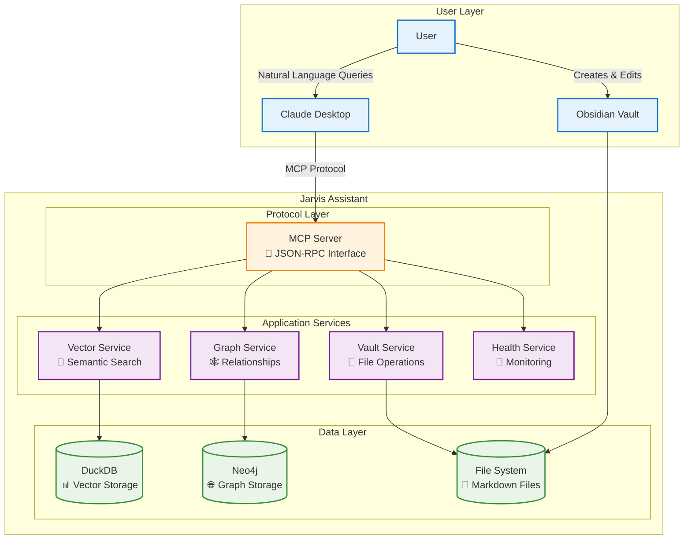
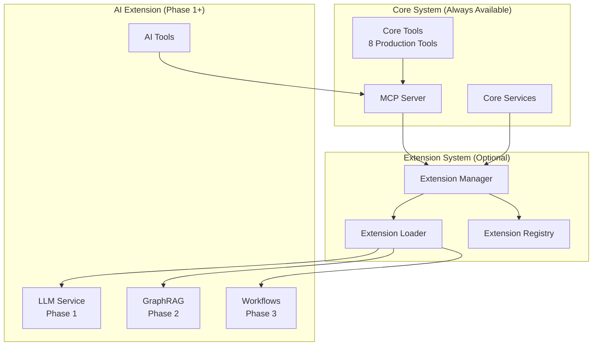
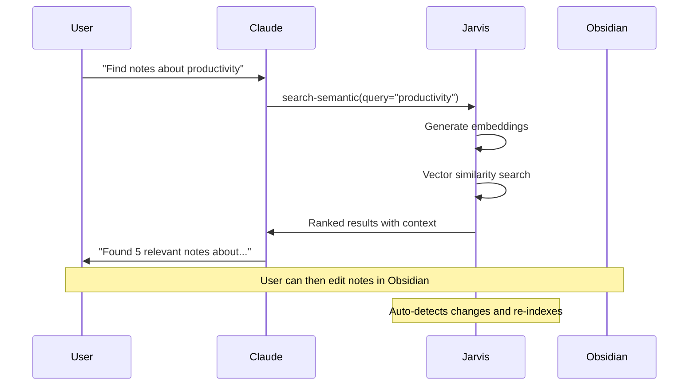
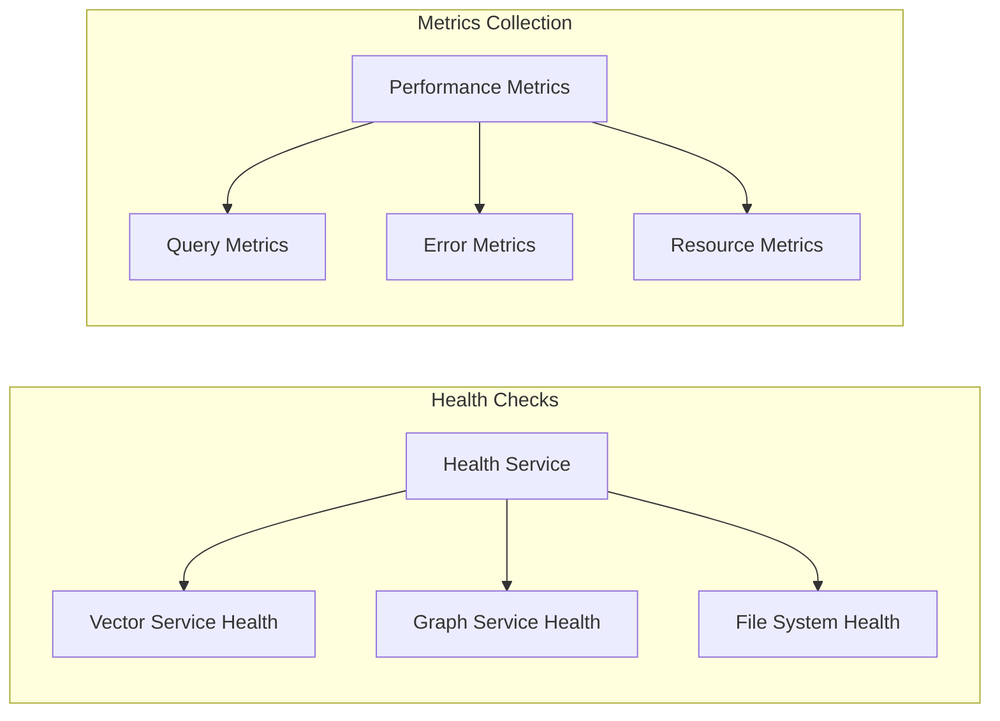

# System Overview

*High-level architecture and design philosophy*

## Overview

Jarvis Assistant is a **production-ready MCP server** that transforms Obsidian vaults into intelligent, searchable knowledge bases. The system bridges the gap between human knowledge organization and AI-powered discovery through sophisticated semantic search, graph relationships, and traditional text matching.

### System Philosophy

Jarvis Assistant embodies a **local-first, privacy-focused** approach to AI-powered knowledge management:

- **Local Intelligence**: All AI processing happens on your machine
- **Privacy by Design**: Your knowledge never leaves your device
- **Graceful Degradation**: Core features work even with minimal setup
- **Production Ready**: Robust error handling and performance optimization
- **AI-Native**: Built specifically for integration with AI tools like Claude Desktop

## System Architecture



## Core Capabilities

### 1. Semantic Search (Vector-Based)

**Purpose**: Find conceptually related content even when exact terms don't match

| Feature | Implementation | Performance |
|---------|----------------|-------------|
| **Embedding Model** | sentence-transformers (local) | ~1000 sentences/sec |
| **Vector Database** | DuckDB with vector extensions | <50ms average query |
| **Similarity Method** | Cosine similarity | 0.7+ threshold |
| **Chunking Strategy** | 256 tokens with 50-token overlap | Preserves context |

**Example**: Query "machine learning" finds notes about "neural networks", "deep learning", "AI algorithms"

### 2. Graph Search (Relationship-Based)

**Purpose**: Discover connections and knowledge paths between notes

| Feature | Implementation | Capability |
|---------|----------------|------------|
| **Graph Database** | Neo4j (optional) | Relationship traversal |
| **Relationship Types** | Links, references, similarities | Multi-directional search |
| **Traversal Depth** | Configurable (1-5 hops) | Prevents result explosion |
| **Fallback Mode** | Semantic search when offline | Graceful degradation |

**Example**: Starting from "Project Management" → finds linked "Agile Methodology" → discovers "Scrum Framework"

### 3. Vault Search (Traditional Text)

**Purpose**: Fast exact-match searching for specific terms or phrases

| Feature | Implementation | Performance |
|---------|----------------|-------------|
| **Search Method** | File system + regex | <10ms average |
| **Content Parsing** | Markdown-aware | Frontmatter support |
| **File Filtering** | Path patterns, types | Flexible targeting |
| **Result Ranking** | Relevance + recency | Smart ordering |

**Example**: Search for "TODO" finds all task items across your vault

### 4. Combined Search (Hybrid)

**Purpose**: Leverage multiple search strategies for comprehensive results

| Strategy | Weight | Use Case |
|----------|--------|----------|
| **Semantic** | 60% | Conceptual similarity |
| **Graph** | 25% | Related through connections |
| **Vault** | 15% | Exact term matches |

## Extension Architecture

*Added in Phase 0 - Extension Foundation*

Jarvis Assistant features a **plugin-based extension architecture** that enables optional advanced capabilities while preserving core system reliability:

### Extension System Design



### Key Extension Principles

✅ **True Optionality**: Extensions are completely separate from core functionality  
✅ **Zero Performance Impact**: Core system performance unchanged when extensions disabled  
✅ **Graceful Degradation**: Extension failures don't affect core system stability  
✅ **Progressive Enhancement**: Users can enable specific features based on needs  
✅ **Resource Efficiency**: AI models only loaded when extensions are enabled  

### Extension Configuration

```bash
# Enable extension system
export JARVIS_EXTENSIONS_ENABLED=true
export JARVIS_EXTENSIONS_AUTO_LOAD=ai

# Configure AI extension (Phase 1+)
export JARVIS_AI_EXTENSION_ENABLED=true
export JARVIS_AI_LLM_PROVIDER=ollama
export JARVIS_AI_MAX_MEMORY_GB=8
```

## MCP Tools Interface

Jarvis Assistant exposes **8 production-ready MCP tools** for AI integration, with additional tools available through extensions:

### Core Search Tools

| Tool | Purpose | Primary Database | Fallback |
|------|---------|------------------|----------|
| `search-semantic` | Conceptual content discovery | DuckDB | Vault search |
| `search-graph` | Relationship traversal | Neo4j | Semantic search |
| `search-vault` | Traditional text matching | File system | None |
| `search-combined` | Multi-strategy hybrid | All databases | Graceful degradation |

### Utility Tools

| Tool | Purpose | Dependencies | Performance |
|------|---------|--------------|-------------|
| `read-note` | File content retrieval | File system | <5ms |
| `list-vaults` | Vault discovery & stats | File system | <10ms |
| `health-status` | System health monitoring | All services | <20ms |
| `performance-metrics` | Performance analytics | Internal metrics | <15ms |

## System Integration Points

### Claude Desktop Integration



### Data Flow Characteristics

| Stage | Latency | Caching | Optimization |
|-------|---------|---------|--------------|
| **Query Processing** | <5ms | Parameter validation | Input sanitization |
| **Embedding Generation** | 100-200ms | LRU cache (1000 queries) | Batch processing |
| **Database Query** | 20-100ms | Query result cache | Index optimization |
| **Result Processing** | 10-30ms | Formatted response cache | Lazy loading |
| **Total Response** | **150-350ms** | Multi-layer caching | Connection pooling |

## Deployment Architecture

### Minimal Setup (Core Features)

```
┌─────────────────┐    ┌─────────────────┐    ┌─────────────────┐
│ Claude Desktop  │────│ Jarvis Assistant│────│ Obsidian Vault  │
│                 │    │ • Vector Search │    │ • .md files     │
│ • MCP Client    │    │ • Vault Search  │    │ • Frontmatter   │
│ • AI Interface  │    │ • DuckDB only   │    │ • Wiki Links    │
└─────────────────┘    └─────────────────┘    └─────────────────┘
```

**Requirements**: Python 3.11+, UV package manager  
**Setup Time**: ~5 minutes  
**Features**: Semantic search, vault search, file operations

### Full Setup (All Features)

```
┌─────────────────┐    ┌─────────────────┐    ┌─────────────────┐
│ Claude Desktop  │────│ Jarvis Assistant│────│ Obsidian Vault  │
│                 │    │ • All Services  │    │ • Full vault    │
│ • MCP Client    │    │ • DuckDB        │    │ • Relationships │
│ • AI Interface  │    │ • Neo4j         │    │ • Rich metadata │
└─────────────────┘    └─────────────────┘    └─────────────────┘
```

**Requirements**: + Neo4j database  
**Setup Time**: ~15 minutes  
**Features**: + Graph search, relationship discovery, advanced analytics

## Performance Characteristics

### System Requirements

| Component | Minimum | Recommended | Notes |
|-----------|---------|-------------|-------|
| **Memory** | 2GB RAM | 4GB+ RAM | Embedding models + databases |
| **Storage** | 1GB free | 5GB+ free | Indexes + original content |
| **CPU** | 2 cores | 4+ cores | Embedding generation |
| **Python** | 3.11+ | 3.11+ | UV package manager |

### Scalability Limits

| Dimension | Current Limit | Bottleneck | Mitigation |
|-----------|---------------|------------|------------|
| **Vault Size** | ~100k files | File system I/O | Incremental indexing |
| **Concurrent Users** | 1 (local) | Single-machine design | Future: clustering |
| **Query Throughput** | ~50 qps | Embedding generation | Caching + batching |
| **Index Size** | ~10GB | Memory + disk | Compression + pruning |

## Security & Privacy

### Privacy-First Design

- **No External APIs**: All processing happens locally
- **No Data Collection**: No telemetry or usage tracking
- **Encrypted Storage**: Database files use standard encryption
- **Access Control**: File system permissions control access

### Security Considerations

| Threat | Mitigation | Implementation |
|--------|------------|----------------|
| **Code Injection** | Input validation + sanitization | Parameter checking |
| **Path Traversal** | Vault root restrictions | Path validation |
| **Resource Exhaustion** | Query limits + timeouts | Circuit breakers |
| **Unauthorized Access** | File system permissions | OS-level security |

## Monitoring & Observability

### Health Monitoring



### Key Metrics

| Category | Metrics | Purpose |
|----------|---------|---------|
| **Performance** | Query latency, throughput | Optimization targets |
| **Reliability** | Error rates, uptime | System stability |
| **Resources** | Memory usage, disk I/O | Capacity planning |
| **Business** | Search quality, user satisfaction | Feature effectiveness |

## Future Roadmap

### Near-Term Enhancements (3 months)

- **Incremental Indexing**: Real-time updates without full re-indexing
- **Query Optimization**: Advanced caching and batch processing
- **Enhanced Monitoring**: Detailed performance analytics
- **Plugin Architecture**: Third-party tool extensions

### Medium-Term Goals (6-12 months)

- **Multi-Language Support**: Non-English content processing
- **Advanced Relationships**: Automatic concept extraction
- **Horizontal Scaling**: Multi-machine deployments
- **Alternative Models**: Support for newer embedding models

### Long-Term Vision (12+ months)

- **Knowledge Graph AI**: Automatic relationship discovery
- **Multi-Modal Search**: Images, PDFs, other content types
- **Collaborative Features**: Shared knowledge bases
- **Enterprise Features**: Advanced security and compliance

---

*This overview provides the architectural foundation for understanding Jarvis Assistant. For implementation details, see the specific design documents in this section.*