# System Overview

## High-Level Architecture and Design Philosophy

## Overview

Jarvis Assistant is a **production-ready MCP server** that transforms Obsidian vaults into intelligent, searchable knowledge bases. The system bridges the gap between human knowledge organization and AI-powered discovery through sophisticated semantic search, graph relationships, and traditional text matching.

### System Philosophy

Jarvis Assistant embodies a **local-first, privacy-focused** approach to AI-powered knowledge management:

- **Local Intelligence**: All AI processing happens on your machine
- **Privacy by Design**: Your knowledge never leaves your device
- **Graceful Degradation**: Core features work even with minimal setup
- **Production Ready**: Robust error handling and performance optimization
- **AI-Native**: Built specifically for integration with AI tools like Claude Desktop

## System Architecture

```mermaid
graph TB
    subgraph "User Layer"
        U[User]
        CD[Claude Desktop]
        OV[Obsidian Vault]
    end
    
    subgraph "Jarvis Assistant"
        subgraph "Protocol Layer"
            MCP[MCP Server<br/>📡 JSON-RPC Interface]
        end
        
        subgraph "Core Infrastructure"
            SC[Service Container<br/>🏗️ Dependency Injection]
            DI[Database Initializer<br/>🔧 Database Management]
        end
        
        subgraph "Application Services"
            VS[Vector Service<br/>🧠 Semantic Search]
            GS[Graph Service<br/>🕸️ Relationships]
            VaultS[Vault Service<br/>📁 File Operations]
            HS[Health Service<br/>💊 Monitoring]
        end
        
        subgraph "Data Layer"
            DDB[(DuckDB<br/>📊 Vector Storage)]
            NEO[(Neo4j<br/>🌐 Graph Storage)]
            FS[(File System<br/>📝 Markdown Files)]
        end
    end
    
    U -->|Natural Language Queries| CD
    CD -->|MCP Protocol| MCP
    U -->|Creates & Edits| OV
    
    MCP --> SC
    SC -->|Manages & Provides| VS
    SC -->|Manages & Provides| GS
    SC -->|Manages & Provides| VaultS
    SC -->|Manages & Provides| HS
    
    DI -->|Ensures Database Ready| DDB
    DI -->|Ensures Database Ready| NEO
    
    VS --> DDB
    GS --> NEO
    VaultS --> FS
    OV --> FS
    
    classDef user fill:#e3f2fd,stroke:#1976d2,stroke-width:2px
    classDef protocol fill:#fff3e0,stroke:#f57c00,stroke-width:2px
    classDef infrastructure fill:#e8eaf6,stroke:#3f51b5,stroke-width:2px
    classDef service fill:#f3e5f5,stroke:#7b1fa2,stroke-width:2px
    classDef storage fill:#e8f5e8,stroke:#388e3c,stroke-width:2px
    
    class U,CD,OV user
    class MCP protocol
    class SC,DI infrastructure
    class VS,GS,VaultS,HS service
    class DDB,NEO,FS storage
```



## Core Infrastructure

### Service Container & Dependency Injection

Jarvis Assistant implements a **Service Container pattern** with **Dependency Injection** to manage service lifecycles and dependencies. This architectural foundation enables:

#### Key Benefits

| Benefit | Implementation | Impact |
|---------|----------------|--------|
| **Loose Coupling** | Services depend on interfaces, not implementations | Easy to swap database backends |
| **Testability** | Mock services can be injected for testing | 97% test coverage achieved |
| **Resource Management** | Singleton pattern for expensive services | 50% reduction in initialization time |
| **Configuration Flexibility** | Feature flags control service availability | Gradual migration support |

#### Service Registration Pattern

```python
# Service container manages all dependencies
container = ServiceContainer(settings)

# Register services with automatic dependency resolution
container.register(IVectorDatabase, VectorDatabase, singleton=True)
container.register(IVectorEncoder, VectorEncoder, singleton=True)
container.register(IVectorSearcher, VectorSearcher, singleton=True)

# Services automatically receive their dependencies
searcher = container.get(IVectorSearcher)  # Gets database and encoder automatically
```

#### Database Initialization System

The **DatabaseInitializer** provides robust database management with comprehensive error handling:

**Features**:

- **Automatic Creation**: Creates missing database files with proper schema
- **Health Validation**: Verifies database integrity and schema version
- **Corruption Recovery**: Backs up corrupted databases and recreates them
- **Permission Handling**: Provides actionable guidance for access issues

**Recovery Strategies**:

```python
class DatabaseRecoveryStrategy:
    def handle_missing_file(self) -> InitializationResult      # Create new database
    def handle_permission_error(self) -> InitializationResult  # Provide user guidance
    def handle_corruption(self) -> InitializationResult        # Backup and recreate
```

**Integration with Service Container**:

```python
# Database initialization happens before service registration
def configure_default_services(self) -> None:
    database_path = self.settings.get_vector_db_path()
    initializer = DatabaseInitializer(database_path, self.settings)
    
    if not initializer.ensure_database_exists():
        raise ConfigurationError("Database initialization failed")
    
    # Register services only after successful initialization
    self.register(IVectorDatabase, VectorDatabase, singleton=True)
```

### Service Architecture Patterns

#### Interface-Based Design

All services implement well-defined interfaces enabling:

- **Runtime Service Swapping**: Switch between implementations
- **Mock Testing**: Easy unit testing with test doubles
- **Plugin Architecture**: Third-party service implementations

```python
# Core service interfaces
IVectorDatabase    # Vector storage operations
IGraphDatabase     # Graph relationship operations  
IVaultReader       # File system operations
IVectorEncoder     # Text embedding operations
IVectorSearcher    # Semantic search operations
IHealthChecker     # System health monitoring
```

#### Graceful Degradation

Services are designed to work independently with fallback mechanisms:

- **Graph Search**: Falls back to semantic search if Neo4j unavailable
- **Metrics Collection**: System works without metrics if disabled
- **Cache Layers**: Multiple cache levels with fallback to source data

## Core Capabilities

### 1. Semantic Search (Vector-Based)

**Purpose**: Find conceptually related content even when exact terms don't match

| Feature | Implementation | Performance |
|---------|----------------|-------------|
| **Embedding Model** | sentence-transformers (local) | ~1000 sentences/sec |
| **Vector Database** | DuckDB with vector extensions | <50ms average query |
| **Similarity Method** | Cosine similarity | 0.7+ threshold |
| **Chunking Strategy** | 256 tokens with 50-token overlap | Preserves context |

**Example**: Query "machine learning" finds notes about "neural networks", "deep learning", "AI algorithms"

### 2. Graph Search (Relationship-Based)

**Purpose**: Discover connections and knowledge paths between notes

| Feature | Implementation | Capability |
|---------|----------------|------------|
| **Graph Database** | Neo4j (optional) | Relationship traversal |
| **Relationship Types** | Links, references, similarities | Multi-directional search |
| **Traversal Depth** | Configurable (1-5 hops) | Prevents result explosion |
| **Fallback Mode** | Semantic search when offline | Graceful degradation |

**Example**: Starting from "Project Management" → finds linked "Agile Methodology" → discovers "Scrum Framework"

### 3. Vault Search (Traditional Text)

**Purpose**: Fast exact-match searching for specific terms or phrases

| Feature | Implementation | Performance |
|---------|----------------|-------------|
| **Search Method** | File system + regex | <10ms average |
| **Content Parsing** | Markdown-aware | Frontmatter support |
| **File Filtering** | Path patterns, types | Flexible targeting |
| **Result Ranking** | Relevance + recency | Smart ordering |

**Example**: Search for "TODO" finds all task items across your vault

### 4. Combined Search (Hybrid)

**Purpose**: Leverage multiple search strategies for comprehensive results

| Strategy | Weight | Use Case |
|----------|--------|----------|
| **Semantic** | 60% | Conceptual similarity |
| **Graph** | 25% | Related through connections |
| **Vault** | 15% | Exact term matches |

## Extension Architecture

*Added in Phase 0 - Extension Foundation*

Jarvis Assistant features a **plugin-based extension architecture** that enables optional advanced capabilities while preserving core system reliability:

### Extension System Design


### Key Extension Principles

✅ **True Optionality**: Extensions are completely separate from core functionality  
✅ **Zero Performance Impact**: Core system performance unchanged when extensions disabled  
✅ **Graceful Degradation**: Extension failures don't affect core system stability  
✅ **Progressive Enhancement**: Users can enable specific features based on needs  
✅ **Resource Efficiency**: AI models only loaded when extensions are enabled  

### Extension Configuration

```bash
# Enable extension system
export JARVIS_EXTENSIONS_ENABLED=true
export JARVIS_EXTENSIONS_AUTO_LOAD=ai

# Configure AI extension (Phase 1+)
export JARVIS_AI_EXTENSION_ENABLED=true
export JARVIS_AI_LLM_PROVIDER=ollama
export JARVIS_AI_MAX_MEMORY_GB=8
```

## MCP Tools Interface

Jarvis Assistant exposes **8 production-ready MCP tools** for AI integration, with additional tools available through extensions:

### Core Search Tools

| Tool | Purpose | Primary Database | Fallback |
|------|---------|------------------|----------|
| `search-semantic` | Conceptual content discovery | DuckDB | Vault search |
| `search-graph` | Relationship traversal | Neo4j | Semantic search |
| `search-vault` | Traditional text matching | File system | None |
| `search-combined` | Multi-strategy hybrid | All databases | Graceful degradation |

### Utility Tools

| Tool | Purpose | Dependencies | Performance |
|------|---------|--------------|-------------|
| `read-note` | File content retrieval | File system | <5ms |
| `list-vaults` | Vault discovery & stats | File system | <10ms |
| `health-status` | System health monitoring | All services | <20ms |
| `performance-metrics` | Performance analytics | Internal metrics | <15ms |

## System Integration Points

### Claude Desktop Integration


### Data Flow Characteristics

| Stage | Latency | Caching | Optimization |
|-------|---------|---------|--------------|
| **Query Processing** | <5ms | Parameter validation | Input sanitization |
| **Embedding Generation** | 100-200ms | LRU cache (1000 queries) | Batch processing |
| **Database Query** | 20-100ms | Query result cache | Index optimization |
| **Result Processing** | 10-30ms | Formatted response cache | Lazy loading |
| **Total Response** | **150-350ms** | Multi-layer caching | Connection pooling |

**Performance Targets vs Current Performance**:

| Operation | Target | Current Average | Status |
|-----------|--------|-----------------|--------|
| **Semantic Search** | <5s | 2.1s | ✅ Exceeds |
| **Graph Search** | <8s | 3.4s | ✅ Exceeds |
| **Vault Search** | <3s | 0.8s | ✅ Exceeds |
| **Database Initialization** | <30s | 12s | ✅ Exceeds |

*For detailed performance analysis, see [Performance Characteristics](performance-characteristics.md)*

## Deployment Architecture

### Minimal Setup (Core Features)

```
┌─────────────────┐    ┌─────────────────┐    ┌─────────────────┐
│ Claude Desktop  │────│ Jarvis Assistant│────│ Obsidian Vault  │
│                 │    │ • Vector Search │    │ • .md files     │
│ • MCP Client    │    │ • Vault Search  │    │ • Frontmatter   │
│ • AI Interface  │    │ • DuckDB only   │    │ • Wiki Links    │
└─────────────────┘    └─────────────────┘    └─────────────────┘
```

**Requirements**: Python 3.11+, UV package manager  
**Setup Time**: ~5 minutes  
**Features**: Semantic search, vault search, file operations

### Full Setup (All Features)

```
┌─────────────────┐    ┌─────────────────┐    ┌─────────────────┐
│ Claude Desktop  │────│ Jarvis Assistant│────│ Obsidian Vault  │
│                 │    │ • All Services  │    │ • Full vault    │
│ • MCP Client    │    │ • DuckDB        │    │ • Relationships │
│ • AI Interface  │    │ • Neo4j         │    │ • Rich metadata │
└─────────────────┘    └─────────────────┘    └─────────────────┘
```

**Requirements**: + Neo4j database  
**Setup Time**: ~15 minutes  
**Features**: + Graph search, relationship discovery, advanced analytics

## Performance Characteristics

### System Requirements

| Component | Minimum | Recommended | Notes |
|-----------|---------|-------------|-------|
| **Memory** | 2GB RAM | 4GB+ RAM | Embedding models + databases |
| **Storage** | 1GB free | 5GB+ free | Indexes + original content |
| **CPU** | 2 cores | 4+ cores | Embedding generation |
| **Python** | 3.11+ | 3.11+ | UV package manager |

### Scalability Limits

| Dimension | Current Limit | Bottleneck | Mitigation |
|-----------|---------------|------------|------------|
| **Vault Size** | ~100k files | File system I/O | Incremental indexing |
| **Concurrent Users** | 1 (local) | Single-machine design | Future: clustering |
| **Query Throughput** | ~50 qps | Embedding generation | Caching + batching |
| **Index Size** | ~10GB | Memory + disk | Compression + pruning |

## Security & Privacy

### Privacy-First Design

- **No External APIs**: All processing happens locally
- **No Data Collection**: No telemetry or usage tracking
- **Encrypted Storage**: Database files use standard encryption
- **Access Control**: File system permissions control access

### Security Considerations

| Threat | Mitigation | Implementation |
|--------|------------|----------------|
| **Code Injection** | Input validation + sanitization | Parameter checking |
| **Path Traversal** | Vault root restrictions | Path validation |
| **Resource Exhaustion** | Query limits + timeouts | Circuit breakers |
| **Unauthorized Access** | File system permissions | OS-level security |

## Monitoring & Observability

### Health Monitoring


### Key Metrics

| Category | Metrics | Purpose |
|----------|---------|---------|
| **Performance** | Query latency, throughput | Optimization targets |
| **Reliability** | Error rates, uptime | System stability |
| **Resources** | Memory usage, disk I/O | Capacity planning |
| **Business** | Search quality, user satisfaction | Feature effectiveness |

## Future Roadmap

### Near-Term Enhancements (3 months)

- **Incremental Indexing**: Real-time updates without full re-indexing
- **Query Optimization**: Advanced caching and batch processing
- **Enhanced Monitoring**: Detailed performance analytics
- **Plugin Architecture**: Third-party tool extensions

### Medium-Term Goals (6-12 months)

- **Multi-Language Support**: Non-English content processing
- **Advanced Relationships**: Automatic concept extraction
- **Horizontal Scaling**: Multi-machine deployments
- **Alternative Models**: Support for newer embedding models

### Long-Term Vision (12+ months)

- **Knowledge Graph AI**: Automatic relationship discovery
- **Multi-Modal Search**: Images, PDFs, other content types
- **Collaborative Features**: Shared knowledge bases
- **Enterprise Features**: Advanced security and compliance

## Architecture Cross-References

### Core Infrastructure Documentation

| Component | Primary Document | Implementation Details | Testing Guide | Status |
|-----------|------------------|----------------------|---------------|--------|
| **System Architecture** | [Architecture](architecture.md) | Complete system design | System integration tests | ✅ Production |
| **Service Container** | [Dependency Injection Implementation](dependency-injection-implementation.md) | `src/jarvis/core/container.py` | `resources/tests/unit/test_service_container.py` | ✅ Production |
| **Database Initializer** | [Database Initialization Architecture](database-initialization-architecture.md) | `src/jarvis/services/database_initializer.py` | `resources/tests/unit/test_database_initializer.py` | ✅ Production |
| **Extension System** | [Extension Architecture](extension-architecture.md) | `src/jarvis/extensions/` | Extension integration tests | 📋 Planned |
| **Performance Analysis** | [Performance Characteristics](performance-characteristics.md) | System-wide metrics | Performance benchmarks | ✅ Current |
| **Service Interfaces** | [Component Interaction](component-interaction.md) | `src/jarvis/core/interfaces.py` | Interface contract tests | ✅ Production |
| **Implementation Status** | [Implementation Status](implementation-status.md) | All components | Coverage reports | 📊 Current |

### Service Layer Documentation

| Service | Architecture Doc | Implementation | MCP Integration | Status |
|---------|------------------|----------------|-----------------|--------|
| **Vector Search** | [Semantic Search Design](semantic-search-design.md) | `src/jarvis/services/vector/` | `search-semantic` tool | ✅ Production |
| **Graph Search** | [Neo4j Schema](neo4j-schema.md) | `src/jarvis/services/graph/` | `search-graph` tool | ✅ Production |
| **Vault Operations** | [Data Flow Architecture](data-flow.md) | `src/jarvis/services/vault/` | `read-note`, `search-vault` tools | ✅ Production |
| **Health Monitoring** | [Component Interaction](component-interaction.md) | `src/jarvis/services/health.py` | `health-status` tool | ✅ Production |
| **Database Management** | [Database Initialization Architecture](database-initialization-architecture.md) | `src/jarvis/services/database_initializer.py` | System startup | ✅ Production |
| **Service Startup** | [Service Startup Sequence](service-startup-sequence.md) | `src/jarvis/mcp/server.py` | MCP server initialization | ✅ Production |

### Protocol & Integration

| Topic | Primary Document | Related ADRs | Implementation |
|-------|------------------|--------------|----------------|
| **MCP Protocol** | [MCP Implementation Details](mcp-implementation-details.md) | ADR-003 | `src/jarvis/mcp/server.py` |
| **Tool Architecture** | [MCP Implementation Details](mcp-implementation-details.md) | ADR-003 | `src/jarvis/mcp/plugins/tools/` |
| **Error Handling** | [Component Interaction](component-interaction.md) | ADR-008 | Error propagation patterns |

### Database Architecture

| Database | Schema Document | Connection Management | Initialization |
|----------|-----------------|----------------------|----------------|
| **DuckDB** | [Semantic Search Design](semantic-search-design.md) | `src/jarvis/services/vector/database.py` | [Database Initialization](database-initialization-architecture.md) |
| **Neo4j** | [Neo4j Schema](neo4j-schema.md) | `src/jarvis/services/graph/database.py` | Optional with graceful degradation |

### Decision History

| Architectural Decision | ADR Reference | Implementation Status | Impact Assessment |
|------------------------|---------------|----------------------|-------------------|
| **Local-First Design** | [ADR-001](architecture-decisions.md#adr-001) | ✅ Complete | High - Fundamental |
| **DuckDB Vector Storage** | [ADR-002](architecture-decisions.md#adr-002) | ✅ Complete | High - Core functionality |
| **MCP Protocol** | [ADR-003](architecture-decisions.md#adr-003) | ✅ Complete | High - AI integration |
| **Dependency Injection** | [ADR-004](architecture-decisions.md#adr-004) | ✅ Complete | Medium - Code organization |
| **Database Initialization** | [ADR-008](architecture-decisions.md#adr-008) | ✅ Complete | High - System reliability |

### Development Workflow

| Phase | Documentation | Implementation Guide | Testing Strategy |
|-------|---------------|---------------------|------------------|
| **Setup** | [Quick Start](../03-getting-started/quick-start.md) | [Detailed Installation](../03-getting-started/detailed-installation.md) | Environment validation |
| **Development** | [Developer Guide](../05-development/developer-guide.md) | [Code Standards](../05-development/code-standards.md) | [Testing Strategy](../05-development/testing-strategy.md) |
| **Deployment** | [Deployment Patterns](deployment-patterns.md) | Configuration management | Integration testing |

### Troubleshooting Quick Reference

| Issue Category | Diagnostic Document | Common Solutions | Related Architecture |
|----------------|-------------------|------------------|---------------------|
| **Database Issues** | [Database Initialization](database-initialization-architecture.md) | Auto-recovery patterns | DatabaseInitializer |
| **Service Failures** | [Component Interaction](component-interaction.md) | Dependency injection debugging | Service Container |
| **MCP Tool Errors** | [MCP Implementation](mcp-implementation-details.md) | Error handling patterns | Tool architecture |
| **Performance Issues** | [Performance Tuning](../07-maintenance/performance-tuning.md) | Caching and optimization | Service layer design |

---

*This overview provides the architectural foundation for understanding Jarvis Assistant. Use the cross-references above to dive deeper into specific components and implementation details.*