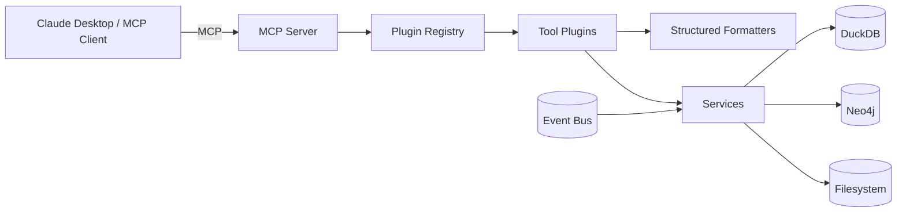
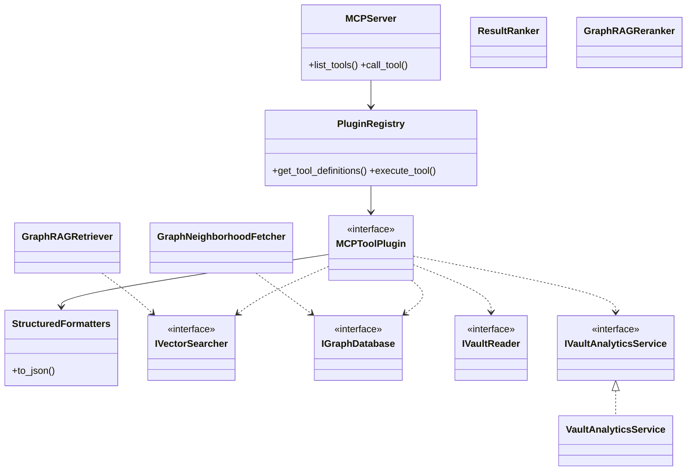
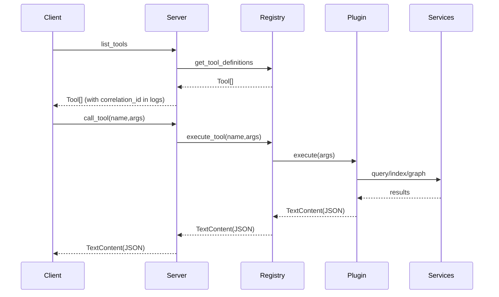
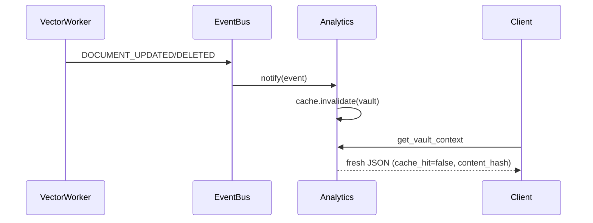
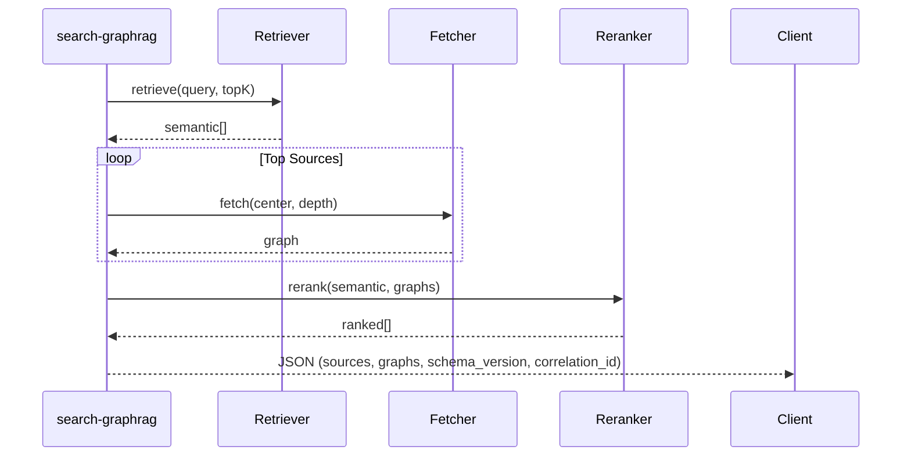
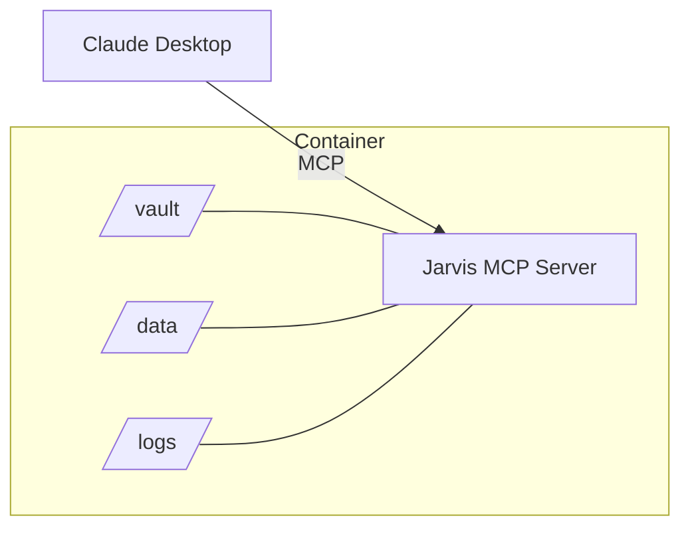

# Jarvis Assistant — arc42 Architecture Documentation

Version: 1.0 • Date: 2025-09-11

## 1. Introduction and Goals

- Local-first MCP server integrating semantic search, graph exploration, and analytics.
- Goals: structured JSON outputs, plugin-based extensibility, privacy, performance, testability.

## 2. Constraints

- JSON-only outputs (schema_version=v1) with correlation_id.
- Must run fully local; optional Dockerized deployment.
- Pluggable services via DI/container and plugin registry.

## 3. System Context

## 4. Solution Strategy

- SOLID:
  - SRP: Plugins orchestrate; services compute; formatters present.
  - OCP: Add new tools/services without modifying existing components (registry + DI).
  - LSP/ISP: Narrow interfaces (`IVectorSearcher`, `IGraphDatabase`, `IVaultReader`, `IVaultAnalyticsService`).
  - DIP: Plugins depend on interfaces resolved by DI.
- Structured responses: centralized schemas and helpers; versioned payloads.
- Event-driven analytics: file changes invalidate cache, analytics return freshness.

| Principle | Mapping |
|---|---|
| SRP | `plugins`, `services`, `structured` separated roles |
| OCP | Plugin registry + DI for extensions |
| LSP | Replaceable service implementations via interfaces |
| ISP | Multiple small ports (searcher, graph, vault, analytics) |
| DIP | Composition root injects all ports into plugins |

## 5. Building Block View

Note: Heavy features (analytics, GraphRAG) reside under `jarvis.features.*` and are re-exported via import shims at `jarvis.services.*` to keep import paths stable. The diagrams show service classes generically; consult `src/jarvis/features/` for implementations.

## 6. Runtime View

### 6.1 Tool Invocation

### 6.2 Analytics Invalidation

### 6.3 GraphRAG MVP

## 7. Deployment View

Docker:
- Dockerfile and docker-compose.yaml provided; mount sample vault and data/logs.

## 8. Cross-cutting Concepts

- Structured JSON Responses: centralized models/formatters; schema_version & correlation_id.
- Config & Secrets: YAML config (base/local) with overrides; pluggable secrets provider (future).
- Observability: structured logs, correlation IDs, metrics categorized by prefixes.

## 9. Quality Requirements

- Performance targets: <2s cached analytics, <15s fresh; <12s GraphRAG MVP.
- Stability: event-driven invalidation; resilient error handling; partial results with diagnostics.

## 10. Risks & Technical Debt

- Graph DB availability: tools fallback with explanation; consider abstractions for alternate graph stores.
- Learning curve: provide sample vault, dockerized demos, JSON schemas.
