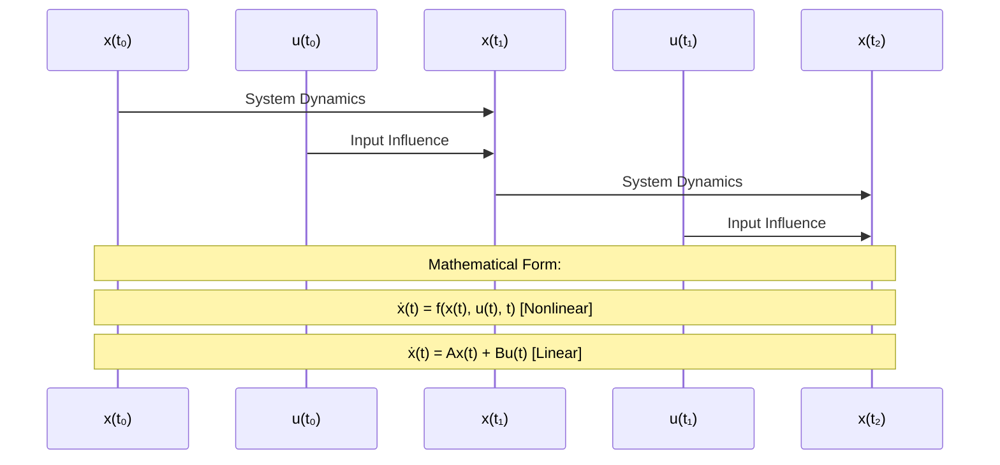

---
tags:
  - ⚛️
  - refinement
aliases:
  - State Variable
  - System State
  - State Space Vector
  - State Variables
summary: Mathematical vector representing the minimum set of variables containing sufficient information to predict future system behavior given future inputs, encoding system memory and current condition
domains:
  - mathematics
  - control-systems
  - systems-theory
"up:":
  - "[[State Space Model]]"
  - "[[Linear Algebra]]"
  - "[[Systems Theory]]"
similar:
  - "[[Vector]]"
  - "[[System Variables]]"
  - "[[Dynamic Systems]]"
leads to:
  - "[[System Matrices]]"
  - "[[Controllability and Observability]]"
  - "[[State Evolution]]"
  - "[[System Identification]]"
extends:
  - "[[Vector]]"
  - "[[Linear Algebra]]"
concepts:
  - "[[State Dimension]]"
  - "[[State Evolution]]"
  - "[[System Memory]]"
  - "[[Minimal Representation]]"
sources:
  - Linear Systems Theory (Kailath)
  - Modern Control Engineering (Ogata)
  - State Space Methods in Control Systems
  - Dynamic Systems and Control (Khalil)
reviewed: 2025-07-14
---

The **State Vector** represents the fundamental concept of system memory in dynamic systems analysis, encoding the minimum information necessary to predict future system behavior given knowledge of future inputs. This mathematical abstraction transforms complex physical systems into tractable vector-based representations that enable systematic analysis, control design, and estimation algorithms across engineering and scientific domains.

The power of the state vector concept lies in its ability to capture the essential "memory" of a system—those aspects of past behavior that influence future response—while eliminating redundant information. Through **[[Linear Algebra]]** formalism, the state vector provides both mathematical rigor and intuitive physical interpretation, making it the cornerstone of modern **[[State Space Model]]** analysis.

Understanding state vectors requires mastering **mathematical definitions**, **physical interpretations**, **dimensional analysis**, and **practical applications** that connect abstract mathematical concepts with real-world engineering systems.

## Mathematical Definition and Properties

### Formal Definition

For a dynamic system, the **state vector** $x(t) \in \mathbb{R}^n$ at time $t$ contains the minimum set of variables such that:

$$x(t_0) + \{u(\tau) : \tau \geq t_0\} \Rightarrow \{x(\tau), y(\tau) : \tau \geq t_0\}$$

**Interpretation**: Knowledge of the state at time $t_0$ plus all future inputs uniquely determines all future states and outputs.

### State Vector Evolution

The state vector evolves according to the **state equation**:



```
State Evolution Diagram:
    
x(t₀) ──► [System Dynamics] ──► x(t₁) ──► [System Dynamics] ──► x(t₂) ──► ...
    │                               │                               │
    ▼                               ▼                               ▼
  u(t₀)                           u(t₁)                           u(t₂)
  
Mathematical Form:
ẋ(t) = f(x(t), u(t), t)  [Nonlinear]
ẋ(t) = Ax(t) + Bu(t)     [Linear Time-Invariant]
```

### Key Properties

| Property | Mathematical Expression | Physical Meaning |
|----------|------------------------|-------------------|
| **Minimality** | $\dim(x) = n$ minimal | No redundant variables |
| **Completeness** | Full system memory | All relevant history captured |
| **Uniqueness** | Unique (up to coordinates) | Well-defined system representation |
| **Determinism** | $x(t_0) \Rightarrow x(t)$ | Predictable evolution |

## Physical Interpretation Across Domains

### Mechanical Systems

**Spring-Mass-Damper System**:
```
Physical System:    State Vector:
    
  ┌─────┐              x(t) = [position]     = [x₁]
  │  m  │◄─────k──     [velocity]      [x₂]
  └─────┘
     │
     c (damper)
     
State Evolution:
ẋ₁ = x₂
ẋ₂ = -(k/m)x₁ - (c/m)x₂ + (1/m)u
```

**Physical Meaning**:
- **Position (x₁)**: Current location relative to equilibrium
- **Velocity (x₂)**: Rate of position change
- **Together**: Complete description of mechanical state

### Electrical Systems

**RC Circuit**:
```
Circuit:           State Vector:
    
R ──┬── C          x(t) = [vC(t)]  (Capacitor voltage)
    │   │
   vin  │          State Evolution:
    │   │          ẋ = -(1/RC)x + (1/RC)vin
   ─┴───┴─
   
RLC Circuit:       State Vector:
    
L ── R ── C        x(t) = [iL(t)]   = [x₁]  (Inductor current)
     │    │               [vC(t)]     [x₂]  (Capacitor voltage)
    vin   │
     │    │        State Evolution:
    ─┴────┴─       ẋ₁ = -(R/L)x₁ - (1/L)x₂ + (1/L)vin
                   ẋ₂ = (1/C)x₁
```

### Thermal Systems

**Building Temperature Control**:
```
Thermal System:    State Vector:
    
┌─────────────┐    x(t) = [T_inside]    = [x₁]  (Indoor temperature)
│   T_inside  │          [T_wall]       [x₂]  (Wall temperature)
│      ┌─┐    │          [T_outside]    [x₃]  (Outdoor temperature)
│      │H│    │
│      └─┘    │    State Evolution (simplified):
└─────────────┘    ẋ₁ = a₁₂(x₂ - x₁) + b₁u_heat
   T_outside       ẋ₂ = a₂₁(x₁ - x₂) + a₂₃(x₃ - x₂)
                   ẋ₃ = 0  (external disturbance)
```

### Economic Systems

**Macroeconomic Model**:
```
Economic Variables:    State Vector:
    
GDP ──► Inflation      x(t) = [GDP]        = [x₁]
 │         │                  [Inflation]    [x₂]
 └────►────┘                  [Employment]   [x₃]
    Employment
    
Policy Inputs:         u(t) = [Interest_Rate]  = [u₁]
Interest Rate ────►           [Gov_Spending]     [u₂]
Gov Spending ─────►
```

## State Dimension and System Complexity

### Relationship to System Order

**System Order**: The dimension $n$ of the state vector equals the **system order**, which determines:

| Dimension | System Characteristics | Examples |
|-----------|----------------------|-----------|
| **n = 1** | First-order system | RC circuit, thermal mass |
| **n = 2** | Second-order system | Mass-spring, RLC circuit |
| **n = 3** | Third-order system | DC motor with load |
| **n ≫ 1** | High-order system | Aircraft dynamics, chemical processes |

### State Dimension Analysis

**Determining State Dimension**:
```
System Analysis Process:
    
Physical System ──► Identify Energy Storage ──► Count Independent States
    │                     Elements                      │
    │                        │                         ▼
    │                        ▼                   State Vector
    │                 • Capacitors (voltage)         Dimension
    │                 • Inductors (current)             n
    │                 • Masses (position, velocity)
    │                 • Thermal masses (temperature)
    ▼
Higher-Order         ──► First-Order State ──► State Vector
Differential Eq.          Space Form            x ∈ ℝⁿ
```

**Examples**:
- **Single integrator**: $\ddot{y} = u$ → $n = 2$ (position, velocity)
- **Double integrator**: $\dddot{y} = u$ → $n = 3$ (position, velocity, acceleration)
- **nth-order system**: $y^{(n)} = f(...)$ → $n$ states

## State Coordinate Transformations

### Similarity Transformations

**Coordinate Change**: For invertible matrix $T$:
$$\bar{x} = T^{-1}x$$

**System Matrices Transform**:
$$\bar{A} = T^{-1}AT, \quad \bar{B} = T^{-1}B, \quad \bar{C} = CT$$

**Invariant Properties** (preserved under transformation):
- Eigenvalues of system matrix $A$
- **[[Controllability and Observability]]** properties
- Input-output behavior
- **[[Transfer Functions]]**

### Canonical Forms

**Controllable Canonical Form**:
```
For system: sⁿ + aₙ₋₁sⁿ⁻¹ + ... + a₁s + a₀

State vector: x = [x₁, x₂, ..., xₙ]ᵀ

A = [0  1  0  ...  0 ]    B = [0]    C = [b₀ b₁ ... bₙ₋₁]
    [0  0  1  ...  0 ]        [0]
    [⋮  ⋮  ⋮  ⋱   ⋮ ]        [⋮]
    [0  0  0  ...  1 ]        [0]
    [-a₀ -a₁ -a₂ ... -aₙ₋₁]   [1]
```

**Observable Canonical Form**: Dual structure emphasizing output relationships.

## Engineering Applications and Design Implications

### Control System Design

**State Feedback Control**:
```
Reference ──► Controller ──► Plant ──► Output
  r(t)         u = -Kx      ẋ = Ax + Bu   y = Cx
    │              ▲            │
    └──── Error ───┘            ▼
         e = r - y           State Vector x(t)
                                 │
                              Feedback
```

**Requirements for state feedback**:
- **Full state measurement**: All elements of $x(t)$ available
- **Controllability**: States must be reachable through inputs
- **Stability**: Feedback gain $K$ must stabilize system

### State Estimation

**Observer Design**:
```
Actual System:        Observer:
ẋ = Ax + Bu          x̂̇ = Ax̂ + Bu + L(y - Cx̂)
y = Cx                ŷ = Cx̂
    │                     │
    ▼                     ▼
Measured Output ──► Error ──► Observer Gain
    y(t)           e = y - ŷ        L
```

**State estimation requirements**:
- **Observability**: States must be detectable from outputs
- **Sensor placement**: Measurements must provide sufficient information
- **Observer dynamics**: Estimation error must converge to zero

### System Identification

**Experimental Determination**:
1. **Input Design**: Excite all system modes
2. **Data Collection**: Measure inputs and outputs
3. **Model Structure**: Determine state dimension $n$
4. **Parameter Estimation**: Identify **[[System Matrices]]** A, B, C, D

## Computational Considerations

### Numerical Representation

**State Vector Storage**:
```
Computer Memory Layout:
    
x(t) = [x₁(t)]     Memory: [x₁_val | x₂_val | ... | xₙ_val]
       [x₂(t)]             [double | double | ... | double ]
       [ ⋮  ]              [ 64bit | 64bit  | ... | 64bit  ]
       [xₙ(t)]
```

**Computational Complexity**:
- **Matrix operations**: $O(n^2)$ for matrix-vector products
- **Eigenvalue computation**: $O(n^3)$ for full eigendecomposition
- **Integration**: $O(n)$ per time step for simulation

### Simulation and Integration

**Numerical Integration Methods**:
```
State Propagation:
    
x(t₀) ──► Integrator ──► x(t₁) ──► Integrator ──► x(t₂)
   │      (Euler/RK4)        │      (Euler/RK4)
   ▼                        ▼
 ẋ(t₀) = f(x(t₀), u(t₀))  ẋ(t₁) = f(x(t₁), u(t₁))
```

**Integration Methods**:
- **Euler**: $x_{k+1} = x_k + h \cdot f(x_k, u_k)$
- **Runge-Kutta**: Higher-order accuracy for smooth systems
- **Implicit methods**: Better stability for stiff systems

## Advanced Topics and Extensions

### Nonlinear State Spaces

**General Form**: $\dot{x} = f(x, u)$ where $f$ is nonlinear

**Linearization**: About equilibrium point $(x_e, u_e)$:
$$\dot{\delta x} = \frac{\partial f}{\partial x}\bigg|_e \delta x + \frac{\partial f}{\partial u}\bigg|_e \delta u$$

### Stochastic State Spaces

**Stochastic Differential Equation**:
$$dx = f(x, u) dt + g(x) dw$$
where $dw$ represents white noise.

**Applications**: **[[Kalman Filter]]**, financial modeling, biological systems.

### Distributed Parameter Systems

**Infinite-Dimensional State Spaces**: Partial differential equations lead to state vectors in function spaces.

**Examples**: Heat equation, wave equation, fluid dynamics.

### Hybrid Systems

**Discrete-Continuous State**: Combination of continuous state variables with discrete modes.

**Applications**: Switching systems, digital control, automotive systems.

The state vector concept provides the mathematical foundation for modern dynamic systems analysis, connecting abstract linear algebra with concrete engineering applications. Its power lies in capturing the essential "memory" of complex systems while enabling systematic design of controllers, estimators, and optimization algorithms. From simple mechanical systems to complex distributed networks, the state vector framework remains central to understanding and controlling dynamic behavior across all engineering and scientific domains.