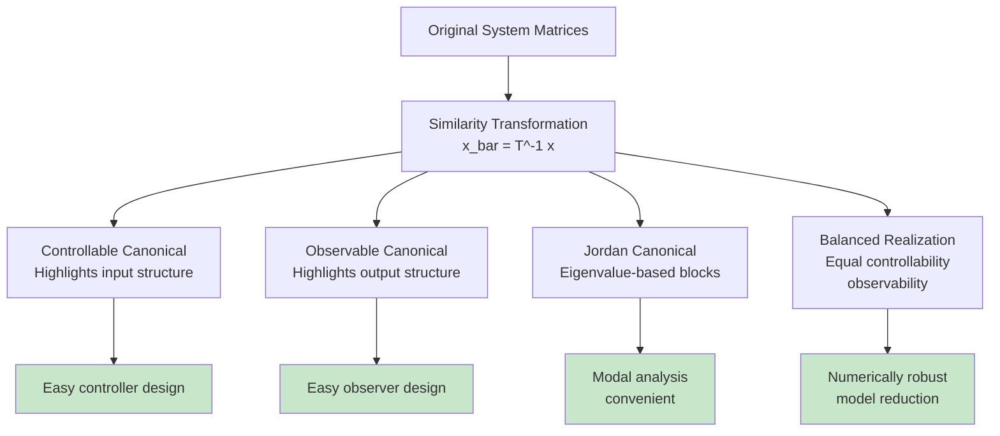

---
tags:
  - ⚛️
  - refinement
aliases:
  - State Space Matrices
  - System Matrix A
  - Input Matrix B
  - Output Matrix C
  - Feedthrough Matrix D
summary: Mathematical matrices A, B, C, D that define the structure and behavior of linear state space systems, encoding dynamics, input coupling, output mapping, and direct feedthrough relationships
domains:
  - linear-algebra
  - control-systems
  - systems-theory
"up:":
  - "[[State Space Model]]"
  - "[[Linear Algebra]]"
  - "[[Systems Theory]]"
similar:
  - "[[Matrix]]"
  - "[[Linear Transformation]]"
  - "[[Transfer Functions]]"
leads to:
  - "[[Controllability and Observability]]"
  - "[[Stability Analysis]]"
  - "[[Control Systems]]"
  - "[[Kalman Filter]]"
extends:
  - "[[Matrix]]"
  - "[[Linear Transformation]]"
concepts:
  - "[[State Evolution]]"
  - "[[Input Coupling]]"
  - "[[Output Mapping]]"
  - "[[System Dynamics]]"
sources:
  - Linear Systems Theory (Kailath)
  - Modern Control Engineering (Ogata)
  - State-Space Methods in Control Systems
reviewed: 2025-07-14
---

System Matrices provide the mathematical foundation for **[[State Space Model]]** representation, encoding all essential information about linear dynamic system behavior through four key matrices: A (system dynamics), B (input coupling), C (output mapping), and D (direct feedthrough). These matrices transform abstract system concepts into concrete computational representations that enable systematic analysis, design, and implementation of control systems, estimation algorithms, and signal processing applications.

The power of this matrix representation lies in its ability to separate different aspects of system behavior while maintaining mathematical tractability. Through **[[Linear Transformation]]** theory, these matrices provide both intuitive physical interpretation and rigorous mathematical foundation for understanding how systems evolve, respond to inputs, and produce measurable outputs.

Understanding system matrices requires mastering **matrix properties**, **physical interpretations**, **structural characteristics**, and **computational considerations** that make state space representation the preferred framework for modern system analysis and design.

## Mathematical Definition and Structure

### Standard State Space Form

The system matrices define the linear state space representation:

$$\dot{x}(t) = Ax(t) + Bu(t)$$
$$y(t) = Cx(t) + Du(t)$$

```mermaid
graph TD
    A[State Vector x(t)] --> B[System Matrix A<br/>n×n]
    C[Input u(t)] --> D[Input Matrix B<br/>n×m]
    
    B --> E[State Evolution<br/>Internal Dynamics]
    D --> F[Input Coupling<br/>External Influence]
    
    E --> G[Next State<br/>dx/dt]
    F --> G
    
    A --> H[Output Matrix C<br/>p×n]
    C --> I[Feedthrough Matrix D<br/>p×m]
    
    H --> J[Output y(t)<br/>Measurements]
    I --> J
    
    style A fill:#e3f2fd
    style C fill:#e8f5e8
    style G fill:#fff3e0
    style J fill:#f3e5f5
```

Where the matrices encode distinct aspects of system behavior:

| Matrix | Dimensions | Mathematical Role | Physical Interpretation |
|--------|------------|-------------------|-------------------------|
| **A** | $n \times n$ | State transition matrix | Internal system dynamics, coupling between states |
| **B** | $n \times m$ | Input distribution matrix | How inputs influence each state variable |
| **C** | $p \times n$ | Output selection matrix | Which states are measured and how |
| **D** | $p \times m$ | Direct feedthrough matrix | Immediate input-to-output coupling |

### Discrete-Time Formulation

For digital systems, the matrices appear in difference equation form:
$$x[k+1] = A_d x[k] + B_d u[k]$$
$$y[k] = C_d x[k] + D_d u[k]$$

**Sampling Relationships**: Continuous and discrete matrices relate through:
$$A_d = e^{AT_s}, \quad B_d = \int_0^{T_s} e^{A\tau} d\tau \cdot B$$

Where $T_s$ is the sampling period, connecting continuous-time physics with discrete-time implementation.

## Matrix A: System Dynamics Matrix

### Mathematical Properties

The **system matrix A** governs autonomous system evolution and determines fundamental system characteristics:

**Eigenvalue Significance**: The eigenvalues $\lambda_i$ of matrix A determine:
- **Stability**: $\text{Re}(\lambda_i) < 0$ for all $i$ ensures asymptotic stability
- **Natural frequencies**: $|\text{Im}(\lambda_i)|$ gives oscillation frequencies  
- **Time constants**: $1/|\text{Re}(\lambda_i)|$ determines response speed
- **Damping**: Ratio of real to imaginary parts indicates damping characteristics

**Modal Interpretation**: Each eigenvalue-eigenvector pair represents a **natural mode**:
$$x(t) = \sum_{i=1}^n c_i v_i e^{\lambda_i t}$$

### Physical Interpretations by Domain

**Mechanical Systems**: Mass-spring-damper dynamics
```
A = [0    1   ]  # [position, velocity] states
    [-k/m -c/m]  # k=spring, c=damping, m=mass
```

**Electrical Circuits**: RC, RLC network dynamics  
```
A = [-1/(RC)]     # RC circuit time constant
A = [0       1  ]  # LC oscillator  
    [-1/(LC) 0  ]
```

**Thermal Systems**: Heat transfer and thermal capacity
```
A = [-1/(RC)]     # R=thermal resistance, C=thermal capacitance
```

**Chemical Processes**: Reaction kinetics and mass transfer
```
A = [-k1  k2 ]    # Reaction rate constants
    [k1  -k2]
```

### Structural Properties

**Sparsity Patterns**: Many physical systems exhibit sparse A matrices:
- **Tridiagonal**: Diffusion processes, transmission lines
- **Block diagonal**: Decoupled subsystems  
- **Companion form**: Systems derived from differential equations

**Special Forms**:
- **Hurwitz matrix**: All eigenvalues in left half-plane (stable)
- **Schur stable**: All eigenvalues inside unit circle (discrete-time stable)
- **Nilpotent**: Some power equals zero (finite settling time)

## Matrix B: Input Distribution Matrix

### Input Coupling Mechanisms

Matrix B determines how external inputs influence internal states:

**Physical Interpretations**:
- **Actuator placement**: Which states are directly influenced by control inputs
- **Coupling strength**: Magnitude of input influence on each state
- **Input direction**: Sign indicates whether input increases or decreases state

**Controllability Connection**: The **[[Controllability and Observability]]** matrix uses B:
$$\mathcal{C} = [B \quad AB \quad A^2B \quad \cdots \quad A^{n-1}B]$$

**Design Considerations**:
- **Actuator selection**: Choose input locations for maximum controllability
- **Input scaling**: Normalize input effects for numerical conditioning
- **Energy efficiency**: Minimize control effort while maintaining performance

### Examples by Application Domain

**Robotic Systems**: Forces and torques on joints
```
B = [0  ]  # Force affects acceleration, not position directly
    [1/m]  # F = ma relationship
```

**Aircraft Control**: Control surface deflections
```
B = [0   0   0 ]  # [angle, rate, acceleration] states
    [0   0   0 ]  # Only acceleration affected by controls  
    [b1  b2  b3]  # Aileron, elevator, rudder effectiveness
```

**Economic Models**: Policy intervention effects
```
B = [b1]  # Monetary policy effectiveness
    [b2]  # Fiscal policy effectiveness
```

## Matrix C: Output Selection Matrix

### Measurement and Observation

Matrix C defines which state combinations are measurable:

**Sensor Models**: 
- **Direct measurement**: C = I (identity) measures all states
- **Partial observation**: C selects subset of states
- **Linear combinations**: C forms weighted combinations of states

**Observable Canonical Form**: For single-output systems, C can be normalized:
$$C = [1 \quad 0 \quad 0 \quad \cdots \quad 0]$$

### Physical Examples

**Position Sensors**: GPS, encoders measure position but not velocity
```
C = [1  0]  # Measure position from [position, velocity] state
```

**Accelerometers**: Measure acceleration, not position
```
C = [0  0  1]  # From [position, velocity, acceleration] state
```

**Temperature Sensors**: Average temperature measurement
```
C = [w1  w2  w3]  # Weighted average of spatial temperature distribution
```

**Economic Indicators**: Observable economic quantities
```
C = [c1  c2]  # GDP, inflation from underlying economic states
```

## Matrix D: Direct Feedthrough Matrix

### Immediate Input-Output Coupling

Matrix D represents direct paths from input to output without state involvement:

**Physical Meaning**:
- **Instantaneous response**: Output immediately responds to input changes
- **Algebraic relationships**: No dynamics involved in coupling
- **Sensor characteristics**: Direct measurement of input effects

**Common Cases**:
- **D = 0**: Most physical systems (pure integrator behavior)
- **D ≠ 0**: Systems with direct coupling or measurement of input

### Examples of Non-Zero D

**Feed-forward Compensation**: Control system with direct input coupling
```
D = [kff]  # Feed-forward gain bypassing dynamics
```

**Measurement Systems**: Sensor measures both state and input
```
D = [1]    # Force sensor measures applied force directly
```

**Economic Models**: Immediate policy effects
```
D = [d1]   # Direct impact before dynamic propagation
```

## Matrix Properties and System Characteristics

### Realizability and Minimality

**Minimal Realization**: Unique (up to similarity transformation) system representation with smallest possible dimension:
- **Controllable and Observable**: Full rank controllability and observability matrices
- **Dimension**: Equals number of poles in transfer function
- **Uniqueness**: Any two minimal realizations are similar (related by similarity transformation)

**Similarity Transformations**: Change of state coordinates
$$\bar{A} = T^{-1}AT, \quad \bar{B} = T^{-1}B, \quad \bar{C} = CT, \quad \bar{D} = D$$

**Invariant Properties**: Eigenvalues, controllability, observability preserved under similarity transformations.

### Canonical Forms



**Controllable Canonical Form**: Standard form highlighting controllability structure
**Observable Canonical Form**: Standard form highlighting observability structure  
**Jordan Canonical Form**: Block diagonal structure based on eigenvalue structure
**Balanced Realization**: Equal controllability and observability gramians

### Numerical Considerations

**Conditioning**: Well-conditioned matrices prevent numerical problems:
- **Eigenvalue sensitivity**: Condition number affects eigenvalue computation accuracy
- **Scaling**: Proper state and input scaling improves numerical properties
- **Balanced realizations**: Minimize numerical sensitivity in computations

**Computational Aspects**:
- **Sparse storage**: Exploit sparsity patterns for large systems
- **Matrix exponential**: Computing $e^{At}$ for simulation and discretization
- **Krylov methods**: Efficient algorithms for large-scale system analysis

## Applications and Design Implications

### Control System Design

**Pole Placement**: Choose feedback gain K to place closed-loop eigenvalues
**LQR Design**: Optimize quadratic cost function to determine optimal feedback
**Observer Design**: Use A and C to design state estimators

### System Identification

**Parameter Estimation**: Determine A, B, C, D from input-output data
**Subspace Methods**: Extract matrices from data using linear algebra techniques
**Model Validation**: Verify identified matrices match system behavior

### Model Reduction

**Balanced Truncation**: Remove weakly controllable/observable states
**Modal Reduction**: Eliminate fast modes to focus on dominant behavior  
**Hankel Norm Reduction**: Optimal approximation preserving input-output characteristics

System matrices provide the mathematical language for describing, analyzing, and designing linear dynamic systems across all engineering and scientific domains. Their structured representation enables systematic approaches to complex system problems while maintaining physical intuition and computational tractability. Understanding these matrices is essential for anyone working with dynamic systems, from classical control engineering to modern machine learning applications involving sequential data and temporal dependencies.