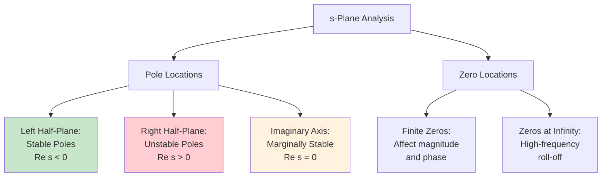

---
tags:
  - ⚛️
  - diagrams
  - refinement
aliases:
  - Transfer Function
  - System Transfer Function
  - Laplace Transfer Function
  - Frequency Response Function
summary: Mathematical representation of linear system input-output relationship in frequency domain through Laplace transform, connecting time-domain state space models with frequency-domain analysis and design
domains:
  - control-systems
  - signal-processing
  - systems-theory
"up:":
  - "[[State Space Model]]"
  - "[[Laplace Transform]]"
  - "[[Control Systems]]"
similar:
  - "[[Frequency Response]]"
  - "[[System Representation]]"
  - "[[Mathematical Models]]"
leads to:
  - "[[Bode Plots]]"
  - "[[Nyquist Analysis]]"
  - "[[Root Locus]]"
  - "[[Frequency Domain Design]]"
extends:
  - "[[Complex Analysis]]"
  - "[[Rational Functions]]"
  - "[[Polynomial Analysis]]"
concepts:
  - "[[Poles and Zeros]]"
  - "[[Frequency Response]]"
  - "[[System Gain]]"
  - "[[Pole-Zero Cancellation]]"
  - "[[Stability Analysis]]"
sources:
  - Modern Control Engineering (Ogata)
  - Linear Systems Theory (Kailath)
  - Signals and Systems (Oppenheim & Willsky)
  - Control Systems Engineering (Nise)
reviewed: 2025-07-14
---

**Transfer Functions** provide the mathematical bridge between time-domain **[[State Space Model]]** representations and frequency-domain analysis, expressing the input-output relationship of linear systems through **[[Laplace Transform]]** techniques. This powerful representation enables systematic analysis of system behavior, stability assessment, and controller design using algebraic methods rather than differential equations.

The transfer function concept transforms complex dynamic system analysis into rational function manipulation, revealing system characteristics through **poles and zeros** that directly correspond to time-domain behavior. By converting convolution operations into multiplication, transfer functions enable powerful graphical design methods and provide intuitive understanding of system frequency response characteristics.

Understanding transfer functions requires mastering **mathematical foundations**, **pole-zero analysis**, **frequency response interpretation**, and **practical applications** that connect abstract algebraic concepts with tangible engineering design tools.

## Mathematical Foundation and Definition

### From State Space to Transfer Function

For linear time-invariant **[[State Space Model]]**:
$$\dot{x}(t) = Ax(t) + Bu(t)$$
$$y(t) = Cx(t) + Du(t)$$

**Transfer Function Derivation**:
```mermaid
graph TD
    A[State Space Model] --> B[Apply Laplace Transform]
    B --> C[sX(s) = AX(s) + BU(s)]
    C --> D[X(s) = (sI - A)^-1 BU(s)]
    D --> E[Y(s) = CX(s) + DU(s)]
    E --> F[Y(s) = C(sI - A)^-1 B + D U(s)]
    F --> G[Transfer Function: G(s) = Y(s)/U(s)]
    
    style A fill:#e1f5fe
    style G fill:#c8e6c9
```

**Transfer Function Formula**:
$$G(s) = C(sI - A)^{-1}B + D$$

### General Form and Properties

**Rational Function Representation**:
$$G(s) = \frac{N(s)}{D(s)} = \frac{b_m s^m + b_{m-1}s^{m-1} + \cdots + b_1 s + b_0}{a_n s^n + a_{n-1}s^{n-1} + \cdots + a_1 s + a_0}$$

**Key Properties**:

| Property | Mathematical Expression | Physical Meaning |
|----------|------------------------|-------------------|
| **Proper** | $m \leq n$ (degree of numerator ≤ denominator) | Physically realizable system |
| **Strictly Proper** | $m < n$ | No direct input-output coupling (D = 0) |
| **Causal** | Proper transfer function | Output doesn't precede input |
| **Stable** | All poles in left half-plane | Bounded response to bounded inputs |

## Poles and Zeros Analysis

### Mathematical Definitions

**Poles**: Values of $s$ where $G(s) \to \infty$ (roots of denominator)
**Zeros**: Values of $s$ where $G(s) = 0$ (roots of numerator)

```mermaid
graph LR
    A[Transfer Function G(s)] --> B[Denominator D(s) = 0]
    A --> C[Numerator N(s) = 0]
    B --> D[Poles: p1, p2, ..., pn]
    C --> E[Zeros: z1, z2, ..., zm]
    
    D --> F[Determine:<br/>• Stability<br/>• Natural Frequencies<br/>• Time Constants]
    E --> G[Determine:<br/>• Transmission Blocking<br/>• Phase Characteristics<br/>• High-frequency Behavior]
    
    style D fill:#ffcdd2
    style E fill:#c8e6c9
```

### Pole-Zero Map Interpretation

**s-Plane Representation**:


### Time Domain Correspondence

**Pole-Time Response Relationship**:

| Pole Type | Location | Time Response | Example |
|-----------|----------|---------------|---------|
| **Real, negative** | $s = -a$ (a > 0) | $e^{-at}$ (exponential decay) | First-order lag |
| **Real, positive** | $s = +a$ | $e^{+at}$ (exponential growth) | Unstable mode |
| **Complex conjugate** | $s = -\sigma \pm j\omega$ | $e^{-\sigma t}\cos(\omega t)$ | Damped oscillation |
| **Imaginary** | $s = \pm j\omega$ | $\cos(\omega t)$ | Sustained oscillation |
| **Multiple** | Repeated poles | $(t^{k-1}/(k-1)!)e^{-at}$ | Higher-order dynamics |

## Frequency Response Analysis

### Sinusoidal Steady-State Response

**Frequency Response**: $G(j\omega) = G(s)|_{s=j\omega}$

```mermaid
graph TD
    A[Sinusoidal Input:<br/>u(t) = A sin wt] --> B[Linear System<br/>G(s)]
    B --> C[Steady-State Output:<br/>y(t) = A magnitude G(jw) sin(wt + phase G(jw))]
    
    D[Transfer Function<br/>G(jw)] --> E[Magnitude:<br/>magnitude G(jw)]
    D --> F[Phase:<br/>phase G(jw)]
    
    E --> G[Gain at frequency w]
    F --> H[Phase shift at frequency w]
    
    style A fill:#e3f2fd
    style C fill:#c8e6c9
```

### Bode Plot Representation

**Magnitude and Phase Plots**:
- **Magnitude**: $20\log_{10}|G(j\omega)|$ dB vs $\log_{10}\omega$
- **Phase**: $\angle G(j\omega)$ degrees vs $\log_{10}\omega$

**Asymptotic Approximations**:

| Element | Magnitude Slope | Phase Contribution |
|---------|----------------|-------------------|
| **Pole at origin** | -20 dB/decade | -90° |
| **Zero at origin** | +20 dB/decade | +90° |
| **Real pole** | -20 dB/decade (above corner) | -90° (asymptotic) |
| **Real zero** | +20 dB/decade (above corner) | +90° (asymptotic) |
| **Complex pole pair** | -40 dB/decade | -180° (asymptotic) |

## System Interconnections

### Series Connection

```mermaid
graph LR
    A[Input U(s)] --> B[G1(s)]
    B --> C[G2(s)]
    C --> D[Output Y(s)]
    
    E[Overall Transfer Function:<br/>G(s) = G1(s) x G2(s)]
    
    style E fill:#c8e6c9
```

### Parallel Connection

```mermaid
graph TD
    A[Input U(s)] --> B[G₁(s)]
    A --> C[G₂(s)]
    B --> D[+]
    C --> D
    D --> E[Output Y(s)]
    
    F[Overall Transfer Function:<br/>G(s) = G₁(s) + G₂(s)]
    
    style F fill:#c8e6c9
```

### Feedback Connection

```mermaid
graph LR
    A[R(s)] --> B[+/-]
    B --> C[G(s)]
    C --> D[Y(s)]
    D --> E[H(s)]
    E --> B
    
    F[Closed-Loop Transfer Function:<br/>T(s) = G(s)/(1 ± G(s)H(s))]
    
    style F fill:#c8e6c9
```

## Stability Analysis Through Transfer Functions

### **[[Stability Analysis]]** Criteria

**BIBO Stability**: All poles in left half-plane
**Marginal Stability**: Simple poles on imaginary axis
**Instability**: Any poles in right half-plane

```mermaid
flowchart TD
    A[Transfer Function G(s)] --> B[Find Denominator Roots]
    B --> C{All Poles in<br/>Left Half-Plane?}
    
    C -->|Yes| D[Stable System]
    C -->|No| E{Poles on<br/>Imaginary Axis?}
    
    E -->|Simple Poles Only| F[Marginally Stable]
    E -->|Multiple Poles or<br/>Right Half-Plane| G[Unstable System]
    
    D --> H[Bounded Output for<br/>Bounded Input]
    F --> I[Sustained Oscillation<br/>Possible]
    G --> J[Unbounded Response<br/>Possible]
    
    style D fill:#c8e6c9
    style F fill:#fff3e0
    style G fill:#ffcdd2
```

### Routh-Hurwitz Application

**Direct Application**: Apply Routh-Hurwitz criterion to denominator polynomial to determine stability without computing roots.

## Engineering Applications

### Control System Design

**Controller Design Process**:
```mermaid
graph TD
    A[Plant Transfer Function<br/>G(s)] --> B[Design Controller<br/>C(s)]
    B --> C[Form Closed-Loop<br/>T(s) = GC/(1+GC)]
    C --> D[Check Stability]
    D --> E{Stable?}
    
    E -->|No| F[Redesign Controller]
    E -->|Yes| G[Analyze Performance]
    F --> B
    G --> H[Check Specifications]
    H --> I{Meets Requirements?}
    
    I -->|No| F
    I -->|Yes| J[Final Design]
    
    style J fill:#c8e6c9
    style F fill:#ffcdd2
```

### Filter Design

**Filter Types and Transfer Functions**:

| Filter Type | Transfer Function Example | Application |
|-------------|---------------------------|-------------|
| **Low-pass** | $G(s) = \frac{K}{s + a}$ | Noise reduction, anti-aliasing |
| **High-pass** | $G(s) = \frac{Ks}{s + a}$ | DC blocking, differentiation |
| **Band-pass** | $G(s) = \frac{Ks}{s^2 + 2\zeta\omega_n s + \omega_n^2}$ | Signal selection |
| **Notch** | $G(s) = \frac{s^2 + \omega_n^2}{s^2 + 2\zeta\omega_n s + \omega_n^2}$ | Interference rejection |

### System Identification

**Experimental Transfer Function Determination**:
```mermaid
graph LR
    A[Input Signal<br/>u(t)] --> B[Unknown System]
    B --> C[Output Signal<br/>y(t)]
    
    D[Frequency Response<br/>Measurement] --> E[Fit Transfer Function<br/>G(s)]
    E --> F[Validate Model]
    F --> G{Good Fit?}
    
    G -->|No| H[Adjust Model Order<br/>or Structure]
    G -->|Yes| I[Final Transfer Function]
    H --> E
    
    style I fill:#c8e6c9
```

## Computational Methods

### Partial Fraction Expansion

**Purpose**: Convert transfer function to sum of simple fractions for inverse Laplace transform.

**General Form**:
$$G(s) = \frac{N(s)}{D(s)} = \sum_{i=1}^n \frac{R_i}{s - p_i} + K$$

where $R_i$ are residues and $p_i$ are poles.

### Numerical Transfer Function Operations

**MATLAB/Programming Implementation**:
- **Creation**: `tf(num, den)` or `ss2tf(A,B,C,D)`
- **Analysis**: `pole(G)`, `zero(G)`, `bode(G)`
- **Operations**: `series(G1,G2)`, `parallel(G1,G2)`, `feedback(G,H)`

## Advanced Topics

### Multivariable Transfer Functions

**MIMO Systems**: Transfer function matrix $G(s) \in \mathbb{C}^{p \times m}$
$$G(s) = \begin{bmatrix} G_{11}(s) & \cdots & G_{1m}(s) \\ \vdots & \ddots & \vdots \\ G_{p1}(s) & \cdots & G_{pm}(s) \end{bmatrix}$$

### Discrete-Time Transfer Functions

**Z-Transform**: $G(z) = C(zI - A_d)^{-1}B_d + D$
**Stability**: Poles inside unit circle
**Frequency Response**: $G(e^{j\omega T})$ where $T$ is sampling period

### Distributed Parameter Systems

**Infinite-Dimensional Transfer Functions**: Systems described by partial differential equations lead to transcendental transfer functions with infinitely many poles.

### Nonlinear Systems

**Describing Functions**: Approximate nonlinear systems with transfer function-like representations for sinusoidal inputs.

Transfer functions provide the essential link between time-domain system descriptions and frequency-domain analysis tools, enabling systematic design and analysis of linear systems across all engineering domains. From classical control design to modern signal processing applications, transfer function concepts remain fundamental to understanding and manipulating dynamic system behavior through algebraic methods rather than differential equations.
